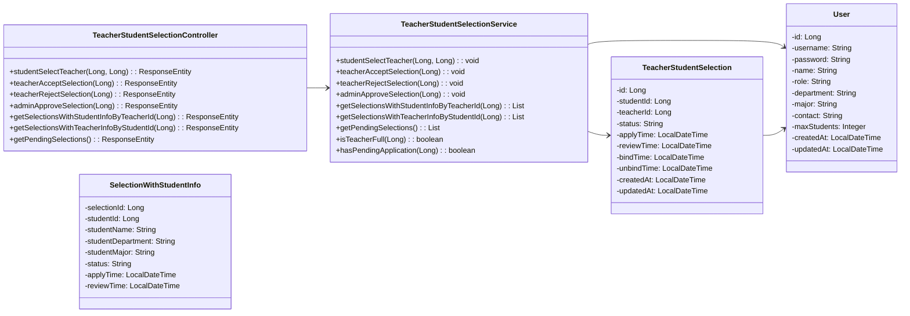
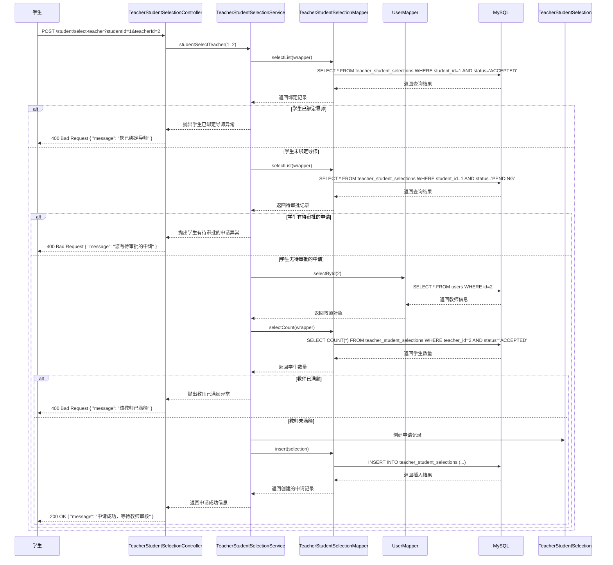
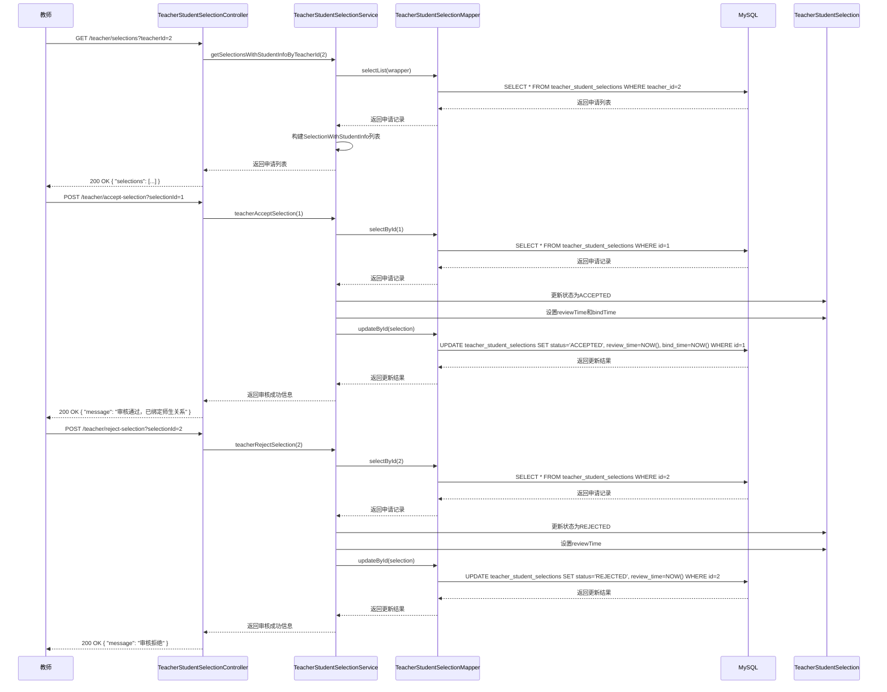

# 师生互选功能详细设计

## 1. 功能概述

师生互选功能是系统的核心功能之一，包括学生申请导师、教师审核申请、师生绑定等。该功能允许学生选择心仪的指导教师，教师审核学生的申请，最终建立师生指导关系。

## 2. 类图设计

### 2.1 师生互选功能类图



## 3. 时序图设计

### 3.1 学生申请导师时序图

学生申请导师模块赋予了学生选择心仪导师的权力。学生在前端浏览教师列表后，选择心仪的教师并提交申请，系统检查学生是否已绑定导师、是否有待审批的申请以及教师是否已满额，如果条件都满足则创建申请记录并等待教师审核；如果任一条件不满足则返回相应的错误信息。

学生申请导师中的学生申请导师时序图如图所示，学生发起请求后，TeacherStudentSelectionController接收并调用TeacherStudentSelectionService的studentSelectTeacher方法处理业务逻辑，服务层首先调用TeacherStudentSelectionMapper的selectList方法查询数据库，检查学生是否已绑定导师，由数据访问层生成并执行SELECT语句操作MySQL数据库，数据库返回查询结果后，TeacherStudentSelectionMapper返回绑定记录给服务层，服务层检查学生是否已绑定导师：如果学生已绑定导师，则抛出学生已绑定导师异常，Controller返回400 Bad Request错误；如果学生未绑定导师，服务层继续调用TeacherStudentSelectionMapper的selectList方法查询数据库，检查学生是否有待审批的申请，数据库返回查询结果后，服务层检查学生是否有待审批的申请：如果学生有待审批的申请，则抛出学生有待审批的申请异常，Controller返回400 Bad Request错误；如果学生无待审批的申请，服务层调用UserMapper的selectById方法查询教师信息，数据库返回教师信息后，UserMapper返回教师对象给服务层，接着服务层调用TeacherStudentSelectionMapper的selectCount方法查询教师已接受的学生数量，数据库返回学生数量后，服务层检查教师是否已满额：如果教师已满额，则抛出教师已满额异常，Controller返回400 Bad Request错误；如果教师未满额，服务层创建TeacherStudentSelection对象并设置申请信息，然后调用TeacherStudentSelectionMapper的insert方法，由数据访问层生成并执行INSERT语句操作MySQL数据库，插入成功后，数据库返回结果，服务层逐层传递状态，最终返回申请成功的响应。



### 3.2 教师审核申请时序图

教师审核申请模块赋予了教师审核学生申请的权力。教师在前端查看待审核的申请列表后，可以选择接受或拒绝学生的申请，系统根据教师的选择更新申请状态，接受申请时还会绑定师生关系并记录绑定时间。

教师审核申请中的教师审核申请时序图如图所示，首先教师查看申请列表，发起GET请求后，TeacherStudentSelectionController接收并调用TeacherStudentSelectionService的getSelectionsWithStudentInfoByTeacherId方法处理业务逻辑，服务层调用TeacherStudentSelectionMapper的selectList方法查询数据库，由数据访问层生成并执行SELECT语句操作MySQL数据库，数据库返回申请列表后，TeacherStudentSelectionMapper返回申请记录给服务层，服务层构建SelectionWithStudentInfo列表并返回给Controller，Controller最终返回包含申请列表的200 OK响应。

接着是教师接受申请的流程，教师发起POST请求后，TeacherStudentSelectionController接收并调用TeacherStudentSelectionService的teacherAcceptSelection方法处理业务逻辑，服务层调用TeacherStudentSelectionMapper的selectById方法查询数据库，数据库返回申请记录后，TeacherStudentSelectionMapper返回申请记录给服务层，服务层更新TeacherStudentSelection对象的状态为ACCEPTED，设置reviewTime和bindTime，然后调用TeacherStudentSelectionMapper的updateById方法，由数据访问层生成并执行UPDATE语句操作MySQL数据库，更新成功后，数据库返回结果，服务层逐层传递状态，最终返回审核通过的响应。

最后是教师拒绝申请的流程，教师发起POST请求后，TeacherStudentSelectionController接收并调用TeacherStudentSelectionService的teacherRejectSelection方法处理业务逻辑，服务层调用TeacherStudentSelectionMapper的selectById方法查询数据库，数据库返回申请记录后，TeacherStudentSelectionMapper返回申请记录给服务层，服务层更新TeacherStudentSelection对象的状态为REJECTED，设置reviewTime，然后调用TeacherStudentSelectionMapper的updateById方法，由数据访问层生成并执行UPDATE语句操作MySQL数据库，更新成功后，数据库返回结果，服务层逐层传递状态，最终返回审核拒绝的响应。



## 4. 技术实现

### 4.1 关键代码实现

#### 4.1.1 TeacherStudentSelectionController.java

```java
@RestController
public class TeacherStudentSelectionController {
    
    @Autowired
    private TeacherStudentSelectionService teacherStudentSelectionService;
    
    @PostMapping("/student/select-teacher")
    public ResponseEntity<?> studentSelectTeacher(@RequestParam Long studentId, @RequestParam Long teacherId) {
        try {
            teacherStudentSelectionService.studentSelectTeacher(studentId, teacherId);
            return ResponseEntity.ok("申请成功，等待教师审核");
        } catch (Exception e) {
            return ResponseEntity.status(HttpStatus.BAD_REQUEST).body(e.getMessage());
        }
    }
    
    @PostMapping("/teacher/accept-selection")
    public ResponseEntity<?> teacherAcceptSelection(@RequestParam Long selectionId) {
        try {
            teacherStudentSelectionService.teacherAcceptSelection(selectionId);
            return ResponseEntity.ok("审核通过，已绑定师生关系");
        } catch (Exception e) {
            return ResponseEntity.status(HttpStatus.BAD_REQUEST).body(e.getMessage());
        }
    }
    
    @PostMapping("/teacher/reject-selection")
    public ResponseEntity<?> teacherRejectSelection(@RequestParam Long selectionId) {
        try {
            teacherStudentSelectionService.teacherRejectSelection(selectionId);
            return ResponseEntity.ok("审核拒绝");
        } catch (Exception e) {
            return ResponseEntity.status(HttpStatus.BAD_REQUEST).body(e.getMessage());
        }
    }
    
    @PostMapping("/admin/approve-selection")
    public ResponseEntity<?> adminApproveSelection(@RequestParam Long selectionId) {
        try {
            teacherStudentSelectionService.adminApproveSelection(selectionId);
            return ResponseEntity.ok("审批通过，已绑定师生关系");
        } catch (Exception e) {
            return ResponseEntity.status(HttpStatus.BAD_REQUEST).body(e.getMessage());
        }
    }
    
    @GetMapping("/teacher/selections")
    public ResponseEntity<?> getSelectionsWithStudentInfoByTeacherId(@RequestParam Long teacherId) {
        try {
            List<SelectionWithStudentInfo> selections = teacherStudentSelectionService.getSelectionsWithStudentInfoByTeacherId(teacherId);
            return ResponseEntity.ok(selections);
        } catch (Exception e) {
            return ResponseEntity.status(HttpStatus.INTERNAL_SERVER_ERROR).body(e.getMessage());
        }
    }
    
    @GetMapping("/student/selections")
    public ResponseEntity<?> getSelectionsWithTeacherInfoByStudentId(@RequestParam Long studentId) {
        try {
            List<SelectionWithTeacherInfo> selections = teacherStudentSelectionService.getSelectionsWithTeacherInfoByStudentId(studentId);
            return ResponseEntity.ok(selections);
        } catch (Exception e) {
            return ResponseEntity.status(HttpStatus.INTERNAL_SERVER_ERROR).body(e.getMessage());
        }
    }
    
    @GetMapping("/admin/pending-selections")
    public ResponseEntity<?> getPendingSelections() {
        try {
            List<TeacherStudentSelection> selections = teacherStudentSelectionService.getPendingSelections();
            return ResponseEntity.ok(selections);
        } catch (Exception e) {
            return ResponseEntity.status(HttpStatus.INTERNAL_SERVER_ERROR).body(e.getMessage());
        }
    }
}
```

#### 4.1.2 TeacherStudentSelectionService.java

```java
@Service
public class TeacherStudentSelectionService {
    
    @Autowired
    private TeacherStudentSelectionMapper selectionMapper;
    
    @Autowired
    private UserMapper userMapper;
    
    public void studentSelectTeacher(Long studentId, Long teacherId) {
        // 检查学生是否已绑定导师
        LambdaQueryWrapper<TeacherStudentSelection> wrapper = new LambdaQueryWrapper<>();
        wrapper.eq(TeacherStudentSelection::getStudentId, studentId)
               .eq(TeacherStudentSelection::getStatus, "ACCEPTED");
        List<TeacherStudentSelection> existingBindings = selectionMapper.selectList(wrapper);
        if (!existingBindings.isEmpty()) {
            throw new RuntimeException("您已绑定导师");
        }
        
        // 检查学生是否有待审批的申请
        LambdaQueryWrapper<TeacherStudentSelection> pendingWrapper = new LambdaQueryWrapper<>();
        pendingWrapper.eq(TeacherStudentSelection::getStudentId, studentId)
                     .eq(TeacherStudentSelection::getStatus, "PENDING");
        List<TeacherStudentSelection> pendingApplications = selectionMapper.selectList(pendingWrapper);
        if (!pendingApplications.isEmpty()) {
            throw new RuntimeException("您有待审批的申请");
        }
        
        // 检查教师是否已满额
        if (isTeacherFull(teacherId)) {
            throw new RuntimeException("该教师已满额");
        }
        
        // 创建申请记录
        TeacherStudentSelection selection = new TeacherStudentSelection();
        selection.setStudentId(studentId);
        selection.setTeacherId(teacherId);
        selection.setStatus("PENDING");
        selection.setApplyTime(LocalDateTime.now());
        selection.setCreatedAt(LocalDateTime.now());
        selection.setUpdatedAt(LocalDateTime.now());
        
        selectionMapper.insert(selection);
    }
    
    public void teacherAcceptSelection(Long selectionId) {
        TeacherStudentSelection selection = selectionMapper.selectById(selectionId);
        if (selection == null) {
            throw new RuntimeException("申请记录不存在");
        }
        
        // 检查教师是否已满额
        if (isTeacherFull(selection.getTeacherId())) {
            throw new RuntimeException("您已满额，无法接受更多学生");
        }
        
        // 更新申请状态
        selection.setStatus("ACCEPTED");
        selection.setReviewTime(LocalDateTime.now());
        selection.setBindTime(LocalDateTime.now());
        selection.setUpdatedAt(LocalDateTime.now());
        
        selectionMapper.updateById(selection);
    }
    
    public void teacherRejectSelection(Long selectionId) {
        TeacherStudentSelection selection = selectionMapper.selectById(selectionId);
        if (selection == null) {
            throw new RuntimeException("申请记录不存在");
        }
        
        // 更新申请状态
        selection.setStatus("REJECTED");
        selection.setReviewTime(LocalDateTime.now());
        selection.setUpdatedAt(LocalDateTime.now());
        
        selectionMapper.updateById(selection);
    }
    
    public void adminApproveSelection(Long selectionId) {
        TeacherStudentSelection selection = selectionMapper.selectById(selectionId);
        if (selection == null) {
            throw new RuntimeException("申请记录不存在");
        }
        
        // 更新申请状态
        selection.setStatus("ACCEPTED");
        selection.setReviewTime(LocalDateTime.now());
        selection.setBindTime(LocalDateTime.now());
        selection.setUpdatedAt(LocalDateTime.now());
        
        selectionMapper.updateById(selection);
    }
    
    public List<SelectionWithStudentInfo> getSelectionsWithStudentInfoByTeacherId(Long teacherId) {
        LambdaQueryWrapper<TeacherStudentSelection> wrapper = new LambdaQueryWrapper<>();
        wrapper.eq(TeacherStudentSelection::getTeacherId, teacherId);
        List<TeacherStudentSelection> selections = selectionMapper.selectList(wrapper);
        
        List<SelectionWithStudentInfo> result = new ArrayList<>();
        for (TeacherStudentSelection selection : selections) {
            User student = userMapper.selectById(selection.getStudentId());
            if (student != null) {
                SelectionWithStudentInfo info = new SelectionWithStudentInfo();
                info.setSelectionId(selection.getId());
                info.setStudentId(student.getId());
                info.setStudentName(student.getName());
                info.setStudentDepartment(student.getDepartment());
                info.setStudentMajor(student.getMajor());
                info.setStatus(selection.getStatus());
                info.setApplyTime(selection.getApplyTime());
                info.setReviewTime(selection.getReviewTime());
                result.add(info);
            }
        }
        
        return result;
    }
    
    public List<SelectionWithTeacherInfo> getSelectionsWithTeacherInfoByStudentId(Long studentId) {
        // 实现逻辑类似，返回包含教师信息的申请记录
        return new ArrayList<>();
    }
    
    public List<TeacherStudentSelection> getPendingSelections() {
        LambdaQueryWrapper<TeacherStudentSelection> wrapper = new LambdaQueryWrapper<>();
        wrapper.eq(TeacherStudentSelection::getStatus, "PENDING");
        return selectionMapper.selectList(wrapper);
    }
    
    public boolean isTeacherFull(Long teacherId) {
        User teacher = userMapper.selectById(teacherId);
        if (teacher == null) {
            throw new RuntimeException("教师不存在");
        }
        
        Integer maxStudents = teacher.getMaxStudents();
        if (maxStudents == null || maxStudents <= 0) {
            return false; // 无限制
        }
        
        LambdaQueryWrapper<TeacherStudentSelection> wrapper = new LambdaQueryWrapper<>();
        wrapper.eq(TeacherStudentSelection::getTeacherId, teacherId)
               .eq(TeacherStudentSelection::getStatus, "ACCEPTED");
        int currentCount = selectionMapper.selectCount(wrapper);
        
        return currentCount >= maxStudents;
    }
    
    public boolean hasPendingApplication(Long studentId) {
        LambdaQueryWrapper<TeacherStudentSelection> wrapper = new LambdaQueryWrapper<>();
        wrapper.eq(TeacherStudentSelection::getStudentId, studentId)
               .eq(TeacherStudentSelection::getStatus, "PENDING");
        return selectionMapper.selectCount(wrapper) > 0;
    }
}
```

## 5. 流程说明

### 5.1 学生申请导师流程

1. 学生登录系统，进入导师选择页面
2. 浏览教师列表，选择心仪的教师
3. 点击"申请导师"按钮，提交申请
4. 前端调用 `/student/select-teacher` 接口，传递学生ID和教师ID
5. TeacherStudentSelectionController接收请求，调用TeacherStudentSelectionService.studentSelectTeacher()方法
6. TeacherStudentSelectionService执行以下检查：
   - 学生是否已绑定导师
   - 学生是否有待审批的申请
   - 教师是否已满额
7. 如果检查通过，创建申请记录，状态为"PENDING"
8. 返回申请成功信息

### 5.2 教师审核申请流程

1. 教师登录系统，进入申请管理页面
2. 查看待审核的申请列表
3. 点击"接受"或"拒绝"按钮
4. 前端调用 `/teacher/accept-selection` 或 `/teacher/reject-selection` 接口
5. TeacherStudentSelectionController接收请求，调用相应的服务方法
6. TeacherStudentSelectionService更新申请状态：
   - 接受申请：状态改为"ACCEPTED"，设置reviewTime和bindTime
   - 拒绝申请：状态改为"REJECTED"，设置reviewTime
7. 返回审核结果

### 5.3 师生绑定流程

1. 教师接受学生的申请
2. 系统自动更新申请状态为"ACCEPTED"
3. 记录绑定时间
4. 学生和教师之间建立指导关系
5. 学生可以在个人中心查看绑定的导师信息
6. 教师可以在个人中心查看指导的学生列表

## 6. 业务规则

1. **唯一性规则**：每个学生只能绑定一个导师
2. **申请限制**：学生同一时间只能有一个待审批的申请
3. **名额限制**：教师的指导学生数不能超过其最大指导学生数
4. **状态流转**：申请状态只能从"PENDING"变为"ACCEPTED"或"REJECTED"
5. **时间记录**：系统自动记录申请时间、审核时间和绑定时间

## 7. 总结

师生互选功能通过学生申请、教师审核、系统验证等流程，实现了公平、有序的师生匹配机制。该功能不仅满足了学生选择心仪导师的需求，也保证了教师的指导名额合理分配，为毕业设计的顺利开展奠定了基础。

通过详细的类图和时序图设计，清晰地展示了师生互选功能的实现细节和流程，为系统的开发和维护提供了参考。