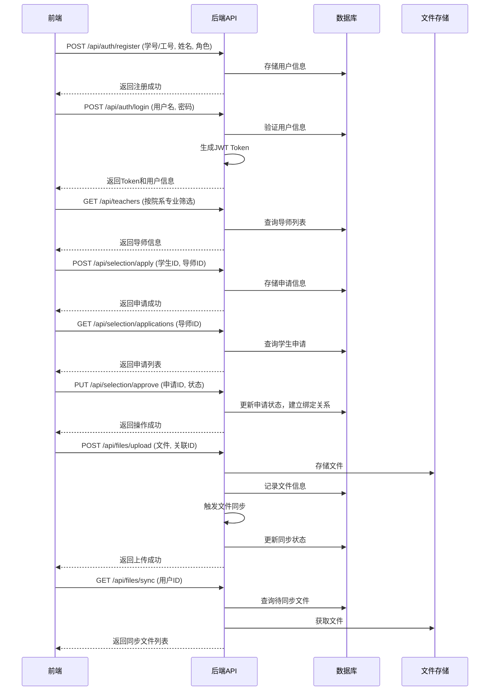

# 毕业论文管理系统技术选型方案

## 1. 技术栈选择

### 1.1 前端技术
| 类别 | 技术 | 版本 | 选型理由 |
|------|------|------|---------|
| 框架 | Vue.js | 3.x | 轻量级框架，响应式设计，组件化开发，适合构建单页应用，社区活跃，文档丰富。 |
| UI组件库 | Element Plus | 2.x | 基于Vue 3的组件库，提供丰富的UI组件，支持主题定制，适合快速开发管理系统界面。 |
| 状态管理 | Pinia | 2.x | Vue 3官方推荐的状态管理库，替代Vuex，API更简洁，性能更好。 |
| 路由 | Vue Router | 4.x | Vue官方路由库，支持嵌套路由和路由守卫，适合实现不同角色的界面切换。 |
| 构建工具 | Vite | 4.x | 快速的前端构建工具，热更新速度快，适合开发环境。 |
| HTTP客户端 | Axios | 1.x | 支持Promise API，拦截器功能强大，适合与后端API交互。 |
| 文件上传 | Vue Upload Component | 3.x | 支持多文件上传，进度条显示，适合处理论文相关文件上传。 |

### 1.2 后端技术
| 类别 | 技术 | 版本 | 选型理由 |
|------|------|------|---------|
| 语言 | Java | 17 | 编译型语言，性能稳定，生态成熟，适合企业级应用开发。 |
| 框架 | Spring Boot | 3.x | 快速开发框架，内置Tomcat，自动配置，简化开发流程，适合构建RESTful API。 |
| 安全框架 | Spring Security | 6.x | 强大的安全框架，支持认证和授权，适合实现基于角色的权限控制。 |
| ORM框架 | MyBatis-Plus | 3.x | 基于MyBatis的增强工具，简化CRUD操作，提供代码生成器，提高开发效率。 |
| API文档 | SpringDoc OpenAPI | 2.x | 自动生成API文档，支持Swagger UI，方便前后端对接。 |
| 任务调度 | Spring Task | 内置 | 轻量级任务调度框架，适合处理定时任务，如截止时间提醒。 |
| 工具库 | Apache Commons | 3.x | 提供常用工具类，如文件操作、字符串处理等。 |

### 1.3 数据库与存储
| 类别 | 技术 | 版本 | 选型理由 |
|------|------|------|---------|
| 主数据库 | MySQL | 8.x | 关系型数据库，稳定可靠，适合存储结构化数据，如用户信息、论文进度等。 |
| 缓存 | Redis | 7.x | 内存数据库，适合缓存热点数据，如用户会话、权限信息，提高系统响应速度。 |
| 文件存储 | 本地存储 + MinIO | 本地存储 | 本地存储适合小规模部署，MinIO作为对象存储服务，适合存储大量文件，支持文件版本管理。 |

### 1.4 认证与安全
| 类别 | 技术 | 版本 | 选型理由 |
|------|------|------|---------|
| 认证方式 | JWT (JSON Web Token) | - | 无状态认证，便于水平扩展，适合前后端分离架构。 |
| 密码加密 | BCrypt | - | 强哈希算法，适合密码加密存储，提高安全性。 |
| 跨域处理 | CORS (Cross-Origin Resource Sharing) | - | 支持跨域请求，适合前后端分离架构。 |
| 数据传输 | HTTPS | - | 加密传输，保护敏感数据，提高安全性。 |

### 1.5 部署与运维
| 类别 | 技术 | 版本 | 选型理由 |
|------|------|------|---------|
| 容器化 | Docker | 20.x | 标准化部署环境，简化部署流程，提高环境一致性。 |
| 容器编排 | Docker Compose | 2.x | 适合本地开发和小规模部署，管理多容器应用。 |
| 持续集成 | Jenkins | 2.x | 自动化构建、测试和部署，提高开发效率。 |
| 监控 | Prometheus + Grafana | 2.x | 监控系统运行状态，及时发现问题。 |
| 日志管理 | ELK Stack (Elasticsearch, Logstash, Kibana) | 8.x | 集中管理日志，便于问题排查。 |

## 2. 系统架构设计

### 2.1 架构风格
- **架构风格**：前后端分离架构
- **前端**：单页应用 (SPA)，通过API与后端交互
- **后端**：RESTful API服务，处理业务逻辑
- **数据存储**：关系型数据库存储结构化数据，对象存储服务存储文件

### 2.2 核心流程图


### 2.3 目录结构设计

#### 前端目录结构
```
frontend/
├── public/              # 静态资源
├── src/
│   ├── assets/          # 图片、样式等
│   ├── components/      # 通用组件
│   ├── views/           # 页面组件
│   │   ├── admin/       # 管理员界面
│   │   ├── teacher/     # 教师界面
│   │   └── student/     # 学生界面
│   ├── router/          # 路由配置
│   ├── store/           # 状态管理
│   ├── services/        # API服务
│   ├── utils/           # 工具函数
│   ├── constants/       # 常量定义
│   ├── App.vue          # 根组件
│   └── main.js          # 入口文件
├── .env                 # 环境变量
├── package.json         # 依赖配置
└── vite.config.js       # Vite配置
```

#### 后端目录结构
```
backend/
├── src/
│   ├── main/
│   │   ├── java/
│   │   │   └── com/
│   │   │       └── thesis/
│   │   │           ├── config/          # 配置类
│   │   │           ├── controller/      # 控制器
│   │   │           ├── service/         # 业务逻辑
│   │   │           ├── mapper/          # 数据访问
│   │   │           ├── entity/          # 实体类
│   │   │           ├── dto/             # 数据传输对象
│   │   │           ├── utils/           # 工具类
│   │   │           ├── security/        # 安全相关
│   │   │           └── Application.java # 应用入口
│   │   └── resources/
│   │       ├── static/                  # 静态资源
│   │       ├── templates/               # 模板文件
│   │       ├── application.yml          # 应用配置
│   │       └── mybatis/                 # MyBatis映射文件
│   └── test/                             # 测试代码
├── pom.xml                               # Maven依赖
└── Dockerfile                            # Docker构建文件
```

## 3. 关键技术实现方案

### 3.1 师生绑定关系管理
- **实现方式**：使用数据库表 `teacher_student_selection` 存储绑定关系，状态字段标识绑定状态（待审核/已接受/已拒绝/已解除）。
- **核心逻辑**：
  - 学生提交申请时，创建申请记录，状态为"待审核"。
  - 导师审核申请时，更新状态为"已接受"或"已拒绝"。
  - 师生解除绑定时，更新状态为"已解除"。
  - 绑定关系建立后，所有文件上传和审核操作基于该关系。

### 3.2 文件同步机制
- **实现方式**：文件上传时，记录上传人、接收人信息，通过定时任务或事件触发文件同步。
- **核心逻辑**：
  - 学生/教师上传文件时，后端存储文件并记录文件信息，关联接收人ID。
  - 接收人登录系统时，前端请求同步文件列表。
  - 后端查询接收人待同步文件，返回文件列表。
  - 前端下载同步文件，标记为已同步。

### 3.3 权限控制
- **实现方式**：基于Spring Security和JWT的角色权限控制。
- **核心逻辑**：
  - 用户登录时，生成包含角色信息的JWT Token。
  - 后端通过拦截器验证Token，提取用户角色。
  - 控制器方法使用 `@PreAuthorize` 注解，基于角色控制访问权限。
  - 通知发布权限仅授予管理员角色，教师和学生角色无此权限。
  - 前端根据用户角色动态显示菜单和功能。

### 3.4 进度跟踪
- **实现方式**：使用数据库表 `progress` 存储学生论文各阶段进度。
- **核心逻辑**：
  - 学生提交或修改文档时，更新对应阶段状态。
  - 教师审核文档时，更新审核状态，同步到进度表。
  - 前端通过API获取进度数据，可视化展示进度。

### 3.5 截止时间管理
- **实现方式**：使用数据库表 `system_settings` 存储各阶段截止时间。
- **核心逻辑**：
  - 管理员设置各阶段截止时间。
  - 后端定时任务检查临近截止时间的任务，发送提醒。
  - 前端显示截止时间倒计时，提醒用户。

## 4. 技术选型评估

### 4.1 性能评估
- **前端**：Vue 3 + Vite 构建速度快，运行时性能好，适合单页应用。
- **后端**：Spring Boot 3 启动速度快，内置Tomcat性能稳定，适合高并发场景。
- **数据库**：MySQL 8 支持事务和索引，适合存储结构化数据，查询性能好。
- **文件存储**：本地存储 + MinIO 适合存储大量文件，读写性能可靠。

### 4.2 可扩展性评估
- **前端**：组件化开发，易于扩展新功能，支持多端适配。
- **后端**：模块化设计，支持水平扩展，可通过Docker容器化部署。
- **数据库**：支持主从复制和分片，可应对数据量增长。
- **文件存储**：MinIO支持集群部署，可扩展存储容量。

### 4.3 安全性评估
- **认证**：JWT Token 无状态认证，避免会话劫持。
- **授权**：基于角色的权限控制，确保用户只能访问授权资源。
- **加密**：密码使用BCrypt加密，文件传输使用HTTPS加密。
- **防护**：后端实现请求限流、SQL注入防护等安全措施。

### 4.4 维护性评估
- **前端**：Vue 3 语法简洁，组件化开发易于维护。
- **后端**：Spring Boot 自动配置，代码结构清晰，易于维护。
- **数据库**：MySQL 8 稳定性高，维护成本低。
- **文档**：SpringDoc自动生成API文档，前端使用VuePress生成开发文档。

## 5. 部署方案

### 5.1 开发环境
- **前端**：Node.js 16+，npm 8+，Vite 开发服务器。
- **后端**：JDK 17，Maven 3.8+，Spring Boot 开发服务器。
- **数据库**：MySQL 8，本地安装或Docker容器。
- **文件存储**：本地目录。

### 5.2 测试环境
- **部署方式**：Docker Compose 编排容器。
- **服务**：
  - 前端：Nginx 容器，静态文件部署。
  - 后端：Spring Boot 容器，连接MySQL和Redis。
  - 数据库：MySQL 容器，数据持久化。
  - 文件存储：MinIO 容器，文件持久化。

### 5.3 生产环境
- **部署方式**：Docker 容器化，Kubernetes 编排（可选）。
- **服务**：
  - 前端：Nginx 容器，负载均衡。
  - 后端：Spring Boot 容器，多实例部署，负载均衡。
  - 数据库：MySQL 主从复制，高可用。
  - 缓存：Redis 集群，高可用。
  - 文件存储：MinIO 集群，高可用。
- **监控**：Prometheus + Grafana 监控系统状态。
- **日志**：ELK Stack 集中管理日志。

## 6. 技术选型总结

本技术选型方案基于前后端分离架构，选择了主流、成熟的技术栈，能够满足毕业论文管理系统的所有功能需求。前端使用Vue 3 + Element Plus构建响应式界面，后端使用Spring Boot 3 + MySQL处理业务逻辑，文件存储使用本地存储 + MinIO确保可靠性。系统支持师生互选、文件同步、进度跟踪等核心功能，具备良好的性能、可扩展性和安全性。

通过本技术方案，能够快速开发、部署和维护毕业论文管理系统，为高校提供高效、规范的论文管理解决方案。