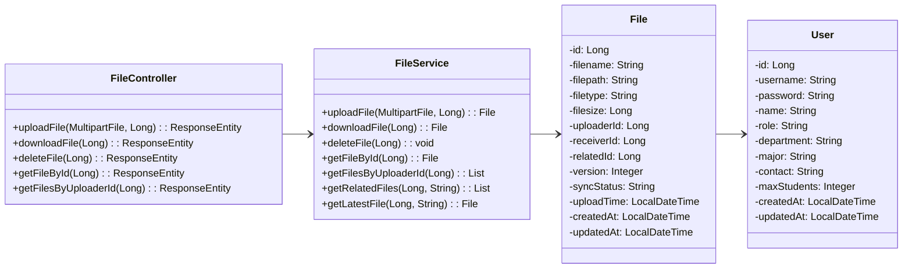
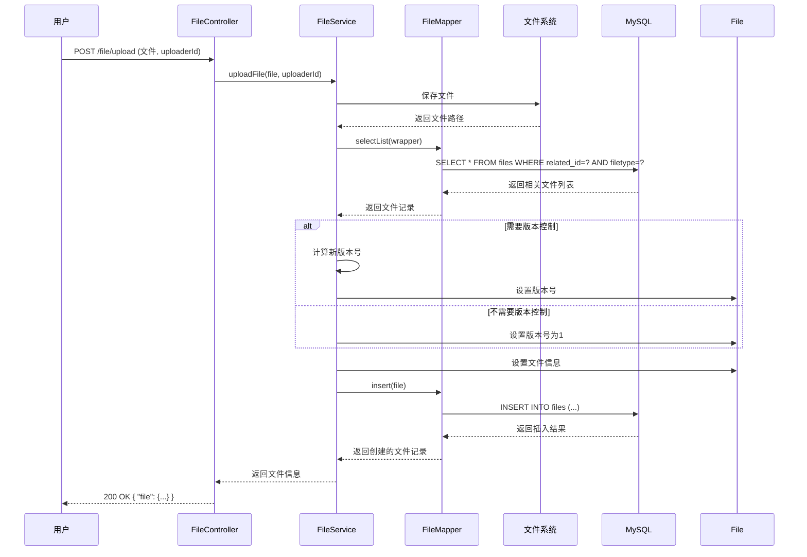
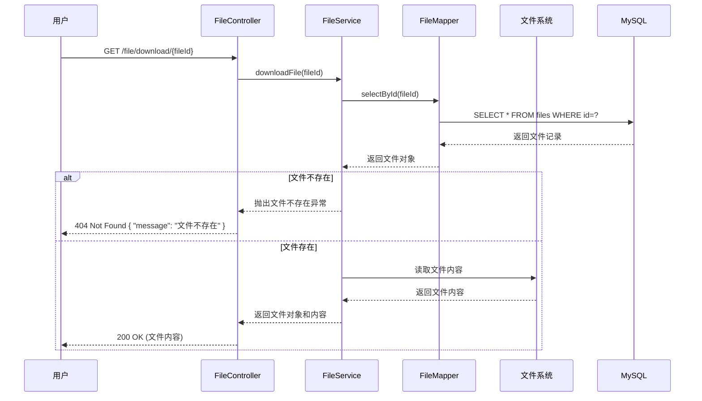
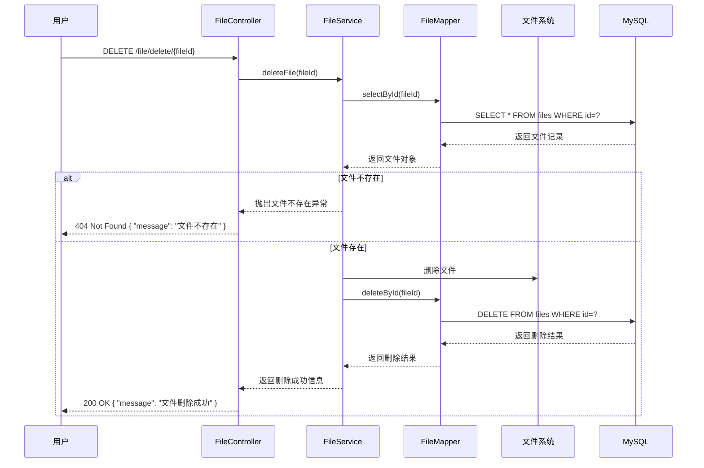

# 文件管理功能详细设计

## 1. 功能概述

文件管理功能是系统的基础功能之一，包括文件上传、下载、版本管理等。该功能允许用户上传和下载各种文件，如论文、报告、任务书等。

## 2. 类图设计

### 2.1 文件管理功能类图



## 3. 时序图设计

### 3.1 文件上传时序图

文件上传模块赋予了用户上传文件的权力。用户在前端选择文件后，提交到系统，系统将文件保存到文件系统，同时在数据库中记录文件信息，包括文件名、路径、类型、大小、上传者等，并支持文件版本控制。

文件上传中的文件上传时序图如图所示，用户发起请求后，FileController接收并调用FileService的uploadFile方法处理业务逻辑，服务层首先确保上传目录存在，然后生成唯一文件名并保存文件到文件系统，文件系统返回文件路径后，服务层解析文件信息（类型、大小等），接着调用FileMapper的selectList方法查询数据库，检查是否存在同类型的文件，数据库返回查询结果后，服务层根据结果进行版本控制处理：如果存在同类型文件，计算最大版本号并加1；如果不存在同类型文件，设置版本号为1，然后创建File对象并设置文件信息，接着调用FileMapper的insert方法，由数据访问层生成并执行INSERT语句操作MySQL数据库，插入成功后，数据库返回结果，服务层逐层传递状态，最终返回上传成功的文件信息。



### 3.2 文件下载时序图

文件下载模块赋予了用户下载文件的权力。用户在前端找到要下载的文件后，点击下载按钮，系统根据文件ID查询文件信息，如果文件存在则从文件系统读取文件内容并返回给用户进行下载；如果文件不存在则返回错误信息。

文件下载中的文件下载时序图如图所示，用户发起请求后，FileController接收并调用FileService的downloadFile方法处理业务逻辑，服务层调用FileMapper的selectById方法查询数据库，由数据访问层生成并执行SELECT语句操作MySQL数据库，数据库返回文件记录后，FileMapper返回File对象给服务层，服务层检查文件是否存在：如果文件不存在，则抛出文件不存在异常，Controller返回404 Not Found错误；如果文件存在，服务层从文件系统读取文件内容，文件系统返回文件内容后，服务层返回文件对象和内容给Controller，Controller设置正确的Content-Type和Content-Disposition响应头，最终返回包含文件内容的200 OK响应，浏览器开始下载文件。



### 3.3 文件删除时序图

文件删除模块赋予了用户删除文件的权力。用户在前端找到要删除的文件后，点击删除按钮，系统根据文件ID查询文件信息，如果文件存在则从文件系统删除文件并从数据库删除文件记录；如果文件不存在则返回错误信息。

文件删除中的文件删除时序图如图所示，用户发起请求后，FileController接收并调用FileService的deleteFile方法处理业务逻辑，服务层调用FileMapper的selectById方法查询数据库，由数据访问层生成并执行SELECT语句操作MySQL数据库，数据库返回文件记录后，FileMapper返回File对象给服务层，服务层检查文件是否存在：如果文件不存在，则抛出文件不存在异常，Controller返回404 Not Found错误；如果文件存在，服务层从文件系统删除文件，然后调用FileMapper的deleteById方法，由数据访问层生成并执行DELETE语句操作MySQL数据库，数据库返回删除结果后，FileMapper返回删除结果给服务层，服务层返回删除成功信息给Controller，Controller最终返回删除成功的200 OK响应。



## 4. 技术实现

### 4.1 关键代码实现

#### 4.1.1 FileController.java

```java
@RestController
@RequestMapping("/file")
public class FileController {
    
    @Autowired
    private FileService fileService;
    
    @PostMapping("/upload")
    public ResponseEntity<?> uploadFile(@RequestParam("file") MultipartFile file, 
                                       @RequestParam("uploaderId") Long uploaderId) {
        try {
            File uploadedFile = fileService.uploadFile(file, uploaderId);
            return ResponseEntity.ok(uploadedFile);
        } catch (Exception e) {
            return ResponseEntity.status(HttpStatus.INTERNAL_SERVER_ERROR).body("文件上传失败: " + e.getMessage());
        }
    }
    
    @GetMapping("/download/{fileId}")
    public ResponseEntity<?> downloadFile(@PathVariable Long fileId) {
        try {
            File file = fileService.downloadFile(fileId);
            FileSystemResource resource = new FileSystemResource(file.getFilepath());
            
            if (!resource.exists()) {
                return ResponseEntity.status(HttpStatus.NOT_FOUND).body("文件不存在");
            }
            
            String contentType = determineContentType(file.getFiletype());
            return ResponseEntity.ok()
                .contentType(MediaType.parseMediaType(contentType))
                .header(HttpHeaders.CONTENT_DISPOSITION, "attachment; filename=" + file.getFilename())
                .body(resource);
        } catch (Exception e) {
            return ResponseEntity.status(HttpStatus.INTERNAL_SERVER_ERROR).body("文件下载失败: " + e.getMessage());
        }
    }
    
    @DeleteMapping("/delete/{fileId}")
    public ResponseEntity<?> deleteFile(@PathVariable Long fileId) {
        try {
            fileService.deleteFile(fileId);
            return ResponseEntity.ok("文件删除成功");
        } catch (Exception e) {
            return ResponseEntity.status(HttpStatus.INTERNAL_SERVER_ERROR).body("文件删除失败: " + e.getMessage());
        }
    }
    
    @GetMapping("/get/{fileId}")
    public ResponseEntity<?> getFileById(@PathVariable Long fileId) {
        try {
            File file = fileService.getFileById(fileId);
            return ResponseEntity.ok(file);
        } catch (Exception e) {
            return ResponseEntity.status(HttpStatus.INTERNAL_SERVER_ERROR).body("获取文件失败: " + e.getMessage());
        }
    }
    
    @GetMapping("/list")
    public ResponseEntity<?> getFilesByUploaderId(@RequestParam Long uploaderId) {
        try {
            List<File> files = fileService.getFilesByUploaderId(uploaderId);
            return ResponseEntity.ok(files);
        } catch (Exception e) {
            return ResponseEntity.status(HttpStatus.INTERNAL_SERVER_ERROR).body("获取文件列表失败: " + e.getMessage());
        }
    }
    
    private String determineContentType(String filetype) {
        switch (filetype.toLowerCase()) {
            case "pdf":
                return "application/pdf";
            case "doc":
            case "docx":
                return "application/msword";
            case "xls":
            case "xlsx":
                return "application/vnd.ms-excel";
            case "ppt":
            case "pptx":
                return "application/vnd.ms-powerpoint";
            case "txt":
                return "text/plain";
            case "jpg":
            case "jpeg":
                return "image/jpeg";
            case "png":
                return "image/png";
            case "gif":
                return "image/gif";
            default:
                return "application/octet-stream";
        }
    }
}
```

#### 4.1.2 FileService.java

```java
@Service
public class FileService {
    
    @Autowired
    private FileMapper fileMapper;
    
    private static final String UPLOAD_DIR = "/tmp/uploads";
    
    public File uploadFile(MultipartFile file, Long uploaderId) throws Exception {
        // 确保上传目录存在
        File uploadDir = new File(UPLOAD_DIR);
        if (!uploadDir.exists()) {
            uploadDir.mkdirs();
        }
        
        // 生成唯一文件名
        String originalFilename = file.getOriginalFilename();
        String filename = UUID.randomUUID().toString() + "_" + originalFilename;
        String filePath = UPLOAD_DIR + File.separator + filename;
        
        // 保存文件到本地
        File dest = new File(filePath);
        file.transferTo(dest);
        
        // 解析文件信息
        String filetype = originalFilename.substring(originalFilename.lastIndexOf('.') + 1);
        long filesize = file.getSize();
        
        // 检查是否需要版本控制
        Integer version = 1;
        LambdaQueryWrapper<File> wrapper = new LambdaQueryWrapper<>();
        wrapper.eq(File::getUploaderId, uploaderId)
               .eq(File::getFiletype, filetype);
        List<File> existingFiles = fileMapper.selectList(wrapper);
        
        if (!existingFiles.isEmpty()) {
            // 找到最大版本号
            version = existingFiles.stream()
                .map(File::getVersion)
                .max(Integer::compare)
                .orElse(0) + 1;
        }
        
        // 创建文件记录
        File newFile = new File();
        newFile.setFilename(originalFilename);
        newFile.setFilepath(filePath);
        newFile.setFiletype(filetype);
        newFile.setFilesize(filesize);
        newFile.setUploaderId(uploaderId);
        newFile.setVersion(version);
        newFile.setSyncStatus("SYNCED");
        newFile.setUploadTime(LocalDateTime.now());
        newFile.setCreatedAt(LocalDateTime.now());
        newFile.setUpdatedAt(LocalDateTime.now());
        
        // 保存到数据库
        fileMapper.insert(newFile);
        
        return newFile;
    }
    
    public File downloadFile(Long fileId) {
        File file = fileMapper.selectById(fileId);
        if (file == null) {
            throw new RuntimeException("文件不存在");
        }
        return file;
    }
    
    public void deleteFile(Long fileId) {
        File file = fileMapper.selectById(fileId);
        if (file == null) {
            throw new RuntimeException("文件不存在");
        }
        
        // 删除本地文件
        File localFile = new File(file.getFilepath());
        if (localFile.exists()) {
            localFile.delete();
        }
        
        // 删除数据库记录
        fileMapper.deleteById(fileId);
    }
    
    public File getFileById(Long fileId) {
        return fileMapper.selectById(fileId);
    }
    
    public List<File> getFilesByUploaderId(Long uploaderId) {
        LambdaQueryWrapper<File> wrapper = new LambdaQueryWrapper<>();
        wrapper.eq(File::getUploaderId, uploaderId);
        return fileMapper.selectList(wrapper);
    }
    
    public List<File> getRelatedFiles(Long relatedId, String filetype) {
        LambdaQueryWrapper<File> wrapper = new LambdaQueryWrapper<>();
        wrapper.eq(File::getRelatedId, relatedId)
               .eq(File::getFiletype, filetype);
        return fileMapper.selectList(wrapper);
    }
    
    public File getLatestFile(Long relatedId, String filetype) {
        LambdaQueryWrapper<File> wrapper = new LambdaQueryWrapper<>();
        wrapper.eq(File::getRelatedId, relatedId)
               .eq(File::getFiletype, filetype)
               .orderByDesc(File::getVersion);
        return fileMapper.selectOne(wrapper);
    }
}
```

## 4. 流程说明

### 4.1 文件上传流程

1. 用户登录系统，进入文件上传页面
2. 选择要上传的文件
3. 点击"上传"按钮
4. 前端调用 `/file/upload` 接口，传递文件和上传者ID
5. FileController接收请求，调用FileService.uploadFile()方法
6. FileService执行以下操作：
   - 确保上传目录存在
   - 生成唯一文件名
   - 保存文件到本地文件系统
   - 解析文件信息（类型、大小等）
   - 检查是否需要版本控制
   - 创建文件记录，设置版本号
   - 保存文件信息到数据库
7. 返回上传成功的文件信息

### 4.2 文件下载流程

1. 用户登录系统，进入文件列表页面
2. 找到要下载的文件
3. 点击"下载"按钮
4. 前端调用 `/file/download/{fileId}` 接口
5. FileController接收请求，调用FileService.downloadFile()方法
6. FileService执行以下操作：
   - 根据文件ID查询文件信息
   - 检查文件是否存在
   - 读取文件内容
7. FileController设置正确的Content-Type和Content-Disposition头
8. 返回文件内容，浏览器开始下载

### 4.3 文件删除流程

1. 用户登录系统，进入文件列表页面
2. 找到要删除的文件
3. 点击"删除"按钮
4. 前端调用 `/file/delete/{fileId}` 接口
5. FileController接收请求，调用FileService.deleteFile()方法
6. FileService执行以下操作：
   - 根据文件ID查询文件信息
   - 检查文件是否存在
   - 删除本地文件
   - 删除数据库记录
7. 返回删除成功信息

### 4.4 文件版本管理流程

1. 用户上传文件时，系统检查是否存在同类型的文件
2. 如果存在同类型文件，系统找到最大版本号并加1
3. 设置新文件的版本号为计算得到的版本号
4. 保存新文件记录到数据库
5. 用户可以通过版本号区分不同版本的文件
6. 系统默认返回最新版本的文件

## 5. 业务规则

1. **文件存储**：文件存储在本地文件系统，路径为 `/tmp/uploads`
2. **版本控制**：同一上传者上传同类型文件时，自动增加版本号
3. **文件命名**：使用UUID生成唯一文件名，避免文件名冲突
4. **文件类型**：系统自动解析文件类型，基于文件扩展名
5. **文件大小**：系统记录文件大小，单位为字节
6. **时间记录**：系统自动记录上传时间、创建时间和更新时间
7. **同步状态**：文件默认标记为"SYNCED"状态

## 6. 总结

文件管理功能通过文件上传、下载、删除、版本管理等流程，实现了规范的文件管理机制。该功能不仅满足了用户上传和下载文件的需求，也保证了文件的版本控制和安全存储，为系统的其他功能模块提供了文件支持。

通过详细的类图和时序图设计，清晰地展示了文件管理功能的实现细节和流程，为系统的开发和维护提供了参考。