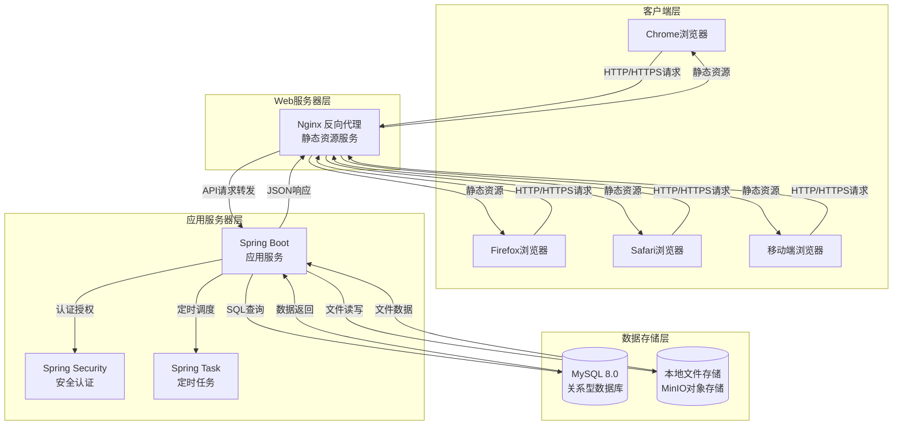
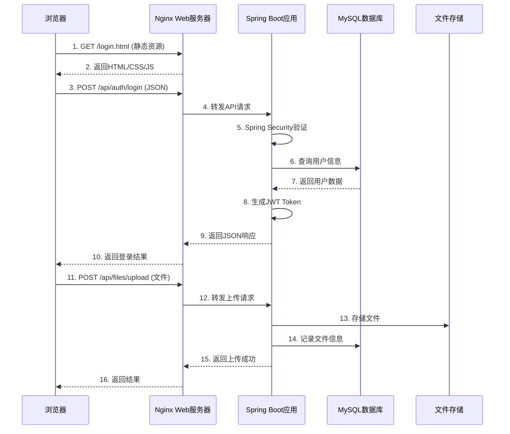
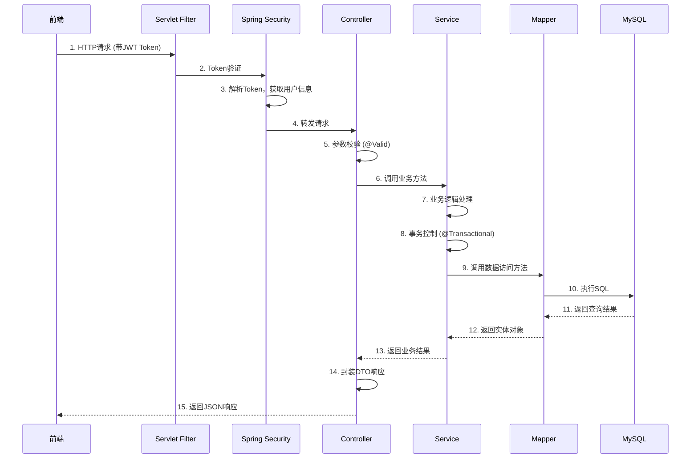
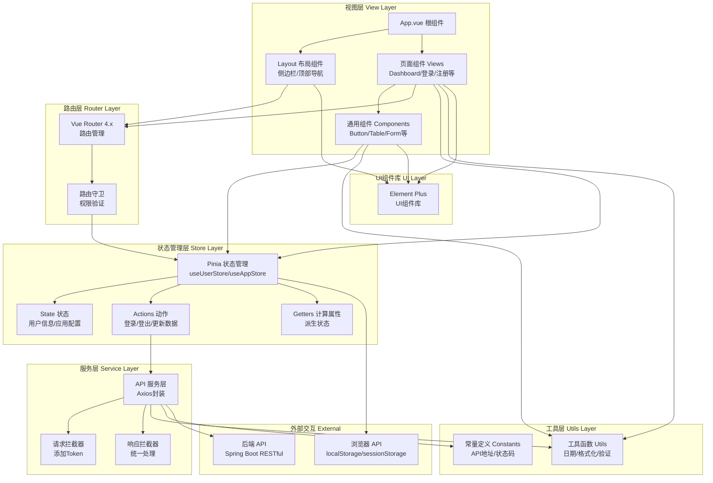
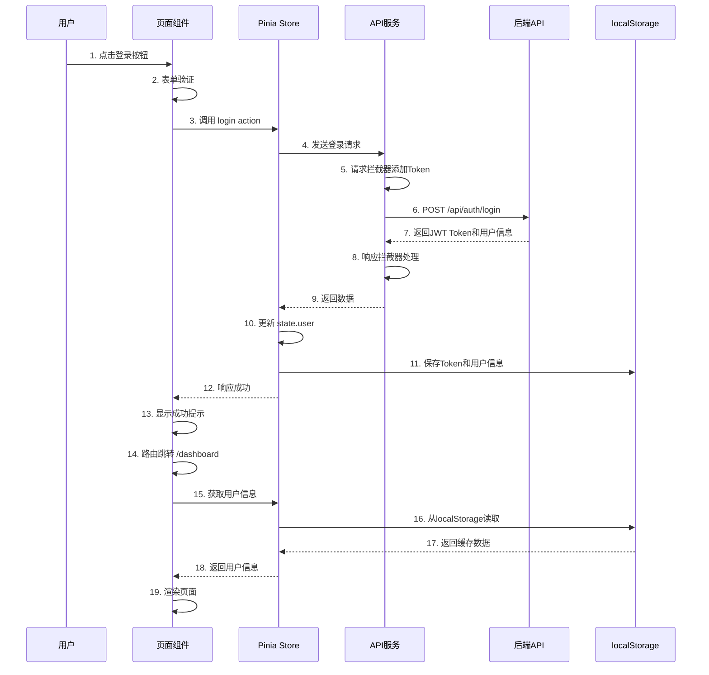
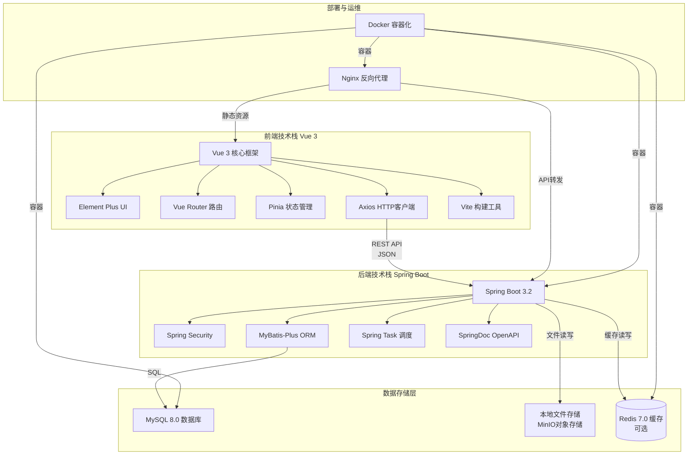

# 毕业论文管理系统 - 理论技术框架图

## 一、B/S架构图

### 1.1 B/S架构整体图



### 1.2 B/S架构说明

#### 1.2.1 B/S架构概述
B/S（Browser/Server，浏览器/服务器）架构是一种基于Web的三层或多层架构模式，用户通过浏览器访问应用程序，无需安装专门的客户端软件。

#### 1.2.2 各层功能说明

| 层次 | 技术组件 | 功能描述 |
|------|---------|---------|
| **客户端层** | Chrome、Firefox、Safari、移动端浏览器 | 用户交互界面，负责展示数据和接收用户输入，通过HTTP/HTTPS协议与服务器通信 |
| **Web服务器层** | Nginx | 反向代理服务器，负责静态资源服务、负载均衡、API请求转发，提高系统性能和安全性 |
| **应用服务器层** | Spring Boot | 核心业务逻辑处理，包含Controller、Service、Repository等组件，提供RESTful API |
| **数据存储层** | MySQL、本地文件存储、MinIO | 数据持久化存储，MySQL存储结构化数据，文件存储保存论文等文档 |

#### 1.2.3 B/S架构优势
- **跨平台性**：浏览器跨操作系统，无需针对不同平台开发客户端
- **部署维护简单**：只需维护服务器端，客户端自动更新
- **零安装**：用户无需安装专门软件，使用浏览器即可访问
- **扩展性好**：易于横向扩展，支持负载均衡

### 1.3 B/S架构请求响应时序图



---

## 二、Spring Boot框架图

### 2.1 Spring Boot整体架构图

```mermaid
graph TB
    subgraph "表现层 Presentation Layer"
        Controller[Controller 控制器<br/>@RestController]
        DTO[DTO 数据传输对象<br/>Request/Response]
    end
    
    subgraph "业务逻辑层 Business Layer"
        Service[Service 业务服务<br/>@Service]
        Security[Spring Security<br/>认证授权]
        Task[Spring Task<br/>定时任务]
    end
    
    subgraph "数据访问层 Data Access Layer"
        Mapper[Mapper/Repository<br/>MyBatis-Plus]
        Entity[Entity 实体类<br/>@TableName]
    end
    
    subgraph "基础设施层 Infrastructure Layer"
        Config[配置类<br/>@Configuration]
        Utils[工具类 Utils]
        Exception[异常处理<br/>GlobalExceptionHandler]
    end
    
    subgraph "外部资源 External Resources"
        MySQL[(MySQL 8.0<br/>数据库)]
        FileStorage[(文件存储<br/>本地/MinIO)]
    end
    
    HTTP[HTTP请求<br/>REST API] --> Controller
    
    Controller -->|调用| Service
    Controller -->|参数验证| DTO
    Controller -->|返回| DTO
    
    Service -->|调用| Mapper
    Service -->|安全验证| Security
    Service -->|定时调度| Task
    
    Mapper -->|映射| Entity
    Mapper -->|SQL操作| MySQL
    
    Service -->|文件操作| FileStorage
    
    Controller -->|异常处理| Exception
    Config -->|配置| Controller
    Config -->|配置| Service
    Config -->|配置| Mapper
    
    Utils -->|工具支持| Controller
    Utils -->|工具支持| Service
    Utils -->|工具支持| Mapper
```

### 2.2 Spring Boot分层架构说明

#### 2.2.1 分层架构概述
Spring Boot 采用经典的分层架构模式，将应用划分为表现层、业务逻辑层、数据访问层和基础设施层，各层职责清晰，耦合度低。

#### 2.2.2 各层详细说明

| 层次 | 组件 | 职责描述 | 关键注解 |
|------|------|---------|---------|
| **表现层** | Controller | 接收HTTP请求，参数校验，调用业务层，返回响应 | `@RestController`, `@RequestMapping`, `@GetMapping`, `@PostMapping` |
| | DTO | 数据传输对象，封装请求和响应数据 | - |
| **业务逻辑层** | Service | 核心业务逻辑处理，事务控制，业务规则实现 | `@Service`, `@Transactional` |
| | Spring Security | 认证授权，JWT Token验证，权限控制 | `@EnableWebSecurity`, `@PreAuthorize` |
| | Spring Task | 定时任务调度，截止时间提醒等 | `@Scheduled`, `@EnableScheduling` |
| **数据访问层** | Mapper/Repository | 数据访问对象，SQL操作，CRUD封装 | `@Mapper`, MyBatis-Plus 注解 |
| | Entity | 数据库表映射实体类 | `@TableName`, `@TableId`, `@TableField` |
| **基础设施层** | Config | 应用配置类，Bean配置 | `@Configuration`, `@Bean` |
| | Utils | 工具类，通用功能封装 | - |
| | Exception | 全局异常处理，统一错误响应 | `@RestControllerAdvice`, `@ExceptionHandler` |

### 2.3 Spring Boot请求处理流程



### 2.4 Spring Boot核心技术组件

| 技术组件 | 版本 | 作用 | 本项目应用 |
|---------|------|------|-----------|
| **Spring Boot** | 3.2.x | 快速开发框架，自动配置，内嵌Tomcat | 应用主体框架，REST API服务 |
| **Spring Security** | 6.x | 安全框架，认证授权 | JWT认证，角色权限控制 |
| **MyBatis-Plus** | 3.5.x | ORM框架，简化数据访问 | 数据库CRUD操作，代码生成 |
| **SpringDoc OpenAPI** | 2.x | API文档生成 | 自动生成Swagger UI文档 |
| **Spring Task** | 内置 | 定时任务调度 | 截止时间提醒，文件同步 |
| **Lombok** | 1.x | 简化Java代码 | 自动生成getter/setter/构造函数 |
| **Hutool** | 5.x | Java工具类库 | 文件操作，字符串处理，日期工具 |

---

## 三、Vue 3框架图

### 3.1 Vue 3整体架构图



### 3.2 Vue 3核心模块说明

#### 3.2.1 模块化架构概述
Vue 3 采用组件化开发模式，结合 Vue Router 进行路由管理、Pinia 进行状态管理、Axios 进行HTTP请求，形成完整的前端应用架构。

#### 3.2.2 各模块详细说明

| 模块 | 技术组件 | 职责描述 | 关键技术 |
|------|---------|---------|---------|
| **视图层** | App.vue | 根组件，应用入口 | `<router-view />`, 全局样式 |
| | Layout | 布局组件，包含侧边栏、顶部导航 | 响应式设计，汉堡菜单 |
| | Views | 页面组件，各功能页面 | Dashboard、登录、注册、论文管理等 |
| | Components | 通用可复用组件 | 自定义Table、Form、Upload等 |
| **路由层** | Vue Router | 路由管理，页面导航 | 嵌套路由、路由懒加载 |
| | 路由守卫 | 权限验证，路由拦截 | beforeEach、afterEach |
| **状态管理层** | Pinia | 状态管理，替代Vuex | Store模块化、组合式API |
| | State | 响应式状态数据 | 用户信息、应用配置、主题设置 |
| | Actions | 异步操作，业务逻辑 | 登录、登出、数据更新 |
| | Getters | 计算属性，派生状态 | 用户角色判断、权限过滤 |
| **服务层** | Axios | HTTP客户端，API请求 | Promise API、拦截器 |
| | 请求拦截器 | 请求预处理，添加Token | Authorization header |
| | 响应拦截器 | 响应后处理，统一错误 | 状态码判断、错误提示 |
| **工具层** | Utils | 工具函数集合 | 日期格式化、表单验证、文件处理 |
| | Constants | 常量定义 | API地址、状态码、角色枚举 |
| **UI层** | Element Plus | Vue 3 UI组件库 | Button、Table、Form、Dialog等 |

### 3.3 Vue 3数据流和组件通信



### 3.4 Vue 3前端技术栈

| 技术组件 | 版本 | 作用 | 本项目应用 |
|---------|------|------|-----------|
| **Vue.js** | 3.4.x | 渐进式JavaScript框架 | 前端主体框架，组合式API |
| **Vite** | 5.x | 新一代前端构建工具 | 开发服务器、构建打包 |
| **Element Plus** | 2.4.x | Vue 3 UI组件库 | 表格、表单、对话框等UI组件 |
| **Vue Router** | 4.2.x | Vue官方路由库 | 页面导航、路由守卫、懒加载 |
| **Pinia** | 2.1.x | Vue 3状态管理库 | 用户状态、应用配置、全局状态 |
| **Axios** | 1.6.x | HTTP客户端 | API请求、拦截器、请求取消 |
| **VueUse** | 10.x | Vue组合式工具集 | 常用hooks、响应式工具 |
| **Day.js** | 1.11.x | 轻量级日期库 | 日期格式化、日期计算 |

### 3.5 前端目录结构对应关系

```
frontend/src/
├── views/                    # 页面组件
│   ├── admin/               # 管理员页面
│   ├── teacher/             # 教师页面
│   └── student/             # 学生页面
├── components/               # 通用组件
│   ├── Layout.vue           # 布局组件
│   └── ...                  # 其他通用组件
├── router/                   # 路由配置
│   └── index.js             # 路由定义
├── stores/                   # Pinia状态管理
│   └── index.js             # userStore, appStore
├── services/                 # API服务
│   ├── api.js               # Axios封装
│   └── ...                  # 各模块API
├── utils/                    # 工具函数
│   └── index.js             # 工具函数集合
├── constants/                # 常量定义
│   └── index.js             # API地址、状态码
├── App.vue                   # 根组件
└── main.js                   # 入口文件
```

---

## 四、整体技术栈整合图

### 4.1 前后端完整技术栈图



### 4.2 技术选型总结

| 层级 | 技术选型 | 优势 |
|------|---------|------|
| **前端** | Vue 3 + Element Plus + Pinia + Vite | 响应式设计、组件化开发、快速构建、生态成熟 |
| **后端** | Spring Boot 3 + Spring Security + MyBatis-Plus | 快速开发、安全可靠、ORM简化、自动配置 |
| **数据库** | MySQL 8.0 | 关系型数据库、稳定可靠、事务支持、索引优化 |
| **文件存储** | 本地存储 + MinIO | 简单易用、可扩展、支持版本管理 |
| **部署** | Docker + Nginx | 容器化、环境一致、反向代理、负载均衡 |

---

## 五、附录：技术原理简介

### 5.1 B/S架构工作原理
B/S架构通过浏览器作为客户端，HTTP/HTTPS作为通信协议，将应用逻辑集中在服务器端，客户端只负责展示和交互。请求流程：浏览器 → Web服务器 → 应用服务器 → 数据库 → 原路返回响应。

### 5.2 Spring Boot自动配置原理
Spring Boot通过 `@EnableAutoConfiguration` 注解，根据类路径下的依赖自动配置应用。例如：检测到MyBatis-Plus依赖，自动配置数据源和MyBatis；检测到Spring Security，自动配置安全过滤器链。

### 5.3 Vue 3响应式原理
Vue 3使用 Proxy 代理对象实现响应式，拦截对象的读取和修改操作。当数据变化时，自动触发依赖更新，重新渲染相关组件。相比Vue 2的Object.defineProperty，Proxy支持数组、动态属性等更多场景。

### 5.4 前后端分离优势
- **职责分离**：前端专注UI交互，后端专注业务逻辑
- **并行开发**：前后端可同时开发，通过API文档对接
- **技术选型灵活**：前后端可独立选择技术栈
- **易于扩展**：前端可多端适配，后端可水平扩展
