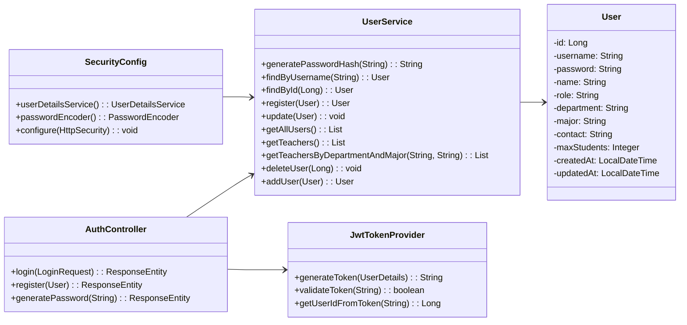
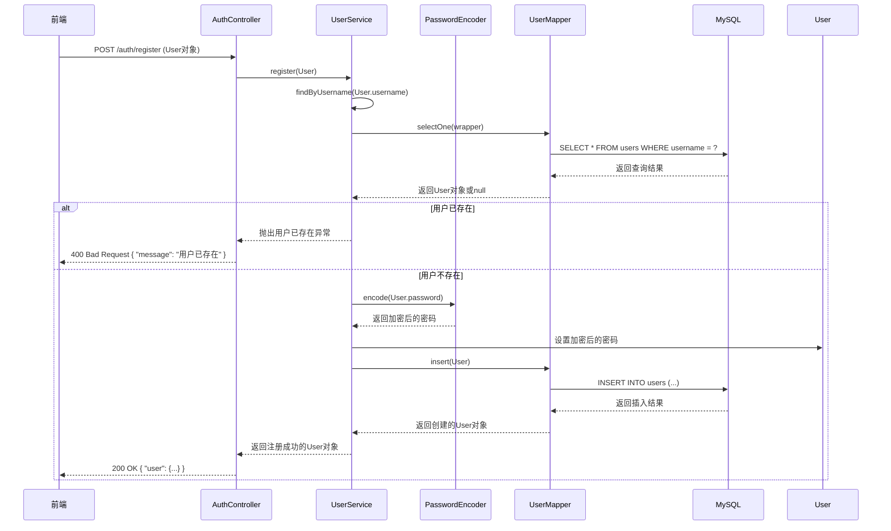
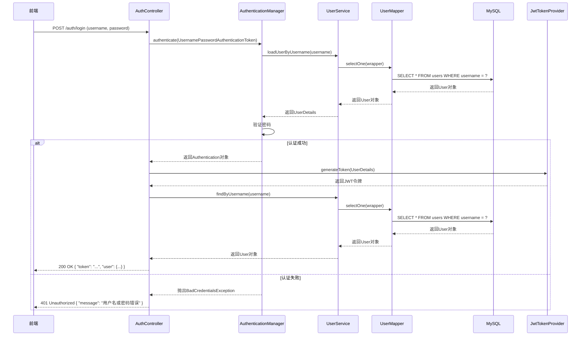

# 用户认证功能详细设计

## 1. 功能概述

用户认证功能是系统的基础功能，包括用户注册、登录、权限管理等。系统采用JWT令牌进行身份认证，确保用户信息的安全性。

## 2. 类图设计

### 2.1 用户认证功能类图



## 3. 时序图设计

### 3.1 用户注册时序图

用户注册模块赋予了用户创建新账户的权力。用户在前端填写注册信息（用户名、密码、姓名、角色等）后，提交到系统，系统检查用户名是否已存在，如果不存在则创建新用户并保存到数据库。用户信息存储完成后，数据库自动进行更新。

用户注册中的用户注册时序图如图所示，用户发起请求后，AuthController接收并调用UserService的register方法处理业务逻辑，服务层调用UserService的findByUsername方法检查用户是否存在，然后调用UserMapper的selectOne方法查询数据库，数据库返回查询结果后，服务层根据结果进行处理：如果用户已存在则抛出异常；如果用户不存在，则调用PasswordEncoder的encode方法对密码进行加密，然后设置到User对象中，接着调用UserMapper的insert方法，由数据访问层生成并执行INSERT语句操作MySQL数据库，插入成功后，数据库返回结果，服务层逐层传递状态，最终返回注册成功的响应。



### 3.2 用户登录时序图

用户登录模块赋予了用户访问系统的权力。用户在前端输入用户名和密码后，提交到系统，系统进行身份认证，验证用户名和密码是否正确。如果验证成功，则生成JWT令牌并返回用户信息；如果验证失败，则返回错误信息。

用户登录中的用户登录时序图如图所示，用户发起请求后，AuthController接收并调用AuthenticationManager的authenticate方法处理业务逻辑，AuthenticationManager调用UserService的loadUserByUsername方法获取用户信息，服务层调用UserMapper的selectOne方法，由数据访问层生成并执行SELECT语句操作MySQL数据库，数据库返回用户信息后，UserMapper返回User对象，UserService返回UserDetails给AuthenticationManager，AuthenticationManager验证密码是否正确：如果认证失败，则抛出BadCredentialsException，AuthController返回401 Unauthorized错误；如果认证成功，AuthenticationManager返回Authentication对象，AuthController调用JwtTokenProvider的generateToken方法生成JWT令牌，JwtTokenProvider返回令牌后，AuthController再调用UserService的findByUsername方法获取完整用户信息，UserService调用UserMapper的selectOne方法查询数据库，数据库返回用户信息后，UserMapper返回User对象，UserService返回User对象给AuthController，AuthController最终返回包含token和user的200 OK响应。



## 4. 技术实现

### 4.1 关键代码实现

#### 4.1.1 AuthController.java

```java
@RestController
@RequestMapping("/auth")
public class AuthController {
    
    @Autowired
    private AuthenticationManager authenticationManager;
    
    @Autowired
    private UserService userService;
    
    @Autowired
    private JwtTokenProvider jwtTokenProvider;
    
    @PostMapping("/login")
    public ResponseEntity<?> login(@RequestBody LoginRequest loginRequest) {
        try {
            Authentication authentication = authenticationManager.authenticate(
                new UsernamePasswordAuthenticationToken(loginRequest.getUsername(), loginRequest.getPassword())
            );
            
            SecurityContextHolder.getContext().setAuthentication(authentication);
            UserDetails userDetails = (UserDetails) authentication.getPrincipal();
            String token = jwtTokenProvider.generateToken(userDetails);
            
            User user = userService.findByUsername(loginRequest.getUsername());
            Map<String, Object> response = new HashMap<>();
            response.put("token", token);
            response.put("user", user);
            
            return ResponseEntity.ok(response);
        } catch (BadCredentialsException e) {
            return ResponseEntity.status(HttpStatus.UNAUTHORIZED).body("用户名或密码错误");
        }
    }
    
    @PostMapping("/register")
    public ResponseEntity<?> register(@RequestBody User user) {
        try {
            User existingUser = userService.findByUsername(user.getUsername());
            if (existingUser != null) {
                return ResponseEntity.status(HttpStatus.BAD_REQUEST).body("用户已存在");
            }
            
            User registeredUser = userService.register(user);
            return ResponseEntity.ok(registeredUser);
        } catch (Exception e) {
            return ResponseEntity.status(HttpStatus.INTERNAL_SERVER_ERROR).body("注册失败: " + e.getMessage());
        }
    }
    
    @PostMapping("/generate-password")
    public ResponseEntity<?> generatePassword(@RequestParam String password) {
        String hashedPassword = userService.generatePasswordHash(password);
        return ResponseEntity.ok(hashedPassword);
    }
}
```

#### 4.1.2 UserService.java

```java
@Service
public class UserService {
    
    @Autowired
    private UserMapper userMapper;
    
    @Autowired
    private PasswordEncoder passwordEncoder;
    
    public String generatePasswordHash(String password) {
        return passwordEncoder.encode(password);
    }
    
    public User findByUsername(String username) {
        LambdaQueryWrapper<User> wrapper = new LambdaQueryWrapper<>();
        wrapper.eq(User::getUsername, username);
        return userMapper.selectOne(wrapper);
    }
    
    public User findById(Long id) {
        return userMapper.selectById(id);
    }
    
    public User register(User user) {
        user.setPassword(generatePasswordHash(user.getPassword()));
        user.setCreatedAt(LocalDateTime.now());
        user.setUpdatedAt(LocalDateTime.now());
        userMapper.insert(user);
        return user;
    }
    
    public void update(User user) {
        user.setUpdatedAt(LocalDateTime.now());
        userMapper.updateById(user);
    }
    
    public List<User> getAllUsers() {
        return userMapper.selectList(null);
    }
    
    public List<User> getTeachers() {
        LambdaQueryWrapper<User> wrapper = new LambdaQueryWrapper<>();
        wrapper.eq(User::getRole, "teacher");
        return userMapper.selectList(wrapper);
    }
    
    public List<User> getTeachersByDepartmentAndMajor(String department, String major) {
        LambdaQueryWrapper<User> wrapper = new LambdaQueryWrapper<>();
        wrapper.eq(User::getRole, "teacher");
        if (department != null) {
            wrapper.eq(User::getDepartment, department);
        }
        if (major != null) {
            wrapper.eq(User::getMajor, major);
        }
        return userMapper.selectList(wrapper);
    }
    
    public void deleteUser(Long id) {
        userMapper.deleteById(id);
    }
    
    public User addUser(User user) {
        user.setPassword(generatePasswordHash(user.getPassword()));
        user.setCreatedAt(LocalDateTime.now());
        user.setUpdatedAt(LocalDateTime.now());
        userMapper.insert(user);
        return user;
    }
}
```

#### 4.1.3 JwtTokenProvider.java

```java
@Component
public class JwtTokenProvider {
    
    @Value("${jwt.secret}")
    private String jwtSecret;
    
    @Value("${jwt.expiration}")
    private int jwtExpirationInMs;
    
    public String generateToken(UserDetails userDetails) {
        Date now = new Date();
        Date expiryDate = new Date(now.getTime() + jwtExpirationInMs);
        
        return Jwts.builder()
            .setSubject(userDetails.getUsername())
            .setIssuedAt(now)
            .setExpiration(expiryDate)
            .signWith(SignatureAlgorithm.HS512, jwtSecret)
            .compact();
    }
    
    public boolean validateToken(String token) {
        try {
            Jwts.parser().setSigningKey(jwtSecret).parseClaimsJws(token);
            return true;
        } catch (SignatureException | MalformedJwtException | UnsupportedJwtException | IllegalArgumentException e) {
            return false;
        } catch (ExpiredJwtException e) {
            return false;
        }
    }
    
    public Long getUserIdFromToken(String token) {
        Claims claims = Jwts.parser()
            .setSigningKey(jwtSecret)
            .parseClaimsJws(token)
            .getBody();
        
        return Long.parseLong(claims.getSubject());
    }
}
```

## 5. 流程说明

### 5.1 用户注册流程

1. 用户在前端填写注册信息（用户名、密码、姓名、角色等）
2. 前端调用 `/auth/register` 接口，发送POST请求
3. AuthController接收请求，调用UserService.register()方法
4. UserService检查用户是否已存在
5. 如果用户已存在，返回错误信息
6. 如果用户不存在，加密密码，设置创建时间和更新时间
7. 调用UserMapper.insert()方法保存用户信息到数据库
8. 返回注册成功的用户信息

### 5.2 用户登录流程

1. 用户在前端输入用户名和密码
2. 前端调用 `/auth/login` 接口，发送POST请求
3. AuthController接收请求，调用AuthenticationManager.authenticate()方法
4. AuthenticationManager调用UserService.loadUserByUsername()方法获取用户信息
5. 验证密码是否正确
6. 如果验证失败，返回401错误
7. 如果验证成功，生成JWT令牌
8. 获取用户详细信息
9. 返回令牌和用户信息

### 5.3 权限管理流程

1. 用户登录成功后，前端存储JWT令牌
2. 后续请求时，前端在请求头中携带JWT令牌
3. JwtAuthenticationFilter拦截请求，验证令牌
4. 如果令牌有效，从令牌中获取用户信息，设置到SecurityContext
5. SecurityConfig根据用户角色控制访问权限
6. 如果令牌无效或权限不足，返回401或403错误

## 6. 安全性考虑

1. **密码安全**：使用BCrypt加密存储密码，防止密码泄露
2. **令牌安全**：使用JWT令牌进行身份认证，设置合理的过期时间
3. **权限控制**：基于角色的访问控制，确保用户只能访问授权的资源
4. **输入验证**：对用户输入进行验证，防止注入攻击
5. **HTTPS传输**：使用HTTPS协议传输数据，防止数据被窃取

## 7. 总结

用户认证功能是系统的基础功能，通过JWT令牌实现了安全的身份认证机制。系统支持用户注册、登录和权限管理，确保了用户信息的安全性和系统的访问控制。

通过详细的类图和时序图设计，清晰地展示了用户认证功能的实现细节和流程，为系统的开发和维护提供了参考。