# 毕业论文管理系统 - 系统架构图和ER图

## 一、系统分层架构图（参考今津有味风格）

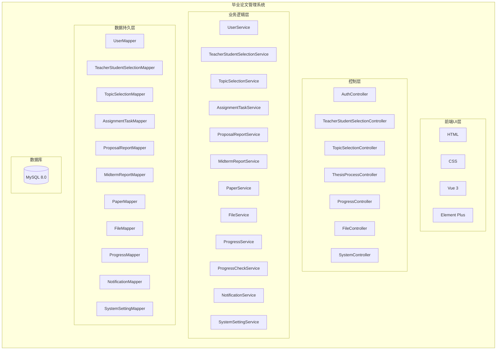

---

## 二、系统功能模块图（参考今津有味风格）

```mermaid
graph TB
    subgraph "毕业论文管理系统"
        direction TB
        
        A[学生]
        B[教师]
        C[管理员]
        
        A1[注册登录]
        A2[选择导师]
        A3[提交选题]
        A4[提交开题报告]
        A5[提交中期检查]
        A6[提交论文]
        A7[查看进度]
        A8[上传文件]
        
        B1[注册登录]
        B2[审核学生申请]
        B3[审核选题]
        B4[上传任务书]
        B5[审核开题报告]
        B6[审核中期检查]
        B7[审核论文]
        B8[查看学生进度]
        B9[下载文件]
        
        C1[用户登录]
        C2[用户管理]
        C3[系统配置]
        C4[发布通知]
        C5[数据统计]
        
        A11[用户注册]
        A12[用户登录]
        
        A21[查看导师列表]
        A22[提交导师申请]
        A23[查看申请状态]
        
        A31[填写选题信息]
        A32[上传选题文件]
        A33[查看审核结果]
        
        A41[下载任务书]
        A42[撰写开题报告]
        A43[上传开题报告]
        
        A51[撰写中期检查]
        A52[上传中期检查]
        
        A61[撰写论文]
        A62[上传论文]
        
        A71[查看论文进度]
        A72[查看各阶段状态]
        
        A81[选择文件]
        A82[上传文件]
        
        B11[用户注册]
        B12[用户登录]
        
        B21[查看学生申请]
        B22[接受学生申请]
        B23[拒绝学生申请]
        
        B31[下载选题文件]
        B32[填写审核意见]
        B33[通过/不通过]
        
        B41[选择任务书]
        B42[上传任务书]
        
        B51[下载开题报告]
        B52[填写审核意见]
        B53[通过/不通过]
        
        B61[下载中期检查]
        B62[填写审核意见]
        B63[通过/不通过]
        
        B71[下载论文]
        B72[填写审核意见]
        B73[通过/不通过]
        
        B81[查看学生列表]
        B82[查看学生进度]
        
        B91[选择文件]
        B92[下载文件]
        
        C21[查看用户信息]
        C22[新增用户]
        C23[编辑用户]
        C24[删除用户]
        C25[重置用户密码]
        
        C31[设置阶段截止时间]
        C32[系统参数配置]
        
        C41[输入通知标题]
        C42[输入通知内容]
        C43[选择接收角色]
        C44[发布通知]
        
        C51[查看用户统计]
        C52[查看论文统计]
        C53[查看整体进度]
        
        A --> A1
        A --> A2
        A --> A3
        A --> A4
        A --> A5
        A --> A6
        A --> A7
        A --> A8
        
        A1 --> A11
        A1 --> A12
        
        A2 --> A21
        A2 --> A22
        A2 --> A23
        
        A3 --> A31
        A3 --> A32
        A3 --> A33
        
        A4 --> A41
        A4 --> A42
        A4 --> A43
        
        A5 --> A51
        A5 --> A52
        
        A6 --> A61
        A6 --> A62
        
        A7 --> A71
        A7 --> A72
        
        A8 --> A81
        A8 --> A82
        
        B --> B1
        B --> B2
        B --> B3
        B --> B4
        B --> B5
        B --> B6
        B --> B7
        B --> B8
        B --> B9
        
        B1 --> B11
        B1 --> B12
        
        B2 --> B21
        B2 --> B22
        B2 --> B23
        
        B3 --> B31
        B3 --> B32
        B3 --> B33
        
        B4 --> B41
        B4 --> B42
        
        B5 --> B51
        B5 --> B52
        B5 --> B53
        
        B6 --> B61
        B6 --> B62
        B6 --> B63
        
        B7 --> B71
        B7 --> B72
        B7 --> B73
        
        B8 --> B81
        B8 --> B82
        
        B9 --> B91
        B9 --> B92
        
        C --> C1
        C --> C2
        C --> C3
        C --> C4
        C --> C5
        
        C2 --> C21
        C2 --> C22
        C2 --> C23
        C2 --> C24
        C2 --> C25
        
        C3 --> C31
        C3 --> C32
        
        C4 --> C41
        C4 --> C42
        C4 --> C43
        C4 --> C44
        
        C5 --> C51
        C5 --> C52
        C5 --> C53
    end
```

---

## 三、系统架构图（原有版本）

### 3.1 整体系统架构图

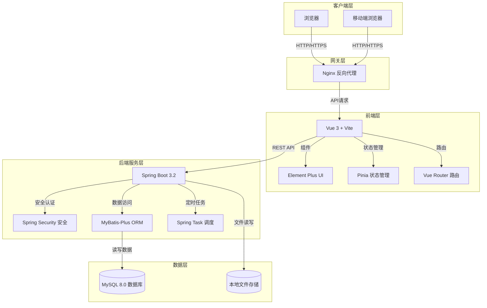

### 3.2 架构说明

| 层次 | 技术栈 | 说明 |
|-----|-------|-----|
| 客户端层 | 浏览器（Chrome、Firefox、Safari） | 用户访问系统的入口，支持PC端和移动端 |
| 前端层 | Vue 3 + Element Plus + Pinia + Vue Router | 单页应用（SPA），负责界面展示和用户交互 |
| 网关层 | Nginx | 反向代理，负责静态资源服务和API请求转发 |
| 后端服务层 | Spring Boot 3.2 + Spring Security + MyBatis-Plus | RESTful API服务，处理业务逻辑 |
| 数据层 | MySQL 8.0 + 本地文件存储 | 存储结构化数据和文件 |

### 3.3 前后端交互流程

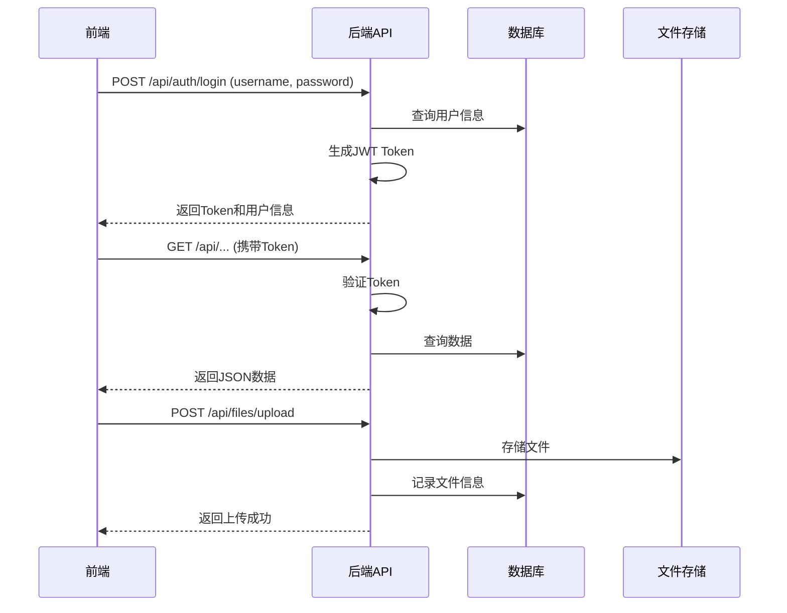

---

## 四、系统功能模块图（原有版本）

### 4.1 整体功能模块图

```mermaid
graph TB
    subgraph "毕业论文管理系统"
        A[用户认证模块]
        B[师生互选模块]
        C[论文管理模块]
        D[文件管理模块]
        E[进度跟踪模块]
        F[系统管理模块]
        G[通知公告模块]
    end
    
    subgraph "学生端功能"
        H[学生注册登录]
        I[选择导师]
        J[提交选题]
        K[提交开题报告]
        L[提交中期检查]
        M[提交论文]
        N[查看进度]
        O[上传文件]
    end
    
    subgraph "教师端功能"
        P[教师注册登录]
        Q[审核学生申请]
        R[审核选题]
        S[上传任务书]
        T[审核开题报告]
        U[审核中期检查]
        V[审核论文]
        W[查看学生进度]
        X[下载文件]
    end
    
    subgraph "管理员端功能"
        Y[管理员登录]
        Z[用户管理]
        AA[系统配置]
        AB[发布通知]
        AC[数据统计]
    end
    
    A --> H
    A --> P
    A --> Y
    B --> I
    B --> Q
    C --> J
    C --> K
    C --> L
    C --> M
    C --> R
    C --> S
    C --> T
    C --> U
    C --> V
    D --> O
    D --> X
    E --> N
    E --> W
    F --> Z
    F --> AA
    G --> AB
    F --> AC
```

### 4.2 学生端功能模块图

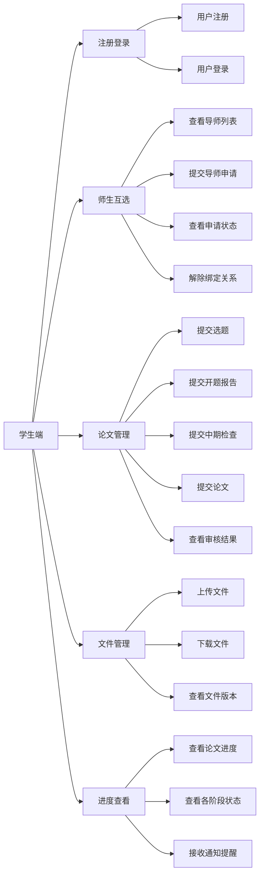

### 4.3 教师端功能模块图

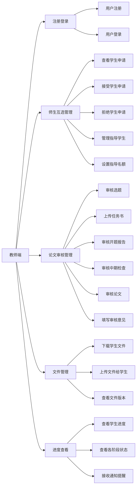

### 4.4 管理员端功能模块图

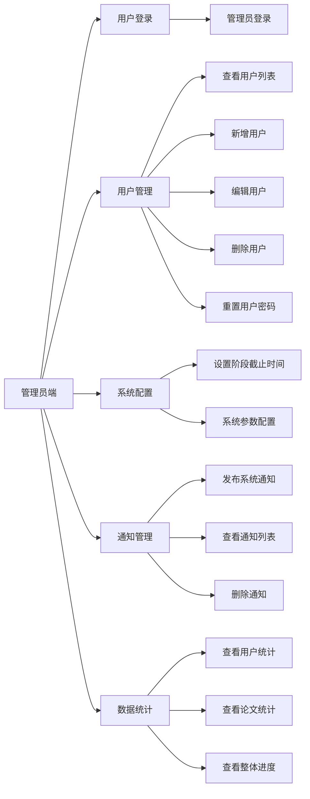

---

## 五、数据库ER图（参考今津有味风格）

```mermaid
graph TB
    subgraph "毕业论文管理系统ER图"
        direction TB
        
        subgraph "用户表"
            A1((用户ID))
            A2((用户名))
            A3((密码))
            A4((姓名))
            A5((角色))
            A6((院系))
            A7((专业))
            A8((联系方式))
            A9((最大指导学生数))
            A10((创建时间))
            A11((更新时间))
            A0(用户)
        end
        
        subgraph "师生互选表"
            B1((互选ID))
            B2((学生ID))
            B3((教师ID))
            B4((状态))
            B5((申请时间))
            B6((审核时间))
            B7((绑定时间))
            B8((解除时间))
            B9((创建时间))
            B10((更新时间))
            B0(师生互选)
        end
        
        subgraph "选题表"
            C1((选题ID))
            C2((学生ID))
            C3((教师ID))
            C4((选题名称))
            C5((选题描述))
            C6((提交时间))
            C7((审核状态))
            C8((审核意见))
            C9((审核时间))
            C10((创建时间))
            C11((更新时间))
            C0(选题)
        end
        
        subgraph "任务书表"
            D1((任务书ID))
            D2((选题ID))
            D3((学生ID))
            D4((教师ID))
            D5((关联文件ID))
            D6((下达时间))
            D7((截止时间))
            D8((创建时间))
            D9((更新时间))
            D0(任务书)
        end
        
        subgraph "开题报告表"
            E1((报告ID))
            E2((选题ID))
            E3((学生ID))
            E4((教师ID))
            E5((关联文件ID))
            E6((提交时间))
            E7((审核状态))
            E8((审核意见))
            E9((审核时间))
            E10((创建时间))
            E11((更新时间))
            E0(开题报告)
        end
        
        subgraph "中期检查表"
            F1((报告ID))
            F2((选题ID))
            F3((学生ID))
            F4((教师ID))
            F5((关联文件ID))
            F6((提交时间))
            F7((审核状态))
            F8((审核意见))
            F9((审核时间))
            F10((创建时间))
            F11((更新时间))
            F0(中期检查)
        end
        
        subgraph "论文表"
            G1((论文ID))
            G2((选题ID))
            G3((学生ID))
            G4((教师ID))
            G5((关联文件ID))
            G6((提交时间))
            G7((审核状态))
            G8((审核意见))
            G9((审核时间))
            G10((成绩))
            G11((创建时间))
            G12((更新时间))
            G0(论文)
        end
        
        subgraph "文件表"
            H1((文件ID))
            H2((关联ID))
            H3((文件名称))
            H4((文件路径))
            H5((上传人ID))
            H6((接收人ID))
            H7((文件类型))
            H8((版本号))
            H9((同步状态))
            H10((上传时间))
            H11((创建时间))
            H12((更新时间))
            H0(文件)
        end
        
        subgraph "进度表"
            I1((进度ID))
            I2((学生ID))
            I3((教师ID))
            I4((选题状态))
            I5((任务书状态))
            I6((开题状态))
            I7((中期状态))
            I8((论文状态))
            I9((更新时间))
            I10((创建时间))
            I0(进度)
        end
        
        subgraph "通知表"
            J1((通知ID))
            J2((标题))
            J3((内容))
            J4((发布人ID))
            J5((接收角色))
            J6((发布时间))
            J7((创建时间))
            J8((更新时间))
            J0(通知)
        end
        
        subgraph "系统设置表"
            K1((设置ID))
            K2((阶段名称))
            K3((开始时间))
            K4((截止时间))
            K5((创建时间))
            K6((更新时间))
            K0(系统设置)
        end
        
        A0 -->|1| B0
        B0 -->|N| A0
        A0 -->|1| C0
        C0 -->|N| A0
        A0 -->|1| D0
        D0 -->|N| A0
        A0 -->|1| E0
        E0 -->|N| A0
        A0 -->|1| F0
        F0 -->|N| A0
        A0 -->|1| G0
        G0 -->|N| A0
        A0 -->|1| H0
        H0 -->|N| A0
        A0 -->|1| I0
        I0 -->|N| A0
        A0 -->|1| J0
        J0 -->|N| A0
        
        C0 -->|1| D0
        D0 -->|N| C0
        C0 -->|1| E0
        E0 -->|N| C0
        C0 -->|1| F0
        F0 -->|N| C0
        C0 -->|1| G0
        G0 -->|N| C0
    end
```

### 5.1 ER图说明

| 实体 | 说明 | 主要属性 |
|-----|------|---------|
| 用户 | 存储学生、教师、管理员信息 | 用户ID、用户名、密码、姓名、角色、院系、专业、联系方式、最大指导学生数、创建时间、更新时间 |
| 师生互选 | 记录师生申请和绑定关系 | 互选ID、学生ID、教师ID、状态、申请时间、审核时间、绑定时间、解除时间、创建时间、更新时间 |
| 选题 | 存储学生提交的论文选题 | 选题ID、学生ID、教师ID、选题名称、选题描述、提交时间、审核状态、审核意见、审核时间、创建时间、更新时间 |
| 任务书 | 存储教师上传的任务书 | 任务书ID、选题ID、学生ID、教师ID、关联文件ID、下达时间、截止时间、创建时间、更新时间 |
| 开题报告 | 存储学生提交的开题报告 | 报告ID、选题ID、学生ID、教师ID、关联文件ID、提交时间、审核状态、审核意见、审核时间、创建时间、更新时间 |
| 中期检查 | 存储学生提交的中期检查 | 报告ID、选题ID、学生ID、教师ID、关联文件ID、提交时间、审核状态、审核意见、审核时间、创建时间、更新时间 |
| 论文 | 存储学生提交的最终论文 | 论文ID、选题ID、学生ID、教师ID、关联文件ID、提交时间、审核状态、审核意见、审核时间、成绩、创建时间、更新时间 |
| 文件 | 存储所有上传的文件信息 | 文件ID、关联ID、文件名称、文件路径、上传人ID、接收人ID、文件类型、版本号、同步状态、上传时间、创建时间、更新时间 |
| 进度 | 记录学生论文各阶段进度 | 进度ID、学生ID、教师ID、选题状态、任务书状态、开题状态、中期状态、论文状态、更新时间、创建时间 |
| 通知 | 存储系统通知信息 | 通知ID、标题、内容、发布人ID、接收角色、发布时间、创建时间、更新时间 |
| 系统设置 | 存储系统配置参数 | 设置ID、阶段名称、开始时间、截止时间、创建时间、更新时间 |

### 5.2 实体关系说明

- **用户 ↔ 师生互选**：1对多关系，一个用户可以有多个师生互选记录
- **用户 ↔ 选题**：1对多关系，一个用户可以有多个选题记录
- **用户 ↔ 任务书**：1对多关系，一个用户可以有多个任务书记录
- **用户 ↔ 开题报告**：1对多关系，一个用户可以有多个开题报告记录
- **用户 ↔ 中期检查**：1对多关系，一个用户可以有多个中期检查记录
- **用户 ↔ 论文**：1对多关系，一个用户可以有多个论文记录
- **用户 ↔ 文件**：1对多关系，一个用户可以上传或接收多个文件
- **用户 ↔ 进度**：1对1关系，一个学生对应一条进度记录
- **用户 ↔ 通知**：1对多关系，一个用户可以发布多个通知
- **选题 ↔ 任务书**：1对多关系，一个选题可以对应多个任务书
- **选题 ↔ 开题报告**：1对多关系，一个选题可以对应多个开题报告
- **选题 ↔ 中期检查**：1对多关系，一个选题可以对应多个中期检查
- **选题 ↔ 论文**：1对多关系，一个选题可以对应多个论文

---

## 六、数据库ER图（原有版本）

### 6.1 整体ER图

```mermaid
erDiagram
    users ||--o{ teacher_student_selection : "学生申请"
    users ||--o{ teacher_student_selection : "导师审核"
    users ||--o{ topic_selections : "学生提交"
    users ||--o{ topic_selections : "导师审核"
    users ||--o{ assignment_tasks : "学生接收"
    users ||--o{ assignment_tasks : "导师上传"
    users ||--o{ proposal_reports : "学生提交"
    users ||--o{ proposal_reports : "导师审核"
    users ||--o{ midterm_reports : "学生提交"
    users ||--o{ midterm_reports : "导师审核"
    users ||--o{ papers : "学生提交"
    users ||--o{ papers : "导师审核"
    users ||--o{ files : "上传文件"
    users ||--o{ files : "接收文件"
    users ||--o{ progress : "学生进度"
    users ||--o{ progress : "导师指导"
    users ||--o{ notifications : "发布通知"
    
    topic_selections ||--o{ assignment_tasks : "关联"
    topic_selections ||--o{ proposal_reports : "关联"
    topic_selections ||--o{ midterm_reports : "关联"
    topic_selections ||--o{ papers : "关联"
    
    users {
        bigint user_id PK "用户ID"
        varchar username UK "用户名"
        varchar password "密码"
        varchar name "姓名"
        varchar role "角色"
        varchar department "院系"
        varchar major "专业"
        varchar contact "联系方式"
        int max_students "最大指导学生数"
        datetime created_at "创建时间"
        datetime updated_at "更新时间"
    }
    
    teacher_student_selection {
        bigint selection_id PK "互选ID"
        bigint student_id FK "学生ID"
        bigint teacher_id FK "教师ID"
        varchar status "状态"
        datetime apply_time "申请时间"
        datetime review_time "审核时间"
        datetime bind_time "绑定时间"
        datetime unbind_time "解除时间"
        datetime created_at "创建时间"
        datetime updated_at "更新时间"
    }
    
    topic_selections {
        bigint topic_id PK "选题ID"
        bigint student_id FK "学生ID"
        bigint teacher_id FK "教师ID"
        varchar topic_name "选题名称"
        text topic_description "选题描述"
        datetime submit_time "提交时间"
        varchar review_status "审核状态"
        text review_opinion "审核意见"
        datetime review_time "审核时间"
        datetime created_at "创建时间"
        datetime updated_at "更新时间"
    }
    
    assignment_tasks {
        bigint task_id PK "任务书ID"
        bigint topic_id FK "选题ID"
        bigint student_id FK "学生ID"
        bigint teacher_id FK "教师ID"
        bigint file_id FK "关联文件ID"
        datetime issue_time "下达时间"
        datetime deadline "截止时间"
        datetime created_at "创建时间"
        datetime updated_at "更新时间"
    }
    
    proposal_reports {
        bigint report_id PK "报告ID"
        bigint topic_id FK "选题ID"
        bigint student_id FK "学生ID"
        bigint teacher_id FK "教师ID"
        bigint file_id FK "关联文件ID"
        datetime submit_time "提交时间"
        varchar review_status "审核状态"
        text review_opinion "审核意见"
        datetime review_time "审核时间"
        datetime created_at "创建时间"
        datetime updated_at "更新时间"
    }
    
    midterm_reports {
        bigint report_id PK "报告ID"
        bigint topic_id FK "选题ID"
        bigint student_id FK "学生ID"
        bigint teacher_id FK "教师ID"
        bigint file_id FK "关联文件ID"
        datetime submit_time "提交时间"
        varchar review_status "审核状态"
        text review_opinion "审核意见"
        datetime review_time "审核时间"
        datetime created_at "创建时间"
        datetime updated_at "更新时间"
    }
    
    papers {
        bigint paper_id PK "论文ID"
        bigint topic_id FK "选题ID"
        bigint student_id FK "学生ID"
        bigint teacher_id FK "教师ID"
        bigint file_id FK "关联文件ID"
        datetime submit_time "提交时间"
        varchar review_status "审核状态"
        text review_opinion "审核意见"
        datetime review_time "审核时间"
        int score "成绩"
        datetime created_at "创建时间"
        datetime updated_at "更新时间"
    }
    
    files {
        bigint file_id PK "文件ID"
        bigint related_id "关联ID"
        varchar file_name "文件名称"
        varchar file_path "文件路径"
        bigint uploader_id FK "上传人ID"
        bigint receiver_id FK "接收人ID"
        varchar file_type "文件类型"
        int version "版本号"
        varchar sync_status "同步状态"
        datetime upload_time "上传时间"
        datetime created_at "创建时间"
        datetime updated_at "更新时间"
    }
    
    progress {
        bigint progress_id PK "进度ID"
        bigint student_id UK FK "学生ID"
        bigint teacher_id FK "教师ID"
        varchar topic_status "选题状态"
        varchar task_status "任务书状态"
        varchar proposal_status "开题状态"
        varchar midterm_status "中期检查状态"
        varchar paper_status "论文状态"
        datetime updated_time "更新时间"
        datetime created_at "创建时间"
    }
    
    notifications {
        bigint notification_id PK "通知ID"
        varchar title "标题"
        text content "内容"
        bigint publisher_id FK "发布人ID"
        varchar receive_role "接收角色"
        datetime publish_time "发布时间"
        datetime created_at "创建时间"
        datetime updated_at "更新时间"
    }
    
    system_settings {
        bigint setting_id PK "设置ID"
        varchar stage_name UK "阶段名称"
        datetime start_time "开始时间"
        datetime end_time "截止时间"
        datetime created_at "创建时间"
        datetime updated_at "更新时间"
    }
    
    roles_permissions {
        bigint role_id PK "角色ID"
        varchar role_name UK "角色名称"
        json permissions "权限列表"
    }
```

### 6.2 用户与师生互选关系ER图

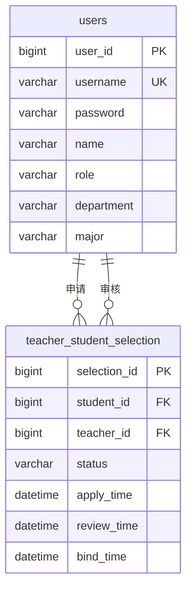

### 6.3 论文管理相关ER图

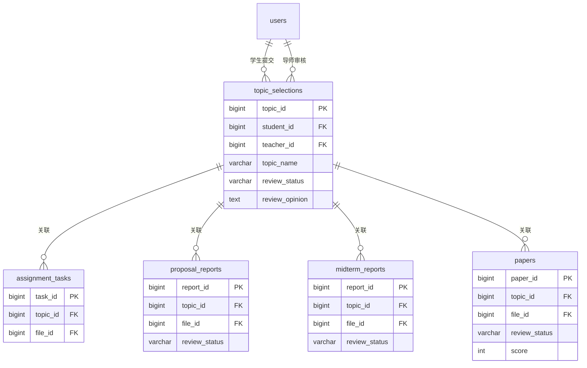

### 6.4 文件管理ER图

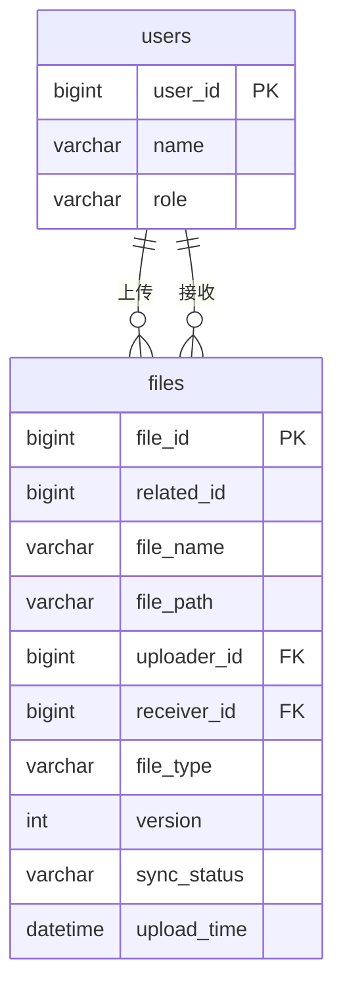

---

## 七、ER图说明

### 7.1 实体说明

| 实体名 | 表名 | 说明 |
|-------|-----|------|
| 用户 | users | 存储系统所有用户信息（学生、教师、管理员） |
| 师生互选 | teacher_student_selection | 存储师生互选申请和绑定关系 |
| 选题 | topic_selections | 存储学生提交的论文选题信息 |
| 任务书 | assignment_tasks | 存储教师上传的任务书信息 |
| 开题报告 | proposal_reports | 存储学生提交的开题报告信息 |
| 中期检查 | midterm_reports | 存储学生提交的中期检查信息 |
| 论文 | papers | 存储学生提交的论文信息 |
| 文件 | files | 存储所有上传的文件信息 |
| 进度 | progress | 存储学生论文各阶段进度 |
| 通知 | notifications | 存储系统通知信息 |
| 系统设置 | system_settings | 存储系统各阶段截止时间等配置 |
| 角色权限 | roles_permissions | 存储角色和权限信息 |

### 7.2 关系说明

| 关系类型 | 说明 | 示例 |
|---------|------|------|
| 1:N | 一对多关系 | 一个用户可以有多个师生互选记录 |
| N:1 | 多对一关系 | 多个选题属于一个学生 |
| 1:1 | 一对一关系 | 一个学生对应一条进度记录 |

### 7.3 主键和外键说明

| 表名 | 主键 | 外键 | 说明 |
|-----|-----|-----|------|
| users | user_id | - | 用户ID自增 |
| teacher_student_selection | selection_id | student_id, teacher_id | 关联学生和教师 |
| topic_selections | topic_id | student_id, teacher_id | 关联学生和教师 |
| assignment_tasks | task_id | topic_id, student_id, teacher_id | 关联选题、学生、教师 |
| proposal_reports | report_id | topic_id, student_id, teacher_id | 关联选题、学生、教师 |
| midterm_reports | report_id | topic_id, student_id, teacher_id | 关联选题、学生、教师 |
| papers | paper_id | topic_id, student_id, teacher_id | 关联选题、学生、教师 |
| files | file_id | uploader_id, receiver_id | 关联上传人和接收人 |
| progress | progress_id | student_id, teacher_id | 关联学生和教师 |
| notifications | notification_id | publisher_id | 关联发布人 |

---

## 八、总结

本文档详细描述了毕业论文管理系统的系统架构图、功能模块图和数据库ER图，包括：

1. **系统分层架构图（参考今津有味风格）**：展示前端UI层、控制层、业务逻辑层、数据持久层、数据库的分层架构
2. **系统功能模块图（参考今津有味风格）**：展示学生、教师、管理员三个角色及其子功能的树形结构
3. **系统架构图（原有版本）**：展示前后端分离架构，包括客户端层、前端层、网关层、后端服务层和数据层
4. **系统功能模块图（原有版本）**：展示整体功能模块划分，以及学生端、教师端、管理员端的详细功能模块
5. **数据库ER图（参考今津有味风格）**：使用直观的graph TB语法绘制11个核心实体，每个实体包含属性椭圆，实体间用箭头表示关系
6. **数据库ER图（原有版本）**：使用标准erDiagram语法，展示12个核心数据表及其实体关系，包括整体ER图和各子模块ER图
7. **ER图说明**：详细说明每个实体、关系、主键和外键

所有图表均使用 Mermaid 语法绘制，兼容 Markdown 文档，便于查看和维护。
