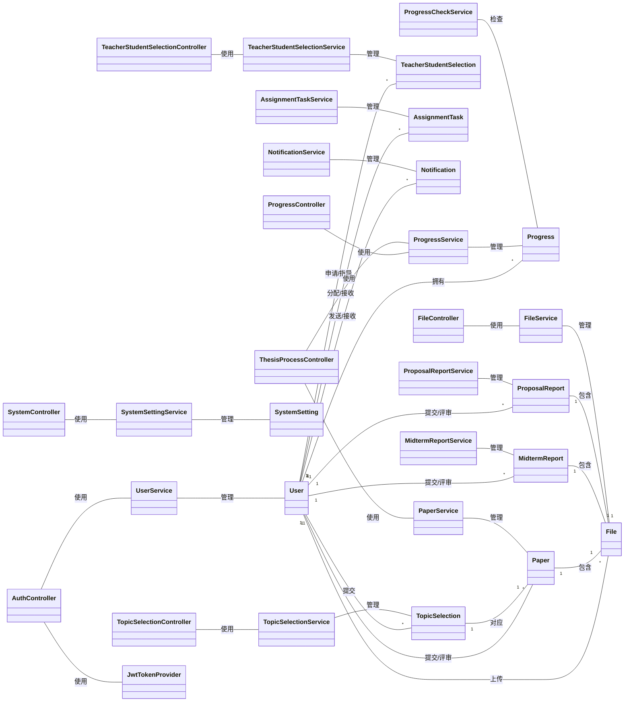

# 系统概念类设计文档

## 1. 系统概述

本系统是一个毕业设计管理系统，用于管理学生的毕业设计全过程，包括选题、师生匹配、进度跟踪、论文提交与评审等功能。系统采用分层架构，包括控制层、服务层、数据访问层和实体层，实现了完整的业务流程管理。

## 2. 核心实体类

### 2.1 User（用户）

**职责**：存储系统用户信息，包括学生、教师和管理员。

**属性**：
- id: Long - 用户ID
- username: String - 用户名
- password: String - 密码（加密存储）
- name: String - 真实姓名
- role: String - 角色（student/teacher/admin）
- department: String - 部门
- major: String - 专业
- contact: String - 联系方式
- maxStudents: Integer - 教师最大指导学生数
- createdAt: LocalDateTime - 创建时间
- updatedAt: LocalDateTime - 更新时间

**关系**：
- 与TopicSelection：一对多（一个学生可以提交多个选题）
- 与TeacherStudentSelection：一对多（一个学生可以申请多个教师，一个教师可以被多个学生申请）
- 与Progress：一对多（一个学生有多个进度记录）
- 与Paper：一对多（一个学生提交一篇论文，一个教师评审多篇论文）

### 2.2 TopicSelection（选题）

**职责**：管理学生的选题信息，包括选题名称、描述、评审状态等。

**属性**：
- topicId: Long - 选题ID
- studentId: Long - 学生ID
- teacherId: Long - 教师ID
- topicName: String - 选题名称
- topicDescription: String - 选题描述
- reviewStatus: String - 评审状态（PENDING/APPROVED/REJECTED）
- reviewOpinion: String - 评审意见
- submitTime: Date - 提交时间
- reviewTime: Date - 评审时间
- createdAt: Date - 创建时间
- updatedAt: Date - 更新时间

**关系**：
- 与User：多对一（多个选题属于一个学生和一个教师）
- 与Paper：一对一（一个选题对应一篇论文）

### 2.3 TeacherStudentSelection（师生选择）

**职责**：管理学生与教师之间的双向选择过程，包括申请、审批、绑定等状态。

**属性**：
- id: Long - 选择ID
- studentId: Long - 学生ID
- teacherId: Long - 教师ID
- status: String - 状态（申请中/已批准/已绑定/已解绑）
- applyTime: LocalDateTime - 申请时间
- reviewTime: LocalDateTime - 评审时间
- bindTime: LocalDateTime - 绑定时间
- unbindTime: LocalDateTime - 解绑时间
- createdAt: LocalDateTime - 创建时间
- updatedAt: LocalDateTime - 更新时间

**关系**：
- 与User：多对一（多个选择记录属于一个学生和一个教师）

### 2.4 Progress（进度）

**职责**：跟踪学生毕业设计的各个阶段进度。

**属性**：
- id: Long - 进度ID
- studentId: Long - 学生ID
- stage: String - 阶段（开题/中期/结题）
- status: String - 状态（未提交/已提交/已通过/未通过）
- createdAt: LocalDateTime - 创建时间
- updatedAt: LocalDateTime - 更新时间

**关系**：
- 与User：多对一（多个进度记录属于一个学生）

### 2.5 Paper（论文）

**职责**：管理学生的论文提交与评审信息。

**属性**：
- id: Long - 论文ID
- topicId: Long - 选题ID
- studentId: Long - 学生ID
- teacherId: Long - 教师ID
- fileId: Long - 文件ID
- submitTime: LocalDateTime - 提交时间
- reviewStatus: String - 评审状态
- reviewOpinion: String - 评审意见
- reviewTime: LocalDateTime - 评审时间
- score: Integer - 分数
- createdAt: LocalDateTime - 创建时间
- updatedAt: LocalDateTime - 更新时间
- paperTitle: String - 论文标题（非数据库字段）
- paperAbstract: String - 论文摘要（非数据库字段）
- status: String - 状态（非数据库字段）
- teacherComment: String - 教师评语（非数据库字段）

**关系**：
- 与User：多对一（多篇论文属于一个学生和一个教师）
- 与TopicSelection：一对一（一篇论文对应一个选题）
- 与File：一对一（一篇论文对应一个文件）

### 2.6 File（文件）

**职责**：存储系统中的文件信息，如论文、报告等。

**属性**：
- id: Long - 文件ID
- filename: String - 文件名
- filepath: String - 文件路径
- filetype: String - 文件类型
- filesize: Long - 文件大小
- uploaderId: Long - 上传者ID
- uploadTime: LocalDateTime - 上传时间
- createdAt: LocalDateTime - 创建时间
- updatedAt: LocalDateTime - 更新时间

**关系**：
- 与User：多对一（多个文件属于一个上传者）
- 与Paper：一对多（一个文件可以对应多篇论文）

### 2.7 AssignmentTask（任务分配）

**职责**：管理教师分配给学生的任务。

**属性**：
- id: Long - 任务ID
- teacherId: Long - 教师ID
- studentId: Long - 学生ID
- taskContent: String - 任务内容
- deadline: LocalDateTime - 截止时间
- status: String - 状态
- submitContent: String - 提交内容
- submitTime: LocalDateTime - 提交时间
- createdAt: LocalDateTime - 创建时间
- updatedAt: LocalDateTime - 更新时间

**关系**：
- 与User：多对一（多个任务属于一个教师和一个学生）

### 2.8 MidtermReport（中期报告）

**职责**：管理学生的中期报告信息。

**属性**：
- id: Long - 报告ID
- studentId: Long - 学生ID
- teacherId: Long - 教师ID
- content: String - 报告内容
- fileId: Long - 文件ID
- submitTime: LocalDateTime - 提交时间
- reviewStatus: String - 评审状态
- reviewOpinion: String - 评审意见
- reviewTime: LocalDateTime - 评审时间
- createdAt: LocalDateTime - 创建时间
- updatedAt: LocalDateTime - 更新时间

**关系**：
- 与User：多对一（多个中期报告属于一个学生和一个教师）
- 与File：一对一（一个中期报告对应一个文件）

### 2.9 Notification（通知）

**职责**：管理系统通知信息。

**属性**：
- id: Long - 通知ID
- title: String - 标题
- content: String - 内容
- type: String - 类型
- recipientId: Long - 接收者ID
- senderId: Long - 发送者ID
- sendTime: LocalDateTime - 发送时间
- readStatus: String - 阅读状态
- createdAt: LocalDateTime - 创建时间
- updatedAt: LocalDateTime - 更新时间

**关系**：
- 与User：多对一（多个通知属于一个接收者和一个发送者）

### 2.10 ProposalReport（开题报告）

**职责**：管理学生的开题报告信息。

**属性**：
- id: Long - 报告ID
- studentId: Long - 学生ID
- teacherId: Long - 教师ID
- content: String - 报告内容
- fileId: Long - 文件ID
- submitTime: LocalDateTime - 提交时间
- reviewStatus: String - 评审状态
- reviewOpinion: String - 评审意见
- reviewTime: LocalDateTime - 评审时间
- createdAt: LocalDateTime - 创建时间
- updatedAt: LocalDateTime - 更新时间

**关系**：
- 与User：多对一（多个开题报告属于一个学生和一个教师）
- 与File：一对一（一个开题报告对应一个文件）

### 2.11 SystemSetting（系统设置）

**职责**：存储系统的全局设置信息。

**属性**：
- id: Long - 设置ID
- settingKey: String - 设置键
- settingValue: String - 设置值
- description: String - 描述
- createdAt: LocalDateTime - 创建时间
- updatedAt: LocalDateTime - 更新时间

## 3. 服务类

### 3.1 UserService

**职责**：处理用户相关的业务逻辑，如用户注册、登录验证、用户信息管理等。

**方法**：
- generatePasswordHash(String password): String - 生成密码哈希
- findByUsername(String username): User - 根据用户名查找用户
- findById(Long id): User - 根据ID查找用户
- register(User user): User - 注册新用户
- update(User user): void - 更新用户信息
- getAllUsers(): List<User> - 获取所有用户
- getTeachers(): List<User> - 获取所有教师
- getTeachersByDepartmentAndMajor(String department, String major): List<User> - 根据部门和专业获取教师
- deleteUser(Long id): void - 删除用户
- addUser(User user): User - 添加用户

### 3.2 TopicSelectionService

**职责**：处理选题相关的业务逻辑，如选题提交、评审等。

### 3.3 TeacherStudentSelectionService

**职责**：处理师生匹配相关的业务逻辑，如学生申请教师、教师审批等。

### 3.4 ProgressService

**职责**：处理进度相关的业务逻辑，如进度更新、查询等。

### 3.5 ProgressCheckService

**职责**：处理进度检查相关的业务逻辑。

### 3.6 PaperService

**职责**：处理论文相关的业务逻辑，如论文提交、评审、评分等。

### 3.7 FileService

**职责**：处理文件相关的业务逻辑，如文件上传、下载、管理等。

### 3.8 AssignmentTaskService

**职责**：处理任务分配相关的业务逻辑，如任务创建、提交、审批等。

### 3.9 MidtermReportService

**职责**：处理中期报告相关的业务逻辑，如报告提交、评审等。

### 3.10 NotificationService

**职责**：处理通知相关的业务逻辑，如通知发送、查询等。

### 3.11 ProposalReportService

**职责**：处理开题报告相关的业务逻辑，如报告提交、评审等。

### 3.12 SystemSettingService

**职责**：处理系统设置相关的业务逻辑，如设置修改、查询等。

## 4. 控制器类

### 4.1 AuthController

**职责**：处理认证相关的HTTP请求，如登录、注册等。

**方法**：
- login(@RequestBody LoginRequest loginRequest): ResponseEntity<?> - 处理登录请求
- register(@RequestBody User user): ResponseEntity<?> - 处理注册请求
- generatePassword(@RequestBody PasswordRequest passwordRequest): ResponseEntity<?> - 生成密码哈希

### 4.2 TopicSelectionController

**职责**：处理选题相关的HTTP请求，如选题提交、查询、评审等。

### 4.3 TeacherStudentSelectionController

**职责**：处理师生匹配相关的HTTP请求，如学生申请教师、教师审批等。

### 4.4 ProgressController

**职责**：处理进度相关的HTTP请求，如进度更新、查询等。

### 4.5 ThesisProcessController

**职责**：处理毕业设计流程相关的HTTP请求，如流程状态查询、操作等。

### 4.6 FileController

**职责**：处理文件相关的HTTP请求，如文件上传、下载等。

### 4.7 SystemController

**职责**：处理系统相关的HTTP请求，如系统设置管理等。

## 5. 工具类

### 5.1 JwtTokenProvider

**职责**：处理JWT令牌的生成和验证。

**方法**：
- generateToken(UserDetails userDetails): String - 生成JWT令牌
- validateToken(String token): boolean - 验证JWT令牌
- getUsernameFromToken(String token): String - 从令牌中获取用户名

## 6. 类关系图

## 7. 业务流程

### 7.1 用户登录流程

1. 用户输入用户名和密码
2. AuthController接收登录请求
3. 调用UserService验证用户信息
4. 生成JWT令牌
5. 返回用户信息和令牌

### 7.2 选题流程

1. 学生提交选题申请
2. TopicSelectionController接收请求
3. 调用TopicSelectionService处理选题逻辑
4. 保存选题信息到数据库
5. 通知教师进行评审

### 7.3 师生匹配流程

1. 学生选择教师并提交申请
2. TeacherStudentSelectionController接收请求
3. 调用TeacherStudentSelectionService处理申请逻辑
4. 教师审核申请
5. 系统更新师生关系状态

### 7.4 论文提交与评审流程

1. 学生上传论文
2. FileController接收文件并保存
3. PaperController接收论文提交请求
4. 调用PaperService处理论文逻辑
5. 教师评审论文
6. 系统更新论文状态和分数

## 8. 设计原则

1. **分层架构**：系统采用控制层、服务层、数据访问层和实体层的分层架构，实现了关注点分离和代码复用。

2. **单一职责**：每个类只负责一项具体的业务功能，如UserService只处理用户相关的业务逻辑。

3. **依赖注入**：使用Spring的依赖注入机制，减少了类之间的耦合，提高了系统的可测试性和可维护性。

4. **缓存机制**：对常用的查询结果进行缓存，如用户信息，提高了系统的响应速度。

5. **安全性**：使用密码哈希存储用户密码，使用JWT进行身份验证，确保系统的安全性。

6. **事务管理**：对关键业务操作进行事务管理，确保数据的一致性和完整性。

## 9. 总结

本系统的概念类设计涵盖了毕业设计管理的全过程，包括用户管理、选题管理、师生匹配、进度跟踪、论文管理等核心功能。通过合理的类设计和关系定义，实现了业务逻辑的清晰分离和高效处理。系统采用了现代Java开发技术栈，如Spring Boot、MyBatis-Plus、Spring Security等，确保了系统的稳定性、安全性和可扩展性。

未来可以考虑进一步优化系统设计，如引入更多的设计模式、优化数据库查询性能、增加更多的业务功能等，以满足不断变化的业务需求。