# 毕业论文管理系统 - 用例图和用例描述

## 一、系统用例图

```mermaid
graph TB
    subgraph "毕业论文管理系统"
        direction TB
        
        subgraph "学生端用例"
            UC_Student_Login((用户登录))
            UC_Student_Register((用户注册))
            UC_Student_SelectTeacher((选择导师))
            UC_Student_SubmitTopic((提交选题))
            UC_Student_SubmitProposal((提交开题报告))
            UC_Student_SubmitMidterm((提交中期检查))
            UC_Student_SubmitPaper((提交论文))
            UC_Student_ViewProgress((查看进度))
            UC_Student_UploadFile((上传文件))
        end
        
        subgraph "教师端用例"
            UC_Teacher_Login((用户登录))
            UC_Teacher_Register((用户注册))
            UC_Teacher_ReviewApplication((审核学生申请))
            UC_Teacher_ReviewTopic((审核选题))
            UC_Teacher_UploadTask((上传任务书))
            UC_Teacher_ReviewProposal((审核开题报告))
            UC_Teacher_ReviewMidterm((审核中期检查))
            UC_Teacher_ReviewPaper((审核论文))
            UC_Teacher_ViewProgress((查看学生进度))
            UC_Teacher_DownloadFile((下载文件))
        end
        
        subgraph "管理员端用例"
            UC_Admin_Login((用户登录))
            UC_Admin_UserManage((用户管理))
            UC_Admin_SystemConfig((系统配置))
            UC_Admin_PublishNotice((发布通知))
            UC_Admin_DataStatistics((数据统计))
        end
    end
    
    Student[学生] --> UC_Student_Login
    Student --> UC_Student_Register
    Student --> UC_Student_SelectTeacher
    Student --> UC_Student_SubmitTopic
    Student --> UC_Student_SubmitProposal
    Student --> UC_Student_SubmitMidterm
    Student --> UC_Student_SubmitPaper
    Student --> UC_Student_ViewProgress
    Student --> UC_Student_UploadFile
    
    Teacher[教师] --> UC_Teacher_Login
    Teacher --> UC_Teacher_Register
    Teacher --> UC_Teacher_ReviewApplication
    Teacher --> UC_Teacher_ReviewTopic
    Teacher --> UC_Teacher_UploadTask
    Teacher --> UC_Teacher_ReviewProposal
    Teacher --> UC_Teacher_ReviewMidterm
    Teacher --> UC_Teacher_ReviewPaper
    Teacher --> UC_Teacher_ViewProgress
    Teacher --> UC_Teacher_DownloadFile
    
    Admin[管理员] --> UC_Admin_Login
    Admin --> UC_Admin_UserManage
    Admin --> UC_Admin_SystemConfig
    Admin --> UC_Admin_PublishNotice
    Admin --> UC_Admin_DataStatistics
    
    UC_Student_Register -.->|<<extend>>| UC_Student_Login
    UC_Teacher_Register -.->|<<extend>>| UC_Teacher_Login
    
    UC_Student_SubmitTopic -.->|<<include>>| UC_Student_UploadFile
    UC_Student_SubmitProposal -.->|<<include>>| UC_Student_UploadFile
    UC_Student_SubmitMidterm -.->|<<include>>| UC_Student_UploadFile
    UC_Student_SubmitPaper -.->|<<include>>| UC_Student_UploadFile
    
    UC_Teacher_UploadTask -.->|<<include>>| UC_Teacher_DownloadFile
    UC_Teacher_ReviewTopic -.->|<<include>>| UC_Teacher_DownloadFile
    UC_Teacher_ReviewProposal -.->|<<include>>| UC_Teacher_DownloadFile
    UC_Teacher_ReviewMidterm -.->|<<include>>| UC_Teacher_DownloadFile
    UC_Teacher_ReviewPaper -.->|<<include>>| UC_Teacher_DownloadFile
```

### 1.1 用例图说明

#### 用例关系说明
- **<<extend>>（扩展关系）**：用户注册扩展了用户登录功能，表示注册是登录的前置可选操作
- **<<include>>（包含关系）**：提交论文、开题报告等用例包含了上传文件功能，表示执行这些用例时必须上传文件

---

## 二、学生角色用例描述

### 表1 用户注册用例描述

| 用例条目 | 描述 |
|---------|------|
| 用例ID | S-01 |
| 用例名称 | 用户注册 |
| 主要参与者 | 学生 |
| 其他参与者 | 无 |
| 描述 | 学生进入注册页面，选择角色为"学生"，输入学号、姓名、密码、确认密码、院系、专业等信息后点击注册按钮，完成用户注册 |
| 前置条件 | 系统正常运行，注册页面可访问 |
| 主事件流 | 1. 学生访问系统注册页面 2. 选择角色为"学生" 3. 输入学号（用户名） 4. 输入姓名 5. 输入密码 6. 再次输入确认密码 7. 输入院系 8. 输入专业 9. 点击"注册"按钮 10. 系统验证输入信息 11. 系统创建用户账号 12. 提示"注册成功，请登录" |
| 备选流 | 1a. 学号已存在：系统提示"学号已存在，请使用其他学号注册" 2a. 密码与确认密码不一致：系统提示"两次输入的密码不一致" 3a. 必填项为空：系统提示相应字段为必填 |
| 后置条件 | 学生账号创建成功，学生可以使用该账号登录系统 |

---

### 表2 用户登录用例描述

| 用例条目 | 描述 |
|---------|------|
| 用例ID | S-02 |
| 用例名称 | 用户登录 |
| 主要参与者 | 学生 |
| 其他参与者 | 无 |
| 描述 | 学生进入登录页面，输入学号和密码，点击登录按钮，系统验证成功后进入学生端系统 |
| 前置条件 | 学生已成功注册账号，系统正常运行 |
| 主事件流 | 1. 学生访问系统登录页面 2. 输入学号（用户名） 3. 输入密码 4. 点击"登录"按钮 5. 系统验证用户名和密码 6. 系统生成 JWT Token 7. 系统保存用户信息到本地存储 8. 跳转到学生端 Dashboard 页面 |
| 备选流 | 1a. 学号或密码错误：系统提示"用户名或密码错误" 2a. 账号不存在：系统提示"用户不存在" |
| 后置条件 | 学生成功登录系统，进入学生端界面，可以使用各项功能 |

---

### 表3 选择导师用例描述

| 用例条目 | 描述 |
|---------|------|
| 用例ID | S-03 |
| 用例名称 | 选择导师 |
| 主要参与者 | 学生 |
| 其他参与者 | 教师 |
| 描述 | 学生登录后进入师生互选页面，查看导师列表，选择有剩余名额的导师并提交申请，等待导师审核 |
| 前置条件 | 学生已成功登录，已完善个人信息（院系、专业） |
| 主事件流 | 1. 学生进入"选择导师"页面 2. 系统显示导师列表（按院系专业筛选） 3. 学生查看导师详情和剩余指导名额 4. 学生选择一名导师 5. 点击"提交申请"按钮 6. 系统创建师生互选申请记录 7. 状态设为"待审核" 8. 提示"申请已提交，等待导师审核" |
| 备选流 | 1a. 导师已无剩余名额：系统提示"该导师指导名额已满，请选择其他导师" 2a. 学生已提交过申请：系统提示"您已提交过导师申请" |
| 后置条件 | 导师收到学生申请通知，可以进行审核操作 |

---

### 表4 提交选题用例描述

| 用例条目 | 描述 |
|---------|------|
| 用例ID | S-04 |
| 用例名称 | 提交选题 |
| 主要参与者 | 学生 |
| 其他参与者 | 教师 |
| 描述 | 学生与导师建立绑定关系后，进入选题页面，填写选题名称和描述，上传选题文件，提交给导师审核 |
| 前置条件 | 学生已登录，已与导师建立绑定关系 |
| 主事件流 | 1. 学生进入"选题"页面 2. 输入选题名称 3. 输入选题描述 4. 点击"上传文件"按钮 5. 选择选题文件（PDF/Word格式） 6. 系统上传文件并自动同步给导师 7. 点击"提交"按钮 8. 系统创建选题记录 9. 状态设为"待审核" 10. 提示"选题已提交，等待导师审核" |
| 备选流 | 1a. 文件格式不正确：系统提示"请上传 PDF 或 Word 格式的文件" 2a. 文件大小超过限制：系统提示"文件大小超出限制" |
| 后置条件 | 导师收到选题提交通知，可以查看并审核选题 |

---

### 表5 提交开题报告用例描述

| 用例条目 | 描述 |
|---------|------|
| 用例ID | S-05 |
| 用例名称 | 提交开题报告 |
| 主要参与者 | 学生 |
| 其他参与者 | 教师 |
| 描述 | 学生选题审核通过后，查看并下载任务书，然后撰写开题报告，上传开题报告文件并提交给导师审核 |
| 前置条件 | 学生已登录，选题已通过审核，导师已上传任务书 |
| 主事件流 | 1. 学生进入"开题报告"页面 2. 查看任务书信息 3. 点击"下载任务书"按钮获取任务书 4. 根据任务书撰写开题报告 5. 点击"上传文件"按钮 6. 选择开题报告文件 7. 系统上传文件并自动同步给导师 8. 点击"提交"按钮 9. 系统创建开题报告记录 10. 状态设为"待审核" 11. 提示"开题报告已提交，等待导师审核" |
| 备选流 | 1a. 选题未通过审核：系统提示"请先通过选题审核" 2a. 文件格式不正确：系统提示"请上传 PDF 或 Word 格式的文件" |
| 后置条件 | 导师收到开题报告提交通知，可以查看并审核 |

---

### 表6 提交中期检查用例描述

| 用例条目 | 描述 |
|---------|------|
| 用例ID | S-06 |
| 用例名称 | 提交中期检查 |
| 主要参与者 | 学生 |
| 其他参与者 | 教师 |
| 描述 | 学生开题报告审核通过后，撰写中期检查报告，上传中期检查文件并提交给导师审核 |
| 前置条件 | 学生已登录，开题报告已通过审核 |
| 主事件流 | 1. 学生进入"中期检查"页面 2. 撰写中期检查报告 3. 点击"上传文件"按钮 4. 选择中期检查报告文件 5. 系统上传文件并自动同步给导师 6. 点击"提交"按钮 7. 系统创建中期检查记录 8. 状态设为"待审核" 9. 提示"中期检查已提交，等待导师审核" |
| 备选流 | 1a. 开题报告未通过审核：系统提示"请先通过开题报告审核" 2a. 文件格式不正确：系统提示"请上传 PDF 或 Word 格式的文件" |
| 后置条件 | 导师收到中期检查提交通知，可以查看并审核 |

---

### 表7 提交论文用例描述

| 用例条目 | 描述 |
|---------|------|
| 用例ID | S-07 |
| 用例名称 | 提交论文 |
| 主要参与者 | 学生 |
| 其他参与者 | 教师 |
| 描述 | 学生中期检查审核通过后，撰写毕业论文，上传论文文件并提交给导师审核 |
| 前置条件 | 学生已登录，中期检查已通过审核 |
| 主事件流 | 1. 学生进入"论文"页面 2. 撰写毕业论文 3. 点击"上传文件"按钮 4. 选择论文文件 5. 系统上传文件并自动同步给导师 6. 点击"提交"按钮 7. 系统创建论文记录 8. 状态设为"待审核" 9. 提示"论文已提交，等待导师审核" |
| 备选流 | 1a. 中期检查未通过审核：系统提示"请先通过中期检查审核" 2a. 文件格式不正确：系统提示"请上传 PDF 或 Word 格式的文件" |
| 后置条件 | 导师收到论文提交通知，可以查看并审核 |

---

### 表8 查看进度用例描述

| 用例条目 | 描述 |
|---------|------|
| 用例ID | S-08 |
| 用例名称 | 查看进度 |
| 主要参与者 | 学生 |
| 其他参与者 | 无 |
| 描述 | 学生进入 Dashboard 页面，查看论文各阶段的进度状态、已完成任务数、待提交任务数和整体论文进度 |
| 前置条件 | 学生已登录系统 |
| 主事件流 | 1. 学生进入学生端 Dashboard 页面 2. 系统显示欢迎信息和用户名 3. 系统显示统计卡片：已完成任务数、待提交任务数、论文进度百分比 4. 系统显示论文进度条 5. 系统显示各阶段状态列表（选题、任务书、开题、中期、论文） 6. 系统显示最近通知列表 |
| 备选流 | 无 |
| 后置条件 | 学生了解自己的论文进度情况 |

---

### 表9 上传文件用例描述

| 用例条目 | 描述 |
|---------|------|
| 用例ID | S-09 |
| 用例名称 | 上传文件 |
| 主要参与者 | 学生 |
| 其他参与者 | 教师 |
| 描述 | 学生在各功能模块中上传相关文件，系统自动将文件同步给绑定的导师 |
| 前置条件 | 学生已登录，已与导师建立绑定关系 |
| 主事件流 | 1. 学生在相应页面点击"上传文件"按钮 2. 选择本地文件（PDF/Word格式） 3. 系统验证文件格式和大小 4. 系统上传文件到服务器 5. 系统识别学生的绑定导师 6. 文件自动同步到导师账户 7. 系统记录文件信息（文件名、上传时间、版本号等） 8. 提示"文件上传成功，已同步给导师" |
| 备选流 | 1a. 文件格式不正确：系统提示"请上传 PDF 或 Word 格式的文件" 2a. 文件大小超过限制：系统提示"文件大小超出限制" |
| 后置条件 | 文件成功上传并同步，导师可以查看和下载该文件 |

---

## 三、教师角色用例描述

### 表10 用户注册用例描述

| 用例条目 | 描述 |
|---------|------|
| 用例ID | T-01 |
| 用例名称 | 用户注册 |
| 主要参与者 | 教师 |
| 其他参与者 | 无 |
| 描述 | 教师进入注册页面，选择角色为"教师"，输入工号、姓名、密码、确认密码、院系、专业、最大指导学生数等信息后点击注册按钮，完成用户注册 |
| 前置条件 | 系统正常运行，注册页面可访问 |
| 主事件流 | 1. 教师访问系统注册页面 2. 选择角色为"教师" 3. 输入工号（用户名） 4. 输入姓名 5. 输入密码 6. 再次输入确认密码 7. 输入院系 8. 输入专业 9. 输入最大指导学生数 10. 点击"注册"按钮 11. 系统验证输入信息 12. 系统创建教师账号 13. 提示"注册成功，请登录" |
| 备选流 | 1a. 工号已存在：系统提示"工号已存在，请使用其他工号注册" 2a. 密码与确认密码不一致：系统提示"两次输入的密码不一致" |
| 后置条件 | 教师账号创建成功，教师可以使用该账号登录系统 |

---

### 表11 用户登录用例描述

| 用例条目 | 描述 |
|---------|------|
| 用例ID | T-02 |
| 用例名称 | 用户登录 |
| 主要参与者 | 教师 |
| 其他参与者 | 无 |
| 描述 | 教师进入登录页面，输入工号和密码，点击登录按钮，系统验证成功后进入教师端系统 |
| 前置条件 | 教师已成功注册账号，系统正常运行 |
| 主事件流 | 1. 教师访问系统登录页面 2. 输入工号（用户名） 3. 输入密码 4. 点击"登录"按钮 5. 系统验证用户名和密码 6. 系统生成 JWT Token 7. 系统保存用户信息到本地存储 8. 跳转到教师端 Dashboard 页面 |
| 备选流 | 1a. 工号或密码错误：系统提示"用户名或密码错误" |
| 后置条件 | 教师成功登录系统，进入教师端界面 |

---

### 表12 审核学生申请用例描述

| 用例条目 | 描述 |
|---------|------|
| 用例ID | T-03 |
| 用例名称 | 审核学生申请 |
| 主要参与者 | 教师 |
| 其他参与者 | 学生 |
| 描述 | 教师进入师生互选页面，查看学生申请列表，可以接受或拒绝学生的导师申请 |
| 前置条件 | 教师已登录，有学生提交了导师申请 |
| 主事件流 | 1. 教师进入"学生管理"页面 2. 系统显示学生申请列表 3. 教师查看学生申请详情 4. 教师点击"接受"或"拒绝"按钮 5. 如点击"接受"：    a. 系统检查剩余指导名额    b. 建立师生绑定关系    c. 申请状态设为"已接受"    d. 剩余指导名额减1 6. 如点击"拒绝"：    a. 申请状态设为"已拒绝" 7. 提示"审核操作成功" |
| 备选流 | 1a. 接受申请但已无剩余名额：系统提示"指导名额已满，无法接受更多学生" |
| 后置条件 | 学生收到审核结果通知，如通过则建立师生绑定关系 |

---

### 表13 审核选题用例描述

| 用例条目 | 描述 |
|---------|------|
| 用例ID | T-04 |
| 用例名称 | 审核选题 |
| 主要参与者 | 教师 |
| 其他参与者 | 学生 |
| 描述 | 教师进入选题管理页面，查看学生提交的选题，可以下载选题文件，填写审核意见，选择通过或不通过 |
| 前置条件 | 教师已登录，有绑定的学生提交了选题 |
| 主事件流 | 1. 教师进入"选题"页面 2. 系统显示学生选题列表 3. 教师点击"下载"按钮获取选题文件 4. 教师查看选题内容 5. 教师填写审核意见（可选） 6. 教师点击"通过"或"不通过"按钮 7. 系统更新选题审核状态 8. 审核意见同步给学生 9. 提示"审核操作成功" |
| 备选流 | 无 |
| 后置条件 | 学生收到选题审核结果通知，如通过可以进行下一步 |

---

### 表14 上传任务书用例描述

| 用例条目 | 描述 |
|---------|------|
| 用例ID | T-05 |
| 用例名称 | 上传任务书 |
| 主要参与者 | 教师 |
| 其他参与者 | 学生 |
| 描述 | 学生选题审核通过后，教师上传任务书文件给学生，系统自动同步给绑定的学生 |
| 前置条件 | 教师已登录，学生选题已通过审核 |
| 主事件流 | 1. 教师进入"任务"页面 2. 选择要上传任务书的学生 3. 点击"上传任务书"按钮 4. 选择任务书文件 5. 系统上传文件并自动同步给学生 6. 系统创建任务书记录 7. 提示"任务书上传成功，已同步给学生" |
| 备选流 | 1a. 文件格式不正确：系统提示"请上传 PDF 或 Word 格式的文件" |
| 后置条件 | 学生收到任务书通知，可以查看和下载任务书 |

---

### 表15 审核开题报告用例描述

| 用例条目 | 描述 |
|---------|------|
| 用例ID | T-06 |
| 用例名称 | 审核开题报告 |
| 主要参与者 | 教师 |
| 其他参与者 | 学生 |
| 描述 | 教师进入报告管理页面，查看学生提交的开题报告，可以下载文件，填写审核意见，选择通过或不通过 |
| 前置条件 | 教师已登录，有绑定的学生提交了开题报告 |
| 主事件流 | 1. 教师进入"报告"页面 2. 系统显示学生开题报告列表 3. 教师点击"下载"按钮获取开题报告文件 4. 教师查看开题报告内容 5. 教师填写审核意见（可选） 6. 教师点击"通过"或"不通过"按钮 7. 系统更新开题报告审核状态 8. 审核意见同步给学生 9. 提示"审核操作成功" |
| 备选流 | 无 |
| 后置条件 | 学生收到开题报告审核结果通知 |

---

### 表16 审核中期检查用例描述

| 用例条目 | 描述 |
|---------|------|
| 用例ID | T-07 |
| 用例名称 | 审核中期检查 |
| 主要参与者 | 教师 |
| 其他参与者 | 学生 |
| 描述 | 教师进入报告管理页面，查看学生提交的中期检查报告，可以下载文件，填写审核意见，选择通过或不通过 |
| 前置条件 | 教师已登录，有绑定的学生提交了中期检查报告 |
| 主事件流 | 1. 教师进入"报告"页面 2. 系统显示学生中期检查列表 3. 教师点击"下载"按钮获取中期检查文件 4. 教师查看中期检查内容 5. 教师填写审核意见（可选） 6. 教师点击"通过"或"不通过"按钮 7. 系统更新中期检查审核状态 8. 审核意见同步给学生 9. 提示"审核操作成功" |
| 备选流 | 无 |
| 后置条件 | 学生收到中期检查审核结果通知 |

---

### 表17 审核论文用例描述

| 用例条目 | 描述 |
|---------|------|
| 用例ID | T-08 |
| 用例名称 | 审核论文 |
| 主要参与者 | 教师 |
| 其他参与者 | 学生 |
| 描述 | 教师进入论文管理页面，查看学生提交的论文，可以下载文件，填写审核意见，选择通过或不通过 |
| 前置条件 | 教师已登录，有绑定的学生提交了论文 |
| 主事件流 | 1. 教师进入"论文"页面 2. 系统显示学生论文列表 3. 教师点击"下载"按钮获取论文文件 4. 教师查看论文内容 5. 教师填写审核意见（可选） 6. 教师点击"通过"或"不通过"按钮 7. 系统更新论文审核状态 8. 审核意见同步给学生 9. 提示"审核操作成功" |
| 备选流 | 无 |
| 后置条件 | 学生收到论文审核结果通知 |

---

### 表18 查看学生进度用例描述

| 用例条目 | 描述 |
|---------|------|
| 用例ID | T-09 |
| 用例名称 | 查看学生进度 |
| 主要参与者 | 教师 |
| 其他参与者 | 无 |
| 描述 | 教师进入 Dashboard 页面，查看指导学生数、待审批任务数、已完成论文数，以及每个学生的论文进度 |
| 前置条件 | 教师已登录系统 |
| 主事件流 | 1. 教师进入教师端 Dashboard 页面 2. 系统显示欢迎信息和教师姓名 3. 系统显示统计卡片：指导学生数、待审批任务数、已完成论文数 4. 系统显示学生进度概览列表 5. 每个学生显示：姓名、选题、进度百分比、进度条 6. 系统显示最近通知列表 |
| 备选流 | 无 |
| 后置条件 | 教师了解所有指导学生的论文进度情况 |

---

### 表19 下载文件用例描述

| 用例条目 | 描述 |
|---------|------|
| 用例ID | T-10 |
| 用例名称 | 下载文件 |
| 主要参与者 | 教师 |
| 其他参与者 | 学生 |
| 描述 | 教师在各功能模块中查看学生上传的文件，可以下载文件到本地 |
| 前置条件 | 教师已登录，学生已上传文件并同步给教师 |
| 主事件流 | 1. 教师在相应页面查看文件列表 2. 点击要下载的文件的"下载"按钮 3. 系统从服务器获取文件 4. 文件下载到教师本地设备 5. 提示"文件下载成功" |
| 备选流 | 1a. 文件不存在：系统提示"文件不存在或已被删除" |
| 后置条件 | 教师成功获取文件，可以在本地查看 |

---

## 四、管理员角色用例描述

### 表20 用户登录用例描述

| 用例条目 | 描述 |
|---------|------|
| 用例ID | A-01 |
| 用例名称 | 用户登录 |
| 主要参与者 | 管理员 |
| 其他参与者 | 无 |
| 描述 | 管理员进入登录页面，输入分配的账号和密码，点击登录按钮，系统验证成功后进入管理员端系统 |
| 前置条件 | 管理员已获取系统分配的账号密码，系统正常运行 |
| 主事件流 | 1. 管理员访问系统登录页面 2. 输入管理员账号 3. 输入密码 4. 点击"登录"按钮 5. 系统验证用户名和密码 6. 系统生成 JWT Token 7. 系统保存用户信息到本地存储 8. 跳转到管理员端 Dashboard 页面 |
| 备选流 | 1a. 账号或密码错误：系统提示"用户名或密码错误" |
| 后置条件 | 管理员成功登录系统，进入管理员端界面 |

---

### 表21 用户管理用例描述

| 用例条目 | 描述 |
|---------|------|
| 用例ID | A-02 |
| 用例名称 | 用户管理 |
| 主要参与者 | 管理员 |
| 其他参与者 | 无 |
| 描述 | 管理员进入用户管理页面，可以查看用户列表、新增用户、编辑用户信息、删除用户、重置用户密码 |
| 前置条件 | 管理员已登录系统 |
| 主事件流 | 1. 管理员进入"用户管理"页面 2. 系统显示用户列表 3. 管理员可以进行以下操作：    a. 查看用户详情    b. 点击"新增"按钮添加新用户    c. 点击"编辑"按钮修改用户信息    d. 点击"删除"按钮删除用户    e. 点击"重置密码"按钮重置用户密码 4. 系统执行相应操作 5. 提示"操作成功" |
| 备选流 | 1a. 删除用户时有关联数据：系统提示"该用户有关联数据，无法删除" |
| 后置条件 | 用户信息更新成功 |

---

### 表22 系统配置用例描述

| 用例条目 | 描述 |
|---------|------|
| 用例ID | A-03 |
| 用例名称 | 系统配置 |
| 主要参与者 | 管理员 |
| 其他参与者 | 无 |
| 描述 | 管理员进入系统设置页面，配置各阶段截止时间等系统参数 |
| 前置条件 | 管理员已登录系统 |
| 主事件流 | 1. 管理员进入"系统设置"页面 2. 系统显示当前系统配置 3. 管理员修改各阶段截止时间（选题、开题、中期检查、论文提交等） 4. 点击"保存"按钮 5. 系统保存配置 6. 提示"配置保存成功" |
| 备选流 | 无 |
| 后置条件 | 系统配置更新成功，各阶段截止时间生效 |

---

### 表23 发布通知用例描述

| 用例条目 | 描述 |
|---------|------|
| 用例ID | A-04 |
| 用例名称 | 发布通知 |
| 主要参与者 | 管理员 |
| 其他参与者 | 学生、教师 |
| 描述 | 管理员进入通知管理页面，发布系统通知，通知可以推送给指定角色的用户 |
| 前置条件 | 管理员已登录系统 |
| 主事件流 | 1. 管理员进入"通知管理"页面 2. 点击"发布通知"按钮 3. 输入通知标题 4. 输入通知内容 5. 选择接收角色（全体/学生/教师） 6. 点击"发布"按钮 7. 系统创建通知记录 8. 通知推送给相应用户 9. 提示"通知发布成功" |
| 备选流 | 无 |
| 后置条件 | 相应用户收到通知，可以查看通知内容 |

---

### 表24 数据统计用例描述

| 用例条目 | 描述 |
|---------|------|
| 用例ID | A-05 |
| 用例名称 | 数据统计 |
| 主要参与者 | 管理员 |
| 其他参与者 | 无 |
| 描述 | 管理员进入 Dashboard 页面，查看系统全局统计数据，包括总用户数、教师数、学生数、论文数等 |
| 前置条件 | 管理员已登录系统 |
| 主事件流 | 1. 管理员进入管理员端 Dashboard 页面 2. 系统显示欢迎信息和管理员姓名 3. 系统显示统计卡片：总用户数、教师数、学生数、论文数 4. 系统展示统计图表（如适用） 5. 管理员可以查看详细统计数据 |
| 备选流 | 无 |
| 后置条件 | 管理员了解系统全局运行情况和统计数据 |

---

## 五、用例图说明

### 5.1 角色说明

| 角色 | 英文标识 | 职责描述 |
|-----|---------|---------|
| 学生 | Student | 完成论文全流程，包括选题、开题、中期检查、论文提交等 |
| 教师 | Teacher | 指导学生论文，审核各阶段材料，上传任务书等 |
| 管理员 | Admin | 管理系统用户、配置系统参数、发布通知、查看统计数据 |

### 5.2 用例模块说明

| 模块 | 包含用例 | 说明 |
|-----|---------|------|
| 学生功能模块 | 用户注册、用户登录、选择导师、提交选题、提交开题报告、提交中期检查、提交论文、查看进度、上传文件 | 学生使用的所有功能 |
| 教师功能模块 | 用户注册、用户登录、审核学生申请、审核选题、上传任务书、审核开题报告、审核中期检查、审核论文、查看学生进度、下载文件 | 教师使用的所有功能 |
| 管理员功能模块 | 用户登录、用户管理、系统配置、发布通知、数据统计 | 管理员使用的所有功能 |

### 5.3 用例关系

- **包含关系**：无
- **扩展关系**：无
- **泛化关系**：无

---

## 六、总结

本文档详细描述了毕业论文管理系统的用例图和各角色的用例描述，包括：

1. **系统用例图**：使用 Mermaid 语法绘制，展示了三个角色及其关联的用例
2. **学生角色用例**：9个用例，覆盖学生从注册到论文提交的完整流程
3. **教师角色用例**：10个用例，覆盖教师从注册到审核论文的完整流程
4. **管理员角色用例**：5个用例，覆盖系统管理、用户管理、通知发布等功能

每个用例都按照标准表格格式编写，包含：用例ID、用例名称、主要参与者、其他参与者、描述、前置条件、主事件流、备选流、后置条件等要素，为系统开发和测试提供了详细的参考依据。
