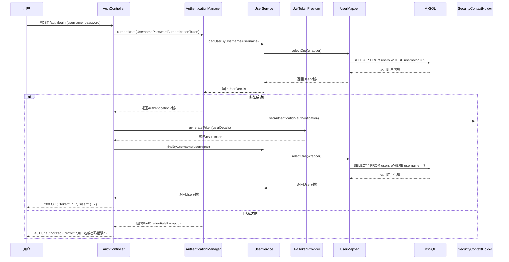
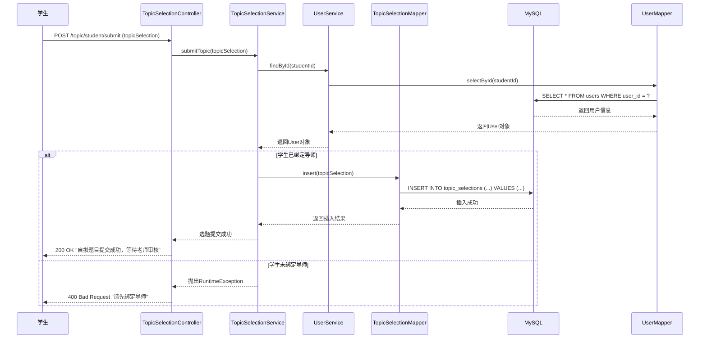
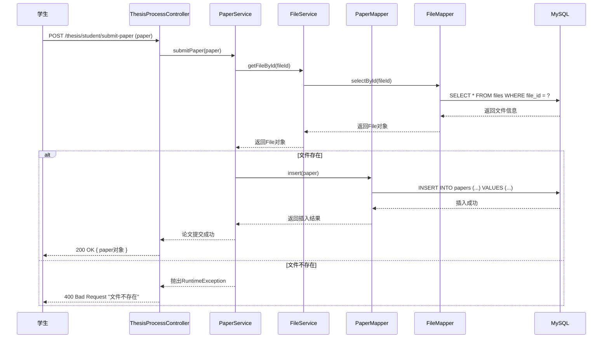
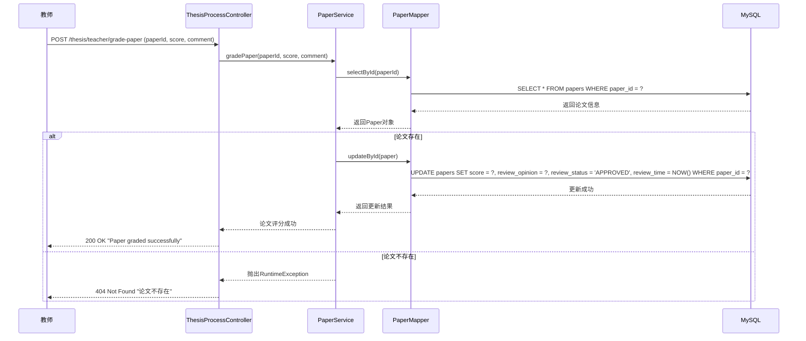

# 毕业论文管理系统 - 系统类图和时序图

## 一、系统类图

```mermaid
classDiagram
    direction TB
    
    %% 控制层
    class AuthController {
        +login(LoginRequest): ResponseEntity
        +register(User): ResponseEntity
        +generatePassword(PasswordRequest): ResponseEntity
    }
    
    class TopicSelectionController {
        +submitTopic(TopicSelection): ResponseEntity
        +getPendingTopics(teacherId: Long): ResponseEntity
        +approveTopic(topicId: Long): ResponseEntity
        +rejectTopic(topicId: Long, comment: String): ResponseEntity
        +uploadTask(topicId: Long, taskFileId: Long): ResponseEntity
        +getTopicStatus(studentId: Long): ResponseEntity
        +getTaskFile(topicId: Long): ResponseEntity
    }
    
    class ThesisProcessController {
        +submitProposal(ProposalReport): ResponseEntity
        +submitMidterm(MidtermReport): ResponseEntity
        +submitPaper(Paper): ResponseEntity
        +gradePaper(paperId: Long, score: Integer, comment: String): ResponseEntity
    }
    
    class FileController {
        +uploadFile(MultipartFile): ResponseEntity
        +downloadFile(fileId: Long): ResponseEntity
    }
    
    class ProgressController {
        +getStudentProgress(studentId: Long): ResponseEntity
        +updateProgress(progress: Progress): ResponseEntity
    }
    
    class TeacherStudentSelectionController {
        +applyForTeacher(studentId: Long, teacherId: Long): ResponseEntity
        +approveApplication(selectionId: Long): ResponseEntity
        +rejectApplication(selectionId: Long): ResponseEntity
    }
    
    class SystemController {
        +getSettings(): ResponseEntity
        +updateSettings(settings: SystemSetting): ResponseEntity
        +sendNotification(notification: Notification): ResponseEntity
    }
    
    %% 服务层
    class UserService {
        +findByUsername(username: String): User
        +register(user: User): User
        +generatePasswordHash(password: String): String
        +findById(id: Long): User
        +getAllUsers(): List<User>
        +getTeachers(): List<User>
        +getTeachersByDepartmentAndMajor(department: String, major: String): List<User>
        +deleteUser(id: Long): void
        +addUser(user: User): User
    }
    
    class TopicSelectionService {
        +submitTopic(topicSelection: TopicSelection): void
        +getPendingTopicsByTeacherId(teacherId: Long): List<TopicSelection>
        +approveTopic(topicId: Long): void
        +rejectTopic(topicId: Long, comment: String): void
        +uploadTask(topicId: Long, taskFileId: Long): void
        +getTopicStatus(studentId: Long): TopicSelection
        +getTaskFileId(topicId: Long): Long
        +getBoundTeachersByStudentId(studentId: Long): List<Long>
    }
    
    class PaperService {
        +submitPaper(paper: Paper): void
        +getPapersByStudentId(studentId: Long): List<Paper>
        +getPapersByTeacherId(teacherId: Long): List<Paper>
        +getPaperById(paperId: Long): Paper
        +gradePaper(paperId: Long, score: Integer, comment: String): void
    }
    
    class ProposalReportService {
        +submitReport(report: ProposalReport): void
        +getReportsByStudentId(studentId: Long): List<ProposalReport>
        +getReportsByTeacherId(teacherId: Long): List<ProposalReport>
        +getReportById(reportId: Long): ProposalReport
        +approveReport(reportId: Long, comment: String): void
        +rejectReport(reportId: Long, comment: String): void
    }
    
    class MidtermReportService {
        +submitReport(report: MidtermReport): void
        +getReportsByStudentId(studentId: Long): List<MidtermReport>
        +getReportsByTeacherId(teacherId: Long): List<MidtermReport>
        +getReportById(reportId: Long): MidtermReport
        +approveReport(reportId: Long, comment: String): void
        +rejectReport(reportId: Long, comment: String): void
    }
    
    class FileService {
        +uploadFile(MultipartFile, uploaderId: Long, receiverId: Long, relatedId: Long, fileType: String): Long
        +getFileById(fileId: Long): File
        +deleteFile(fileId: Long): void
    }
    
    class ProgressService {
        +getStudentProgress(studentId: Long): List<Progress>
        +updateProgress(progress: Progress): void
    }
    
    class TeacherStudentSelectionService {
        +applyForTeacher(studentId: Long, teacherId: Long): void
        +approveApplication(selectionId: Long): void
        +rejectApplication(selectionId: Long): void
        +getStudentApplications(studentId: Long): List<TeacherStudentSelection>
        +getTeacherApplications(teacherId: Long): List<TeacherStudentSelection>
    }
    
    class SystemSettingService {
        +getSettings(): List<SystemSetting>
        +updateSettings(settings: SystemSetting): void
    }
    
    class NotificationService {
        +sendNotification(notification: Notification): void
        +getNotificationsByRole(role: String): List<Notification>
    }
    
    %% 数据访问层
    class UserMapper {
        +selectOne(wrapper: LambdaQueryWrapper): User
        +selectById(id: Long): User
        +insert(user: User): int
        +updateById(user: User): int
        +deleteById(id: Long): int
        +selectList(wrapper: LambdaQueryWrapper): List<User>
    }
    
    class TopicSelectionMapper {
        +insert(topicSelection: TopicSelection): int
        +selectOne(wrapper: LambdaQueryWrapper): TopicSelection
        +selectList(wrapper: LambdaQueryWrapper): List<TopicSelection>
        +updateById(topicSelection: TopicSelection): int
    }
    
    class PaperMapper {
        +insert(paper: Paper): int
        +selectList(wrapper: LambdaQueryWrapper): List<Paper>
        +selectById(paperId: Long): Paper
        +updateById(paper: Paper): int
    }
    
    class ProposalReportMapper {
        +insert(report: ProposalReport): int
        +selectList(wrapper: LambdaQueryWrapper): List<ProposalReport>
        +selectById(reportId: Long): ProposalReport
        +updateById(report: ProposalReport): int
    }
    
    class MidtermReportMapper {
        +insert(report: MidtermReport): int
        +selectList(wrapper: LambdaQueryWrapper): List<MidtermReport>
        +selectById(reportId: Long): MidtermReport
        +updateById(report: MidtermReport): int
    }
    
    class FileMapper {
        +insert(file: File): int
        +selectById(fileId: Long): File
        +deleteById(fileId: Long): int
        +selectList(wrapper: LambdaQueryWrapper): List<File>
    }
    
    class ProgressMapper {
        +insert(progress: Progress): int
        +selectList(wrapper: LambdaQueryWrapper): List<Progress>
        +updateById(progress: Progress): int
    }
    
    class TeacherStudentSelectionMapper {
        +insert(selection: TeacherStudentSelection): int
        +selectList(wrapper: LambdaQueryWrapper): List<TeacherStudentSelection>
        +updateById(selection: TeacherStudentSelection): int
    }
    
    class SystemSettingMapper {
        +selectList(wrapper: LambdaQueryWrapper): List<SystemSetting>
        +updateById(setting: SystemSetting): int
    }
    
    class NotificationMapper {
        +insert(notification: Notification): int
        +selectList(wrapper: LambdaQueryWrapper): List<Notification>
    }
    
    %% 关系
    AuthController --> UserService
    TopicSelectionController --> TopicSelectionService
    ThesisProcessController --> ProposalReportService
    ThesisProcessController --> MidtermReportService
    ThesisProcessController --> PaperService
    ThesisProcessController --> AssignmentTaskService
    FileController --> FileService
    ProgressController --> ProgressService
    TeacherStudentSelectionController --> TeacherStudentSelectionService
    SystemController --> SystemSettingService
    SystemController --> NotificationService
    
    UserService --> UserMapper
    TopicSelectionService --> TopicSelectionMapper
    PaperService --> PaperMapper
    ProposalReportService --> ProposalReportMapper
    MidtermReportService --> MidtermReportMapper
    FileService --> FileMapper
    ProgressService --> ProgressMapper
    TeacherStudentSelectionService --> TeacherStudentSelectionMapper
    SystemSettingService --> SystemSettingMapper
    NotificationService --> NotificationMapper
```

## 二、登录时序图

```mermaid
sequenceDiagram
    participant User as 用户
    participant AuthController as AuthController
    participant AuthenticationManager as AuthenticationManager
    participant UserService as UserService
    participant JwtTokenProvider as JwtTokenProvider
    participant UserMapper as UserMapper
    participant MySQL as MySQL
    
    User->>AuthController: POST /auth/login (username, password)
    AuthController->>AuthenticationManager: authenticate(UsernamePasswordAuthenticationToken)
    AuthenticationManager->>UserService: loadUserByUsername(username)
    UserService->>UserMapper: selectOne(wrapper)
    UserMapper->>MySQL: SELECT * FROM users WHERE username = ?
    MySQL-->>UserMapper: 返回用户信息
    UserMapper-->>UserService: 返回User对象
    UserService-->>AuthenticationManager: 返回UserDetails
    
    alt 认证成功
        AuthenticationManager-->>AuthController: 返回Authentication对象
        AuthController->>SecurityContextHolder: setAuthentication(authentication)
        AuthController->>JwtTokenProvider: generateToken(userDetails)
        JwtTokenProvider-->>AuthController: 返回JWT Token
        AuthController->>UserService: findByUsername(username)
        UserService->>UserMapper: selectOne(wrapper)
        UserMapper->>MySQL: SELECT * FROM users WHERE username = ?
        MySQL-->>UserMapper: 返回用户信息
        UserMapper-->>UserService: 返回User对象
        UserService-->>AuthController: 返回User对象
        AuthController-->>User: 200 OK { "token": "...", "user": {...} }
    else 认证失败
        AuthenticationManager-->>AuthController: 抛出BadCredentialsException
        AuthController-->>User: 401 Unauthorized { "error": "用户名或密码错误" }
    end
```

## 三、选题提交时序图

```mermaid
sequenceDiagram
    participant Student as 学生
    participant TopicSelectionController as TopicSelectionController
    participant TopicSelectionService as TopicSelectionService
    participant UserService as UserService
    participant TopicSelectionMapper as TopicSelectionMapper
    participant MySQL as MySQL
    
    Student->>TopicSelectionController: POST /topic/student/submit (topicSelection)
    TopicSelectionController->>TopicSelectionService: submitTopic(topicSelection)
    TopicSelectionService->>UserService: findById(studentId)
    UserService->>UserMapper: selectById(studentId)
    UserMapper->>MySQL: SELECT * FROM users WHERE user_id = ?
    MySQL-->>UserMapper: 返回用户信息
    UserMapper-->>UserService: 返回User对象
    UserService-->>TopicSelectionService: 返回User对象
    
    alt 学生已绑定导师
        TopicSelectionService->>TopicSelectionMapper: insert(topicSelection)
        TopicSelectionMapper->>MySQL: INSERT INTO topic_selections (...) VALUES (...)
        MySQL-->>TopicSelectionMapper: 插入成功
        TopicSelectionMapper-->>TopicSelectionService: 返回插入结果
        TopicSelectionService-->>TopicSelectionController: 选题提交成功
        TopicSelectionController-->>Student: 200 OK "自拟题目提交成功，等待老师审核"
    else 学生未绑定导师
        TopicSelectionService-->>TopicSelectionController: 抛出RuntimeException
        TopicSelectionController-->>Student: 400 Bad Request "请先绑定导师"
    end
```

## 四、论文提交时序图

```mermaid
sequenceDiagram
    participant Student as 学生
    participant ThesisProcessController as ThesisProcessController
    participant PaperService as PaperService
    participant FileService as FileService
    participant PaperMapper as PaperMapper
    participant FileMapper as FileMapper
    participant MySQL as MySQL
    
    Student->>ThesisProcessController: POST /thesis/student/submit-paper (paper)
    ThesisProcessController->>PaperService: submitPaper(paper)
    PaperService->>FileService: getFileById(fileId)
    FileService->>FileMapper: selectById(fileId)
    FileMapper->>MySQL: SELECT * FROM files WHERE file_id = ?
    MySQL-->>FileMapper: 返回文件信息
    FileMapper-->>FileService: 返回File对象
    FileService-->>PaperService: 返回File对象
    
    alt 文件存在
        PaperService->>PaperMapper: insert(paper)
        PaperMapper->>MySQL: INSERT INTO papers (...) VALUES (...)
        MySQL-->>PaperMapper: 插入成功
        PaperMapper-->>PaperService: 返回插入结果
        PaperService-->>ThesisProcessController: 论文提交成功
        ThesisProcessController-->>Student: 200 OK { paper对象 }
    else 文件不存在
        PaperService-->>ThesisProcessController: 抛出RuntimeException
        ThesisProcessController-->>Student: 400 Bad Request "文件不存在"
    end
```

## 五、论文审核与评分时序图

```mermaid
sequenceDiagram
    participant Teacher as 教师
    participant ThesisProcessController as ThesisProcessController
    participant PaperService as PaperService
    participant PaperMapper as PaperMapper
    participant MySQL as MySQL
    
    Teacher->>ThesisProcessController: POST /thesis/teacher/grade-paper (paperId, score, comment)
    ThesisProcessController->>PaperService: gradePaper(paperId, score, comment)
    PaperService->>PaperMapper: selectById(paperId)
    PaperMapper->>MySQL: SELECT * FROM papers WHERE paper_id = ?
    MySQL-->>PaperMapper: 返回论文信息
    PaperMapper-->>PaperService: 返回Paper对象
    
    alt 论文存在
        PaperService->>PaperMapper: updateById(paper)
        PaperMapper->>MySQL: UPDATE papers SET score = ?, review_opinion = ?, review_status = 'APPROVED', review_time = NOW() WHERE paper_id = ?
        MySQL-->>PaperMapper: 更新成功
        PaperMapper-->>PaperService: 返回更新结果
        PaperService-->>ThesisProcessController: 论文评分成功
        ThesisProcessController-->>Teacher: 200 OK "Paper graded successfully"
    else 论文不存在
        PaperService-->>ThesisProcessController: 抛出RuntimeException
        ThesisProcessController-->>Teacher: 404 Not Found "论文不存在"
    end
```