# 毕业设计管理系统详细设计与实现文档

## 1. 系统概述

本系统是一个毕业设计管理系统，用于管理学生的毕业设计全过程，包括选题、师生匹配、进度跟踪、论文提交与评审等功能。系统采用分层架构，包括控制层、服务层、数据访问层和实体层，实现了完整的业务流程管理。

系统主要功能模块包括：
- 用户认证功能：用户注册、登录、权限管理
- 师生互选功能：学生申请导师、教师审核申请、师生绑定
- 选题管理功能：学生提交选题、教师审核选题、任务书上传
- 论文管理功能：开题报告、中期检查、最终论文提交与评审
- 文件管理功能：文件上传、下载、版本管理
- 系统管理功能：系统设置、通知管理、用户管理

## 2. 系统架构

### 2.1 技术栈

- **前端**：Vue 3、Vue Router、Pinia、Axios
- **后端**：Spring Boot 3、MyBatis-Plus、Spring Security、JWT
- **数据库**：MySQL
- **认证**：JWT 令牌认证
- **文件存储**：本地文件系统

### 2.2 分层架构

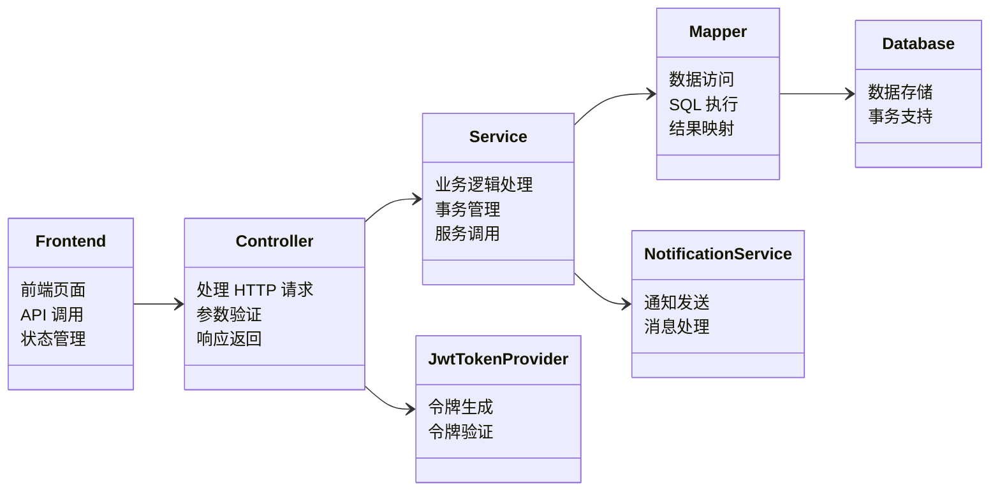
```mermaid
classDiagram
    direction LR
    
    %% 前端层
    Frontend --> Controller
    
    %% 后端层
    Controller --> Service
    Service --> Mapper
    Mapper --> Database
    
    %% 辅助层
    Controller --> JwtTokenProvider
    Service --> NotificationService
    
    %% 层间关系
    class Frontend {
        前端页面
        API 调用
        状态管理
    }
    
    class Controller {
        处理 HTTP 请求
        参数验证
        响应返回
    }
    
    class Service {
        业务逻辑处理
        事务管理
        服务调用
    }
    
    class Mapper {
        数据访问
        SQL 执行
        结果映射
    }
    
    class Database {
        数据存储
        事务支持
    }
    
    class JwtTokenProvider {
        令牌生成
        令牌验证
    }
    
    class NotificationService {
        通知发送
        消息处理
    }
```

## 3. 核心实体类设计

### 3.1 User（用户）

**职责**：存储系统用户信息，包括学生、教师和管理员。

**属性**：
- id: Long - 用户ID
- username: String - 用户名
- password: String - 密码（加密存储）
- name: String - 真实姓名
- role: String - 角色（student/teacher/admin）
- department: String - 部门
- major: String - 专业
- contact: String - 联系方式
- maxStudents: Integer - 教师最大指导学生数
- createdAt: LocalDateTime - 创建时间
- updatedAt: LocalDateTime - 更新时间

**关系**：
- 与TopicSelection：一对多（一个学生可以提交多个选题）
- 与TeacherStudentSelection：一对多（一个学生可以申请多个教师，一个教师可以被多个学生申请）
- 与Progress：一对多（一个学生有多个进度记录）
- 与Paper：一对多（一个学生提交一篇论文，一个教师评审多篇论文）

### 3.2 TopicSelection（选题）

**职责**：管理学生的选题信息，包括选题名称、描述、评审状态等。

**属性**：
- topicId: Long - 选题ID
- studentId: Long - 学生ID
- teacherId: Long - 教师ID
- topicName: String - 选题名称
- topicDescription: String - 选题描述
- reviewStatus: String - 评审状态（PENDING/APPROVED/REJECTED）
- reviewOpinion: String - 评审意见
- submitTime: Date - 提交时间
- reviewTime: Date - 评审时间
- createdAt: Date - 创建时间
- updatedAt: Date - 更新时间

**关系**：
- 与User：多对一（多个选题属于一个学生和一个教师）
- 与Paper：一对一（一个选题对应一篇论文）

### 3.3 TeacherStudentSelection（师生选择）

**职责**：管理学生与教师之间的双向选择过程，包括申请、审批、绑定等状态。

**属性**：
- id: Long - 选择ID
- studentId: Long - 学生ID
- teacherId: Long - 教师ID
- status: String - 状态（申请中/已批准/已绑定/已解绑）
- applyTime: LocalDateTime - 申请时间
- reviewTime: LocalDateTime - 评审时间
- bindTime: LocalDateTime - 绑定时间
- unbindTime: LocalDateTime - 解绑时间
- createdAt: LocalDateTime - 创建时间
- updatedAt: LocalDateTime - 更新时间

**关系**：
- 与User：多对一（多个选择记录属于一个学生和一个教师）

### 3.4 Progress（进度）

**职责**：跟踪学生毕业设计的各个阶段进度。

**属性**：
- id: Long - 进度ID
- studentId: Long - 学生ID
- stage: String - 阶段（开题/中期/结题）
- status: String - 状态（未提交/已提交/已通过/未通过）
- createdAt: LocalDateTime - 创建时间
- updatedAt: LocalDateTime - 更新时间

**关系**：
- 与User：多对一（多个进度记录属于一个学生）

### 3.5 Paper（论文）

**职责**：管理学生的论文提交与评审信息。

**属性**：
- id: Long - 论文ID
- topicId: Long - 选题ID
- studentId: Long - 学生ID
- teacherId: Long - 教师ID
- fileId: Long - 文件ID
- submitTime: LocalDateTime - 提交时间
- reviewStatus: String - 评审状态
- reviewOpinion: String - 评审意见
- reviewTime: LocalDateTime - 评审时间
- score: Integer - 分数
- createdAt: LocalDateTime - 创建时间
- updatedAt: LocalDateTime - 更新时间
- paperTitle: String - 论文标题（非数据库字段）
- paperAbstract: String - 论文摘要（非数据库字段）
- status: String - 状态（非数据库字段）
- teacherComment: String - 教师评语（非数据库字段）

**关系**：
- 与User：多对一（多篇论文属于一个学生和一个教师）
- 与TopicSelection：一对一（一篇论文对应一个选题）
- 与File：一对一（一篇论文对应一个文件）

### 3.6 File（文件）

**职责**：存储系统中的文件信息，如论文、报告等。

**属性**：
- id: Long - 文件ID
- filename: String - 文件名
- filepath: String - 文件路径
- filetype: String - 文件类型
- filesize: Long - 文件大小
- uploaderId: Long - 上传者ID
- uploadTime: LocalDateTime - 上传时间
- createdAt: LocalDateTime - 创建时间
- updatedAt: LocalDateTime - 更新时间

**关系**：
- 与User：多对一（多个文件属于一个上传者）
- 与Paper：一对多（一个文件可以对应多篇论文）

### 3.7 AssignmentTask（任务分配）

**职责**：管理教师分配给学生的任务。

**属性**：
- id: Long - 任务ID
- teacherId: Long - 教师ID
- studentId: Long - 学生ID
- taskContent: String - 任务内容
- deadline: LocalDateTime - 截止时间
- status: String - 状态
- submitContent: String - 提交内容
- submitTime: LocalDateTime - 提交时间
- createdAt: LocalDateTime - 创建时间
- updatedAt: LocalDateTime - 更新时间

**关系**：
- 与User：多对一（多个任务属于一个教师和一个学生）

### 3.8 MidtermReport（中期报告）

**职责**：管理学生的中期报告信息。

**属性**：
- id: Long - 报告ID
- studentId: Long - 学生ID
- teacherId: Long - 教师ID
- content: String - 报告内容
- fileId: Long - 文件ID
- submitTime: LocalDateTime - 提交时间
- reviewStatus: String - 评审状态
- reviewOpinion: String - 评审意见
- reviewTime: LocalDateTime - 评审时间
- createdAt: LocalDateTime - 创建时间
- updatedAt: LocalDateTime - 更新时间

**关系**：
- 与User：多对一（多个中期报告属于一个学生和一个教师）
- 与File：一对一（一个中期报告对应一个文件）

### 3.9 Notification（通知）

**职责**：管理系统通知信息。

**属性**：
- id: Long - 通知ID
- title: String - 标题
- content: String - 内容
- type: String - 类型
- recipientId: Long - 接收者ID
- senderId: Long - 发送者ID
- sendTime: LocalDateTime - 发送时间
- readStatus: String - 阅读状态
- createdAt: LocalDateTime - 创建时间
- updatedAt: LocalDateTime - 更新时间

**关系**：
- 与User：多对一（多个通知属于一个接收者和一个发送者）

### 3.10 ProposalReport（开题报告）

**职责**：管理学生的开题报告信息。

**属性**：
- id: Long - 报告ID
- studentId: Long - 学生ID
- teacherId: Long - 教师ID
- content: String - 报告内容
- fileId: Long - 文件ID
- submitTime: LocalDateTime - 提交时间
- reviewStatus: String - 评审状态
- reviewOpinion: String - 评审意见
- reviewTime: LocalDateTime - 评审时间
- createdAt: LocalDateTime - 创建时间
- updatedAt: LocalDateTime - 更新时间

**关系**：
- 与User：多对一（多个开题报告属于一个学生和一个教师）
- 与File：一对一（一个开题报告对应一个文件）

### 3.11 SystemSetting（系统设置）

**职责**：存储系统的全局设置信息。

**属性**：
- id: Long - 设置ID
- settingKey: String - 设置键
- settingValue: String - 设置值
- description: String - 描述
- createdAt: LocalDateTime - 创建时间
- updatedAt: LocalDateTime - 更新时间

## 4. 服务类设计

### 4.1 UserService

**职责**：处理用户相关的业务逻辑，如用户注册、登录验证、用户信息管理等。

**方法**：
- generatePasswordHash(String password): String - 生成密码哈希
- findByUsername(String username): User - 根据用户名查找用户
- findById(Long id): User - 根据ID查找用户
- register(User user): User - 注册新用户
- update(User user): void - 更新用户信息
- getAllUsers(): List<User> - 获取所有用户
- getTeachers(): List<User> - 获取所有教师
- getTeachersByDepartmentAndMajor(String department, String major): List<User> - 根据部门和专业获取教师
- deleteUser(Long id): void - 删除用户
- addUser(User user): User - 添加用户

### 4.2 TeacherStudentSelectionService

**职责**：处理师生匹配相关的业务逻辑，如学生申请教师、教师审批等。

**方法**：
- studentSelectTeacher(Long studentId, Long teacherId): void - 学生选择教师
- teacherAcceptSelection(Long selectionId): void - 教师接受申请
- teacherRejectSelection(Long selectionId): void - 教师拒绝申请
- adminApproveSelection(Long selectionId): void - 管理员审批申请
- getSelectionsWithStudentInfoByTeacherId(Long teacherId): List<SelectionWithStudentInfo> - 获取教师收到的申请（包含学生信息）
- getSelectionsWithTeacherInfoByStudentId(Long studentId): List<SelectionWithTeacherInfo> - 获取学生的申请记录（包含教师信息）
- getPendingSelections(): List<TeacherStudentSelection> - 获取待审批的申请
- isTeacherFull(Long teacherId): boolean - 检查教师是否已满额
- hasPendingApplication(Long studentId): boolean - 检查学生是否有待审批的申请

### 4.3 TopicSelectionService

**职责**：处理选题相关的业务逻辑，如选题提交、评审等。

**方法**：
- submitTopic(TopicSelection topicSelection): void - 学生提交选题
- approveTopic(Long topicId): void - 教师审核通过选题
- rejectTopic(Long topicId, String comment): void - 教师审核拒绝选题
- uploadTask(Long topicId, Long taskFileId): void - 教师上传任务书
- getPendingTopicsByTeacherId(Long teacherId): List<TopicSelection> - 获取教师的待审核选题
- getTopicStatus(Long studentId): Map<String, Object> - 获取学生的选题状态
- getTaskFileId(Long topicId): Long - 获取任务书文件ID

### 4.4 ProgressService

**职责**：处理进度相关的业务逻辑，如进度更新、查询等。

**方法**：
- updateProgress(Long studentId, String stage, String status): void - 更新进度
- getProgressByStudentId(Long studentId): List<Progress> - 获取学生的进度记录
- checkProgressStatus(Long studentId, String stage): String - 检查进度状态

### 4.5 PaperService

**职责**：处理论文相关的业务逻辑，如论文提交、评审、评分等。

**方法**：
- submitPaper(Paper paper): void - 学生提交论文
- reviewPaper(Long paperId, String reviewStatus, String reviewOpinion, Integer score): void - 教师评审论文
- getPaperByStudentId(Long studentId): Paper - 获取学生的论文
- getPapersByTeacherId(Long teacherId): List<Paper> - 获取教师需要评审的论文
- updatePaperStatus(Long paperId, String status): void - 更新论文状态

### 4.6 FileService

**职责**：处理文件相关的业务逻辑，如文件上传、下载、管理等。

**方法**：
- uploadFile(MultipartFile file, Long uploaderId): File - 上传文件
- downloadFile(Long fileId): File - 下载文件
- deleteFile(Long fileId): void - 删除文件
- getFileById(Long fileId): File - 根据ID获取文件
- getFilesByUploaderId(Long uploaderId): List<File> - 获取上传者的文件

### 4.7 NotificationService

**职责**：处理通知相关的业务逻辑，如通知发送、查询等。

**方法**：
- sendNotification(String title, String content, Long recipientId, Long senderId): void - 发送通知
- getNotificationsByRecipientId(Long recipientId): List<Notification> - 获取接收者的通知
- markAsRead(Long notificationId): void - 标记通知为已读
- getUnreadCount(Long recipientId): Integer - 获取未读通知数量

### 4.8 SystemSettingService

**职责**：处理系统设置相关的业务逻辑，如设置修改、查询等。

**方法**：
- getSetting(String key): String - 获取系统设置
- updateSetting(String key, String value): void - 更新系统设置
- getAllSettings(): List<SystemSetting> - 获取所有系统设置

## 5. 控制器类设计

### 5.1 AuthController

**职责**：处理认证相关的HTTP请求，如登录、注册等。

**接口**：
- POST /auth/login - 用户登录
- POST /auth/register - 用户注册
- POST /auth/generate-password - 生成密码哈希

### 5.2 TeacherStudentSelectionController

**职责**：处理师生互选相关的HTTP请求。

**接口**：
- POST /student/select-teacher - 学生选择教师
- GET /teacher/selections - 获取教师收到的申请
- POST /teacher/accept-selection - 教师接受申请
- POST /teacher/reject-selection - 教师拒绝申请
- GET /admin/pending-selections - 获取待审批的申请
- POST /admin/approve-selection - 管理员审批申请
- GET /student/selections - 获取学生的申请记录

### 5.3 TopicSelectionController

**职责**：处理选题相关的HTTP请求，如选题提交、查询、评审等。

**接口**：
- POST /topic/student/submit - 学生提交选题
- GET /topic/teacher/pending - 获取待审核选题
- POST /topic/teacher/approve - 审核通过选题
- POST /topic/teacher/reject - 审核拒绝选题
- POST /topic/teacher/upload-task - 上传任务书
- GET /topic/student/status - 获取选题状态

### 5.4 ProgressController

**职责**：处理进度相关的HTTP请求，如进度更新、查询等。

**接口**：
- GET /progress/student - 获取学生进度
- PUT /progress/update - 更新进度

### 5.5 ThesisProcessController

**职责**：处理毕业设计流程相关的HTTP请求，如流程状态查询、操作等。

**接口**：
- GET /thesis/student/status - 获取学生毕业设计状态
- POST /thesis/submit-proposal - 提交开题报告
- POST /thesis/submit-midterm - 提交中期报告
- POST /thesis/submit-final - 提交最终论文
- GET /thesis/teacher/proposals - 获取教师的开题报告
- GET /thesis/teacher/midterms - 获取教师的中期报告
- GET /thesis/teacher/final - 获取教师的最终论文
- POST /thesis/review-proposal - 评审开题报告
- POST /thesis/review-midterm - 评审中期报告
- POST /thesis/review-final - 评审最终论文

### 5.6 FileController

**职责**：处理文件相关的HTTP请求，如文件上传、下载等。

**接口**：
- POST /file/upload - 上传文件
- GET /file/download/{fileId} - 下载文件
- GET /file/list - 获取文件列表
- DELETE /file/delete/{fileId} - 删除文件

### 5.7 SystemController

**职责**：处理系统相关的HTTP请求，如系统设置管理等。

**接口**：
- GET /system/settings - 获取系统设置
- PUT /system/settings - 更新系统设置
- POST /system/notification - 发送系统通知
- GET /system/users - 获取用户列表
- POST /system/user/add - 添加用户
- DELETE /system/user/delete/{userId} - 删除用户
- PUT /system/user/update - 更新用户信息

## 6. 数据库表结构设计

### 6.1 用户表

| 字段名称 | 数据类型 | 允许为空 | 主键或外键 | 字段说明 |
| :--- | :--- | :--- | :--- | :--- |
| `user_id` | `BIGINT(20)` | 否 | 主键 | 用户ID |
| `username` | `VARCHAR(255)` | 否 | 否 | 用户名 |
| `password` | `VARCHAR(255)` | 否 | 否 | 密码 |
| `name` | `VARCHAR(255)` | 否 | 否 | 姓名 |
| `role` | `VARCHAR(255)` | 否 | 否 | 角色 |
| `department` | `VARCHAR(255)` | 是 | 否 | 院系 |
| `major` | `VARCHAR(255)` | 是 | 否 | 专业 |
| `contact` | `VARCHAR(255)` | 是 | 否 | 联系方式 |
| `max_students` | `INT` | 是 | 否 | 最大指导学生数 |
| `created_at` | `TIMESTAMP` | 否 | 否 | 创建时间 |
| `updated_at` | `TIMESTAMP` | 否 | 否 | 更新时间 |

### 6.2 师生互选表

| 字段名称 | 数据类型 | 允许为空 | 主键或外键 | 字段说明 |
| :--- | :--- | :--- | :--- | :--- |
| `selection_id` | `BIGINT(20)` | 否 | 主键 | 互选ID |
| `student_id` | `BIGINT(20)` | 否 | 外键 | 学生ID |
| `teacher_id` | `BIGINT(20)` | 否 | 外键 | 教师ID |
| `status` | `VARCHAR(255)` | 否 | 否 | 状态 |
| `apply_time` | `TIMESTAMP` | 是 | 否 | 申请时间 |
| `review_time` | `TIMESTAMP` | 是 | 否 | 审核时间 |
| `bind_time` | `TIMESTAMP` | 是 | 否 | 绑定时间 |
| `unbind_time` | `TIMESTAMP` | 是 | 否 | 解除时间 |
| `created_at` | `TIMESTAMP` | 否 | 否 | 创建时间 |
| `updated_at` | `TIMESTAMP` | 否 | 否 | 更新时间 |

### 6.3 选题表

| 字段名称 | 数据类型 | 允许为空 | 主键或外键 | 字段说明 |
| :--- | :--- | :--- | :--- | :--- |
| `topic_id` | `BIGINT(20)` | 否 | 主键 | 选题ID |
| `student_id` | `BIGINT(20)` | 否 | 外键 | 学生ID |
| `teacher_id` | `BIGINT(20)` | 否 | 外键 | 教师ID |
| `topic_name` | `VARCHAR(255)` | 否 | 否 | 选题名称 |
| `topic_description` | `TEXT` | 是 | 否 | 选题描述 |
| `review_status` | `VARCHAR(255)` | 否 | 否 | 审核状态 |
| `review_opinion` | `TEXT` | 是 | 否 | 审核意见 |
| `submit_time` | `TIMESTAMP` | 是 | 否 | 提交时间 |
| `review_time` | `TIMESTAMP` | 是 | 否 | 审核时间 |
| `created_at` | `TIMESTAMP` | 否 | 否 | 创建时间 |
| `updated_at` | `TIMESTAMP` | 否 | 否 | 更新时间 |

### 6.4 任务书表

| 字段名称 | 数据类型 | 允许为空 | 主键或外键 | 字段说明 |
| :--- | :--- | :--- | :--- | :--- |
| `task_id` | `BIGINT(20)` | 否 | 主键 | 任务书ID |
| `topic_id` | `BIGINT(20)` | 否 | 外键 | 选题ID |
| `student_id` | `BIGINT(20)` | 否 | 外键 | 学生ID |
| `teacher_id` | `BIGINT(20)` | 否 | 外键 | 教师ID |
| `file_id` | `BIGINT(20)` | 是 | 外键 | 关联文件ID |
| `issue_time` | `TIMESTAMP` | 是 | 否 | 下达时间 |
| `deadline` | `TIMESTAMP` | 是 | 否 | 截止时间 |
| `created_at` | `TIMESTAMP` | 否 | 否 | 创建时间 |
| `updated_at` | `TIMESTAMP` | 否 | 否 | 更新时间 |

### 6.5 开题报告表

| 字段名称 | 数据类型 | 允许为空 | 主键或外键 | 字段说明 |
| :--- | :--- | :--- | :--- | :--- |
| `report_id` | `BIGINT(20)` | 否 | 主键 | 报告ID |
| `topic_id` | `BIGINT(20)` | 否 | 外键 | 选题ID |
| `student_id` | `BIGINT(20)` | 否 | 外键 | 学生ID |
| `teacher_id` | `BIGINT(20)` | 否 | 外键 | 教师ID |
| `file_id` | `BIGINT(20)` | 是 | 外键 | 关联文件ID |
| `submit_time` | `TIMESTAMP` | 是 | 否 | 提交时间 |
| `review_status` | `VARCHAR(255)` | 否 | 否 | 审核状态 |
| `review_opinion` | `TEXT` | 是 | 否 | 审核意见 |
| `review_time` | `TIMESTAMP` | 是 | 否 | 审核时间 |
| `created_at` | `TIMESTAMP` | 否 | 否 | 创建时间 |
| `updated_at` | `TIMESTAMP` | 否 | 否 | 更新时间 |

### 6.6 中期检查表

| 字段名称 | 数据类型 | 允许为空 | 主键或外键 | 字段说明 |
| :--- | :--- | :--- | :--- | :--- |
| `report_id` | `BIGINT(20)` | 否 | 主键 | 报告ID |
| `topic_id` | `BIGINT(20)` | 否 | 外键 | 选题ID |
| `student_id` | `BIGINT(20)` | 否 | 外键 | 学生ID |
| `teacher_id` | `BIGINT(20)` | 否 | 外键 | 教师ID |
| `file_id` | `BIGINT(20)` | 是 | 外键 | 关联文件ID |
| `submit_time` | `TIMESTAMP` | 是 | 否 | 提交时间 |
| `review_status` | `VARCHAR(255)` | 否 | 否 | 审核状态 |
| `review_opinion` | `TEXT` | 是 | 否 | 审核意见 |
| `review_time` | `TIMESTAMP` | 是 | 否 | 审核时间 |
| `created_at` | `TIMESTAMP` | 否 | 否 | 创建时间 |
| `updated_at` | `TIMESTAMP` | 否 | 否 | 更新时间 |

### 6.7 论文表

| 字段名称 | 数据类型 | 允许为空 | 主键或外键 | 字段说明 |
| :--- | :--- | :--- | :--- | :--- |
| `paper_id` | `BIGINT(20)` | 否 | 主键 | 论文ID |
| `topic_id` | `BIGINT(20)` | 否 | 外键 | 选题ID |
| `student_id` | `BIGINT(20)` | 否 | 外键 | 学生ID |
| `teacher_id` | `BIGINT(20)` | 否 | 外键 | 教师ID |
| `file_id` | `BIGINT(20)` | 是 | 外键 | 关联文件ID |
| `submit_time` | `TIMESTAMP` | 是 | 否 | 提交时间 |
| `review_status` | `VARCHAR(255)` | 否 | 否 | 审核状态 |
| `review_opinion` | `TEXT` | 是 | 否 | 审核意见 |
| `review_time` | `TIMESTAMP` | 是 | 否 | 审核时间 |
| `score` | `INT` | 是 | 否 | 成绩 |
| `created_at` | `TIMESTAMP` | 否 | 否 | 创建时间 |
| `updated_at` | `TIMESTAMP` | 否 | 否 | 更新时间 |

### 6.8 文件表

| 字段名称 | 数据类型 | 允许为空 | 主键或外键 | 字段说明 |
| :--- | :--- | :--- | :--- | :--- |
| `file_id` | `BIGINT(20)` | 否 | 主键 | 文件ID |
| `file_name` | `VARCHAR(255)` | 否 | 否 | 文件名称 |
| `file_path` | `VARCHAR(255)` | 否 | 否 | 文件路径 |
| `uploader_id` | `BIGINT(20)` | 否 | 外键 | 上传人ID |
| `receiver_id` | `BIGINT(20)` | 是 | 外键 | 接收人ID |
| `related_id` | `BIGINT(20)` | 是 | 否 | 关联ID |
| `file_type` | `VARCHAR(255)` | 是 | 否 | 文件类型 |
| `version` | `INT` | 是 | 否 | 版本号 |
| `sync_status` | `VARCHAR(255)` | 是 | 否 | 同步状态 |
| `upload_time` | `TIMESTAMP` | 否 | 否 | 上传时间 |
| `created_at` | `TIMESTAMP` | 否 | 否 | 创建时间 |
| `updated_at` | `TIMESTAMP` | 否 | 否 | 更新时间 |

### 6.9 进度表

| 字段名称 | 数据类型 | 允许为空 | 主键或外键 | 字段说明 |
| :--- | :--- | :--- | :--- | :--- |
| `id` | `BIGINT(20)` | 否 | 主键 | 进度ID |
| `student_id` | `BIGINT(20)` | 否 | 外键 | 学生ID |
| `stage` | `VARCHAR(255)` | 否 | 否 | 阶段名称 |
| `status` | `VARCHAR(255)` | 否 | 否 | 阶段状态 |
| `created_at` | `TIMESTAMP` | 否 | 否 | 创建时间 |
| `updated_at` | `TIMESTAMP` | 否 | 否 | 更新时间 |

### 6.10 通知表

| 字段名称 | 数据类型 | 允许为空 | 主键或外键 | 字段说明 |
| :--- | :--- | :--- | :--- | :--- |
| `notification_id` | `BIGINT(20)` | 否 | 主键 | 通知ID |
| `title` | `VARCHAR(255)` | 否 | 否 | 标题 |
| `content` | `TEXT` | 否 | 否 | 内容 |
| `publisher_id` | `BIGINT(20)` | 否 | 外键 | 发布人ID |
| `receive_role` | `VARCHAR(255)` | 否 | 否 | 接收角色 |
| `publish_time` | `TIMESTAMP` | 否 | 否 | 发布时间 |
| `created_at` | `TIMESTAMP` | 否 | 否 | 创建时间 |
| `updated_at` | `TIMESTAMP` | 否 | 否 | 更新时间 |

### 6.11 系统设置表

| 字段名称 | 数据类型 | 允许为空 | 主键或外键 | 字段说明 |
| :--- | :--- | :--- | :--- | :--- |
| `id` | `BIGINT(20)` | 否 | 主键 | 设置ID |
| `setting_key` | `VARCHAR(255)` | 否 | 否 | 设置键 |
| `setting_value` | `VARCHAR(255)` | 否 | 否 | 设置值 |
| `description` | `TEXT` | 是 | 否 | 描述 |
| `created_at` | `TIMESTAMP` | 否 | 否 | 创建时间 |
| `updated_at` | `TIMESTAMP` | 否 | 否 | 更新时间 |

## 7. 功能模块实现

### 7.1 用户认证功能

#### 7.1.1 功能概述

用户认证功能是系统的基础功能，包括用户注册、登录、权限管理等。系统采用JWT令牌进行身份认证，确保用户信息的安全性。

#### 7.1.2 类图设计

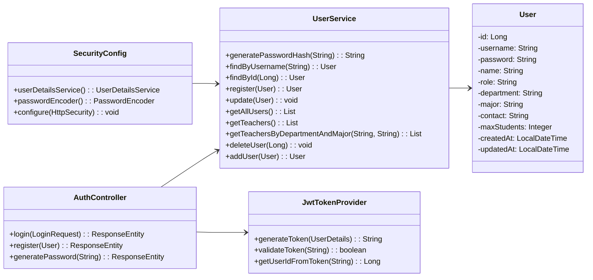
```mermaid
classDiagram
    direction LR
    
    %% 控制器类
    class AuthController {
        +login(LoginRequest): ResponseEntity
        +register(User): ResponseEntity
        +generatePassword(String): ResponseEntity
    }
    
    %% 服务类
    class UserService {
        +generatePasswordHash(String): String
        +findByUsername(String): User
        +findById(Long): User
        +register(User): User
        +update(User): void
        +getAllUsers(): List<User>
        +getTeachers(): List<User>
        +getTeachersByDepartmentAndMajor(String, String): List<User>
        +deleteUser(Long): void
        +addUser(User): User
    }
    
    %% 实体类
    class User {
        -id: Long
        -username: String
        -password: String
        -name: String
        -role: String
        -department: String
        -major: String
        -contact: String
        -maxStudents: Integer
        -createdAt: LocalDateTime
        -updatedAt: LocalDateTime
    }
    
    %% 工具类
    class JwtTokenProvider {
        +generateToken(UserDetails): String
        +validateToken(String): boolean
        +getUserIdFromToken(String): Long
    }
    
    %% 配置类
    class SecurityConfig {
        +userDetailsService(): UserDetailsService
        +passwordEncoder(): PasswordEncoder
        +configure(HttpSecurity): void
    }
    
    %% 关系
    AuthController --> UserService
    AuthController --> JwtTokenProvider
    UserService --> User
    SecurityConfig --> UserService
```

#### 7.1.3 时序图设计

##### 7.1.3.1 用户注册时序图

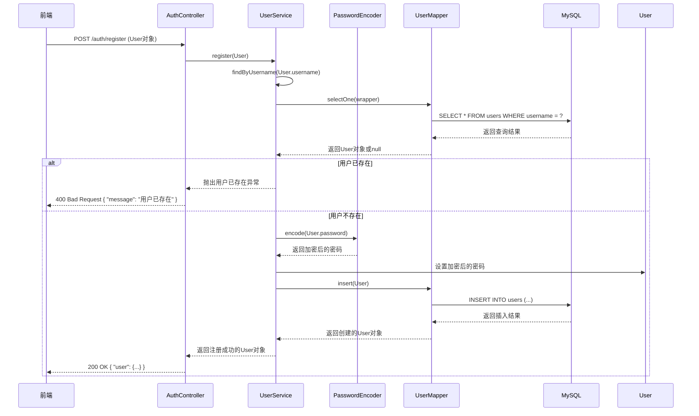
```mermaid
sequenceDiagram
    participant Client as 前端
    participant AuthController as AuthController
    participant UserService as UserService
    participant PasswordEncoder as PasswordEncoder
    participant UserMapper as UserMapper
    participant MySQL as MySQL
    
    Client->>AuthController: POST /auth/register (User对象)
    AuthController->>UserService: register(User)
    UserService->>UserService: findByUsername(User.username)
    UserService->>UserMapper: selectOne(wrapper)
    UserMapper->>MySQL: SELECT * FROM users WHERE username = ?
    MySQL-->>UserMapper: 返回查询结果
    UserMapper-->>UserService: 返回User对象或null
    
    alt 用户已存在
        UserService-->>AuthController: 抛出用户已存在异常
        AuthController-->>Client: 400 Bad Request { "message": "用户已存在" }
    else 用户不存在
        UserService->>PasswordEncoder: encode(User.password)
        PasswordEncoder-->>UserService: 返回加密后的密码
        UserService->>User: 设置加密后的密码
        UserService->>UserMapper: insert(User)
        UserMapper->>MySQL: INSERT INTO users (...)
        MySQL-->>UserMapper: 返回插入结果
        UserMapper-->>UserService: 返回创建的User对象
        UserService-->>AuthController: 返回注册成功的User对象
        AuthController-->>Client: 200 OK { "user": {...} }
    end
```

##### 7.1.3.2 用户登录时序图

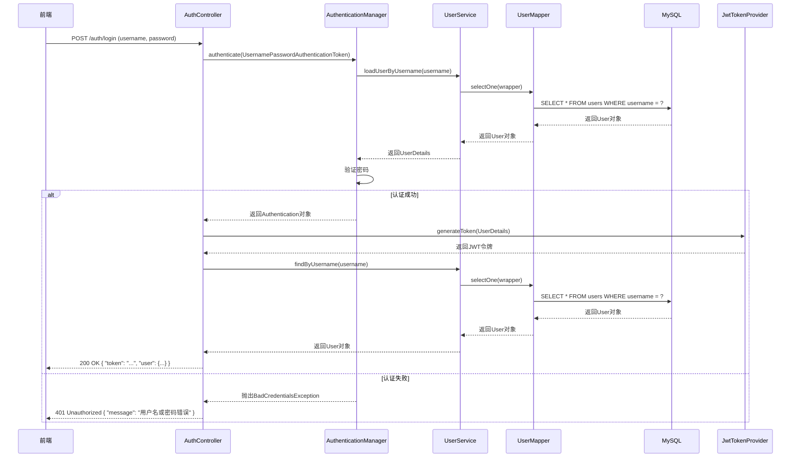
```mermaid
sequenceDiagram
    participant Client as 前端
    participant AuthController as AuthController
    participant AuthenticationManager as AuthenticationManager
    participant UserService as UserService
    participant UserMapper as UserMapper
    participant MySQL as MySQL
    participant JwtTokenProvider as JwtTokenProvider
    
    Client->>AuthController: POST /auth/login (username, password)
    AuthController->>AuthenticationManager: authenticate(UsernamePasswordAuthenticationToken)
    AuthenticationManager->>UserService: loadUserByUsername(username)
    UserService->>UserMapper: selectOne(wrapper)
    UserMapper->>MySQL: SELECT * FROM users WHERE username = ?
    MySQL-->>UserMapper: 返回User对象
    UserMapper-->>UserService: 返回User对象
    UserService-->>AuthenticationManager: 返回UserDetails
    AuthenticationManager->>AuthenticationManager: 验证密码
    
    alt 认证成功
        AuthenticationManager-->>AuthController: 返回Authentication对象
        AuthController->>JwtTokenProvider: generateToken(UserDetails)
        JwtTokenProvider-->>AuthController: 返回JWT令牌
        AuthController->>UserService: findByUsername(username)
        UserService->>UserMapper: selectOne(wrapper)
        UserMapper->>MySQL: SELECT * FROM users WHERE username = ?
        MySQL-->>UserMapper: 返回User对象
        UserMapper-->>UserService: 返回User对象
        UserService-->>AuthController: 返回User对象
        AuthController-->>Client: 200 OK { "token": "...", "user": {...} }
    else 认证失败
        AuthenticationManager-->>AuthController: 抛出BadCredentialsException
        AuthController-->>Client: 401 Unauthorized { "message": "用户名或密码错误" }
    end
```

#### 7.1.4 技术实现

**前端实现**：
- 登录页面：用户输入用户名和密码
- 注册页面：用户填写注册信息
- 权限控制：根据用户角色显示不同的页面和功能
- 令牌管理：存储和使用JWT令牌

**后端实现**：
- AuthController：处理登录、注册请求
- UserService：处理用户认证和用户信息管理
- JwtTokenProvider：生成和验证JWT令牌
- SecurityConfig：配置Spring Security，实现权限控制

**登录流程**：
1. 用户输入用户名和密码
2. 前端调用 `/auth/login` 接口
3. 后端验证用户信息
4. 生成JWT令牌
5. 返回用户信息和令牌
6. 前端存储令牌，用于后续请求

**注册流程**：
1. 用户填写注册信息
2. 前端调用 `/auth/register` 接口
3. 后端验证注册信息
4. 加密密码
5. 保存用户信息
6. 返回注册结果

### 7.2 师生互选功能

#### 7.2.1 功能概述

师生互选功能是系统的核心功能之一，包括学生申请导师、教师审核申请、师生绑定等。该功能允许学生选择心仪的指导教师，教师审核学生的申请，最终建立师生指导关系。

#### 7.2.2 类图设计

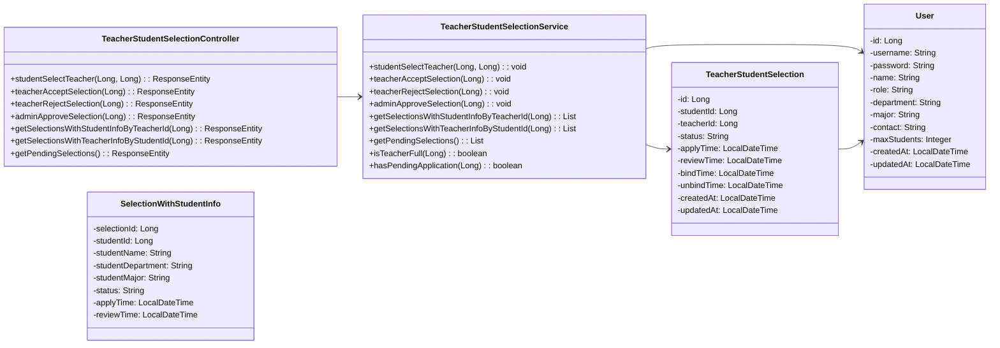
```mermaid
classDiagram
    direction LR
    
    %% 控制器类
    class TeacherStudentSelectionController {
        +studentSelectTeacher(Long, Long): ResponseEntity
        +teacherAcceptSelection(Long): ResponseEntity
        +teacherRejectSelection(Long): ResponseEntity
        +adminApproveSelection(Long): ResponseEntity
        +getSelectionsWithStudentInfoByTeacherId(Long): ResponseEntity
        +getSelectionsWithTeacherInfoByStudentId(Long): ResponseEntity
        +getPendingSelections(): ResponseEntity
    }
    
    %% 服务类
    class TeacherStudentSelectionService {
        +studentSelectTeacher(Long, Long): void
        +teacherAcceptSelection(Long): void
        +teacherRejectSelection(Long): void
        +adminApproveSelection(Long): void
        +getSelectionsWithStudentInfoByTeacherId(Long): List<SelectionWithStudentInfo>
        +getSelectionsWithTeacherInfoByStudentId(Long): List<SelectionWithTeacherInfo>
        +getPendingSelections(): List<TeacherStudentSelection>
        +isTeacherFull(Long): boolean
        +hasPendingApplication(Long): boolean
    }
    
    %% 实体类
    class TeacherStudentSelection {
        -id: Long
        -studentId: Long
        -teacherId: Long
        -status: String
        -applyTime: LocalDateTime
        -reviewTime: LocalDateTime
        -bindTime: LocalDateTime
        -unbindTime: LocalDateTime
        -createdAt: LocalDateTime
        -updatedAt: LocalDateTime
    }
    
    class User {
        -id: Long
        -username: String
        -password: String
        -name: String
        -role: String
        -department: String
        -major: String
        -contact: String
        -maxStudents: Integer
        -createdAt: LocalDateTime
        -updatedAt: LocalDateTime
    }
    
    %% DTO类
    class SelectionWithStudentInfo {
        -selectionId: Long
        -studentId: Long
        -studentName: String
        -studentDepartment: String
        -studentMajor: String
        -status: String
        -applyTime: LocalDateTime
        -reviewTime: LocalDateTime
    }
    
    %% 关系
    TeacherStudentSelectionController --> TeacherStudentSelectionService
    TeacherStudentSelectionService --> TeacherStudentSelection
    TeacherStudentSelectionService --> User
    TeacherStudentSelection --> User
```

#### 7.2.3 时序图设计

##### 7.2.3.1 学生申请导师时序图

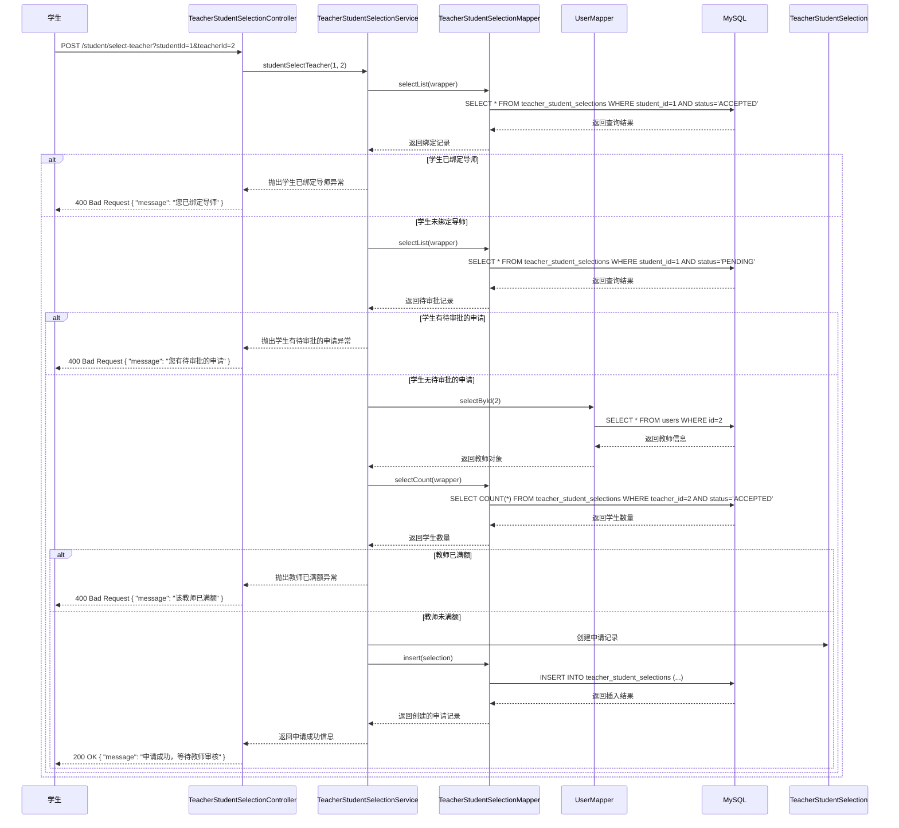
```mermaid
sequenceDiagram
    participant Student as 学生
    participant Controller as TeacherStudentSelectionController
    participant Service as TeacherStudentSelectionService
    participant SelectionMapper as TeacherStudentSelectionMapper
    participant UserMapper as UserMapper
    participant MySQL as MySQL
    
    Student->>Controller: POST /student/select-teacher?studentId=1&teacherId=2
    Controller->>Service: studentSelectTeacher(1, 2)
    
    %% 检查学生是否已绑定导师
    Service->>SelectionMapper: selectList(wrapper)
    SelectionMapper->>MySQL: SELECT * FROM teacher_student_selections WHERE student_id=1 AND status='ACCEPTED'
    MySQL-->>SelectionMapper: 返回查询结果
    SelectionMapper-->>Service: 返回绑定记录
    
    alt 学生已绑定导师
        Service-->>Controller: 抛出学生已绑定导师异常
        Controller-->>Student: 400 Bad Request { "message": "您已绑定导师" }
    else 学生未绑定导师
        
        %% 检查学生是否有待审批的申请
        Service->>SelectionMapper: selectList(wrapper)
        SelectionMapper->>MySQL: SELECT * FROM teacher_student_selections WHERE student_id=1 AND status='PENDING'
        MySQL-->>SelectionMapper: 返回查询结果
        SelectionMapper-->>Service: 返回待审批记录
        
        alt 学生有待审批的申请
            Service-->>Controller: 抛出学生有待审批的申请异常
            Controller-->>Student: 400 Bad Request { "message": "您有待审批的申请" }
        else 学生无待审批的申请
            
            %% 检查教师是否已满额
            Service->>UserMapper: selectById(2)
            UserMapper->>MySQL: SELECT * FROM users WHERE id=2
            MySQL-->>UserMapper: 返回教师信息
            UserMapper-->>Service: 返回教师对象
            
            Service->>SelectionMapper: selectCount(wrapper)
            SelectionMapper->>MySQL: SELECT COUNT(*) FROM teacher_student_selections WHERE teacher_id=2 AND status='ACCEPTED'
            MySQL-->>SelectionMapper: 返回学生数量
            SelectionMapper-->>Service: 返回学生数量
            
            alt 教师已满额
                Service-->>Controller: 抛出教师已满额异常
                Controller-->>Student: 400 Bad Request { "message": "该教师已满额" }
            else 教师未满额
                
                %% 创建申请记录
                Service->>TeacherStudentSelection: 创建申请记录
                Service->>SelectionMapper: insert(selection)
                SelectionMapper->>MySQL: INSERT INTO teacher_student_selections (...)
                MySQL-->>SelectionMapper: 返回插入结果
                SelectionMapper-->>Service: 返回创建的申请记录
                
                Service-->>Controller: 返回申请成功信息
                Controller-->>Student: 200 OK { "message": "申请成功，等待教师审核" }
            end
        end
    end
```

##### 7.2.3.2 教师审核申请时序图

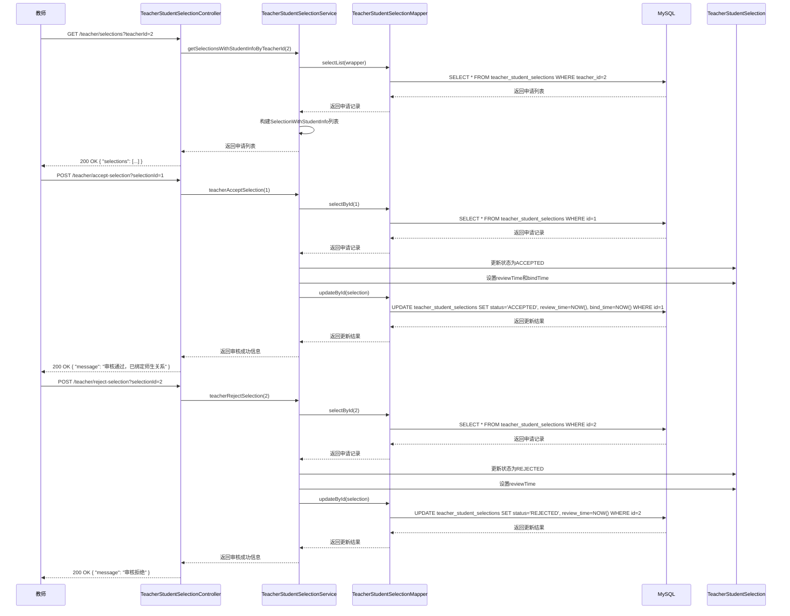
```mermaid
sequenceDiagram
    participant Teacher as 教师
    participant Controller as TeacherStudentSelectionController
    participant Service as TeacherStudentSelectionService
    participant SelectionMapper as TeacherStudentSelectionMapper
    participant MySQL as MySQL
    
    %% 教师查看申请列表
    Teacher->>Controller: GET /teacher/selections?teacherId=2
    Controller->>Service: getSelectionsWithStudentInfoByTeacherId(2)
    Service->>SelectionMapper: selectList(wrapper)
    SelectionMapper->>MySQL: SELECT * FROM teacher_student_selections WHERE teacher_id=2
    MySQL-->>SelectionMapper: 返回申请列表
    SelectionMapper-->>Service: 返回申请记录
    Service->>Service: 构建SelectionWithStudentInfo列表
    Service-->>Controller: 返回申请列表
    Controller-->>Teacher: 200 OK { "selections": [...] }
    
    %% 教师接受申请
    Teacher->>Controller: POST /teacher/accept-selection?selectionId=1
    Controller->>Service: teacherAcceptSelection(1)
    
    Service->>SelectionMapper: selectById(1)
    SelectionMapper->>MySQL: SELECT * FROM teacher_student_selections WHERE id=1
    MySQL-->>SelectionMapper: 返回申请记录
    SelectionMapper-->>Service: 返回申请记录
    
    Service->>TeacherStudentSelection: 更新状态为ACCEPTED
    Service->>TeacherStudentSelection: 设置reviewTime和bindTime
    Service->>SelectionMapper: updateById(selection)
    SelectionMapper->>MySQL: UPDATE teacher_student_selections SET status='ACCEPTED', review_time=NOW(), bind_time=NOW() WHERE id=1
    MySQL-->>SelectionMapper: 返回更新结果
    SelectionMapper-->>Service: 返回更新结果
    
    Service-->>Controller: 返回审核成功信息
    Controller-->>Teacher: 200 OK { "message": "审核通过，已绑定师生关系" }
    
    %% 教师拒绝申请
    Teacher->>Controller: POST /teacher/reject-selection?selectionId=2
    Controller->>Service: teacherRejectSelection(2)
    
    Service->>SelectionMapper: selectById(2)
    SelectionMapper->>MySQL: SELECT * FROM teacher_student_selections WHERE id=2
    MySQL-->>SelectionMapper: 返回申请记录
    SelectionMapper-->>Service: 返回申请记录
    
    Service->>TeacherStudentSelection: 更新状态为REJECTED
    Service->>TeacherStudentSelection: 设置reviewTime
    Service->>SelectionMapper: updateById(selection)
    SelectionMapper->>MySQL: UPDATE teacher_student_selections SET status='REJECTED', review_time=NOW() WHERE id=2
    MySQL-->>SelectionMapper: 返回更新结果
    SelectionMapper-->>Service: 返回更新结果
    
    Service-->>Controller: 返回审核成功信息
    Controller-->>Teacher: 200 OK { "message": "审核拒绝" }
```

#### 7.2.4 技术实现

**前端实现**：
- 导师选择页面：显示教师列表，支持按院系和专业筛选
- 申请状态页面：显示学生的申请状态
- 申请管理页面：教师查看和审核学生申请

**后端实现**：
- TeacherStudentSelectionController：处理师生互选相关的请求
- TeacherStudentSelectionService：处理师生互选的业务逻辑
- TeacherStudentSelectionMapper：数据访问

**学生申请导师流程**：
1. 学生登录系统
2. 进入导师选择页面
3. 筛选教师：根据院系和专业筛选教师
4. 查看教师信息：查看教师的基本信息、最大指导学生数和当前指导学生数
5. 提交申请：选择心仪的教师，提交申请
6. 系统验证：
   - 检查学生是否已经绑定导师
   - 检查学生是否有待审批的申请
   - 检查教师是否已满额
7. 生成申请记录：系统生成师生互选申请记录，状态为"PENDING"
8. 提示申请成功：显示申请成功提示，跳转到申请状态页面

**教师审核申请流程**：
1. 教师登录系统
2. 进入申请管理页面
3. 查看申请列表：查看所有学生的申请，包含学生的基本信息
4. 审核申请：
   - 接受申请：将申请状态改为"ACCEPTED"，记录审核时间
   - 拒绝申请：将申请状态改为"REJECTED"，记录审核时间
5. 系统处理：
   - 若教师接受申请，建立师生指导关系
   - 若教师拒绝申请，学生可以重新选择其他教师

### 7.3 选题管理功能

#### 7.3.1 功能概述

选题管理功能是系统的重要功能之一，包括学生提交选题、教师审核选题、任务书上传等。该功能允许学生提交自拟论文题目，教师审核选题并上传任务书。

#### 7.3.2 类图设计

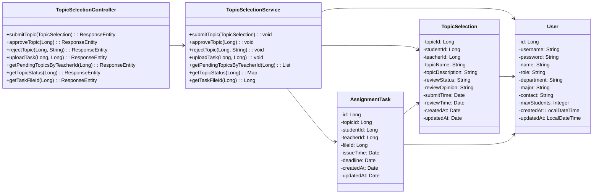
```mermaid
classDiagram
    direction LR
    
    %% 控制器类
    class TopicSelectionController {
        +submitTopic(TopicSelection): ResponseEntity
        +approveTopic(Long): ResponseEntity
        +rejectTopic(Long, String): ResponseEntity
        +uploadTask(Long, Long): ResponseEntity
        +getPendingTopicsByTeacherId(Long): ResponseEntity
        +getTopicStatus(Long): ResponseEntity
        +getTaskFileId(Long): ResponseEntity
    }
    
    %% 服务类
    class TopicSelectionService {
        +submitTopic(TopicSelection): void
        +approveTopic(Long): void
        +rejectTopic(Long, String): void
        +uploadTask(Long, Long): void
        +getPendingTopicsByTeacherId(Long): List<TopicSelection>
        +getTopicStatus(Long): Map<String, Object>
        +getTaskFileId(Long): Long
    }
    
    %% 实体类
    class TopicSelection {
        -topicId: Long
        -studentId: Long
        -teacherId: Long
        -topicName: String
        -topicDescription: String
        -reviewStatus: String
        -reviewOpinion: String
        -submitTime: Date
        -reviewTime: Date
        -createdAt: Date
        -updatedAt: Date
    }
    
    class AssignmentTask {
        -id: Long
        -topicId: Long
        -studentId: Long
        -teacherId: Long
        -fileId: Long
        -issueTime: Date
        -deadline: Date
        -createdAt: Date
        -updatedAt: Date
    }
    
    class User {
        -id: Long
        -username: String
        -password: String
        -name: String
        -role: String
        -department: String
        -major: String
        -contact: String
        -maxStudents: Integer
        -createdAt: LocalDateTime
        -updatedAt: LocalDateTime
    }
    
    %% 关系
    TopicSelectionController --> TopicSelectionService
    TopicSelectionService --> TopicSelection
    TopicSelectionService --> AssignmentTask
    TopicSelectionService --> User
    TopicSelection --> User
    AssignmentTask --> TopicSelection
    AssignmentTask --> User
```

#### 7.3.3 时序图设计

##### 7.3.3.1 学生提交选题时序图

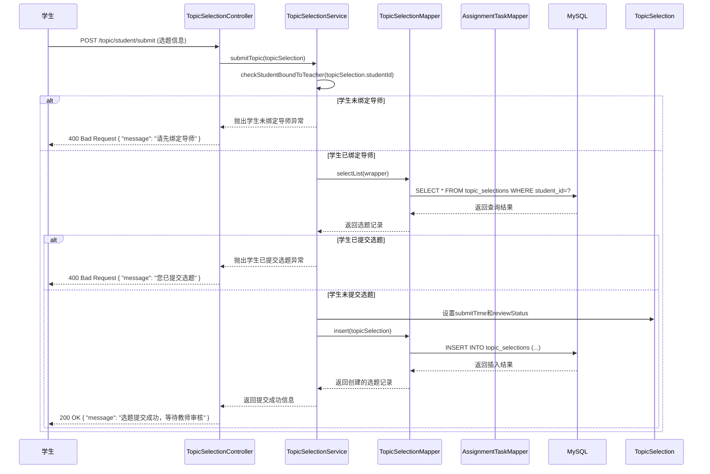
```mermaid
sequenceDiagram
    participant Student as 学生
    participant Controller as TopicSelectionController
    participant Service as TopicSelectionService
    participant TopicMapper as TopicSelectionMapper
    participant TaskMapper as AssignmentTaskMapper
    participant MySQL as MySQL
    
    Student->>Controller: POST /topic/student/submit (选题信息)
    Controller->>Service: submitTopic(topicSelection)
    
    %% 检查学生是否已绑定导师
    Service->>Service: checkStudentBoundToTeacher(topicSelection.studentId)
    
    alt 学生未绑定导师
        Service-->>Controller: 抛出学生未绑定导师异常
        Controller-->>Student: 400 Bad Request { "message": "请先绑定导师" }
    else 学生已绑定导师
        
        %% 检查学生是否已提交选题
        Service->>TopicMapper: selectList(wrapper)
        TopicMapper->>MySQL: SELECT * FROM topic_selections WHERE student_id=?
        MySQL-->>TopicMapper: 返回查询结果
        TopicMapper-->>Service: 返回选题记录
        
        alt 学生已提交选题
            Service-->>Controller: 抛出学生已提交选题异常
            Controller-->>Student: 400 Bad Request { "message": "您已提交选题" }
        else 学生未提交选题
            
            %% 保存选题信息
            Service->>TopicSelection: 设置submitTime和reviewStatus
            Service->>TopicMapper: insert(topicSelection)
            TopicMapper->>MySQL: INSERT INTO topic_selections (...)
            MySQL-->>TopicMapper: 返回插入结果
            TopicMapper-->>Service: 返回创建的选题记录
            
            Service-->>Controller: 返回提交成功信息
            Controller-->>Student: 200 OK { "message": "选题提交成功，等待教师审核" }
        end
    end
```

##### 7.3.3.2 教师审核选题时序图

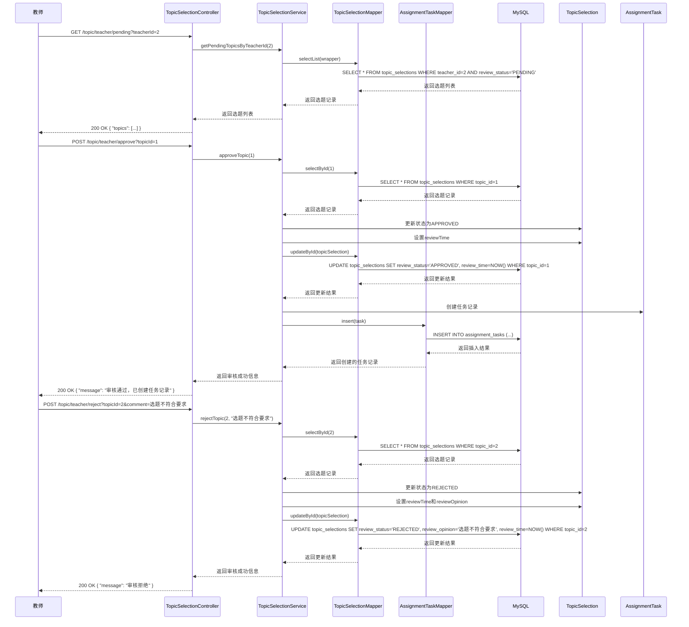
```mermaid
sequenceDiagram
    participant Teacher as 教师
    participant Controller as TopicSelectionController
    participant Service as TopicSelectionService
    participant TopicMapper as TopicSelectionMapper
    participant TaskMapper as AssignmentTaskMapper
    participant MySQL as MySQL
    
    %% 教师查看待审核选题
    Teacher->>Controller: GET /topic/teacher/pending?teacherId=2
    Controller->>Service: getPendingTopicsByTeacherId(2)
    Service->>TopicMapper: selectList(wrapper)
    TopicMapper->>MySQL: SELECT * FROM topic_selections WHERE teacher_id=2 AND review_status='PENDING'
    MySQL-->>TopicMapper: 返回选题列表
    TopicMapper-->>Service: 返回选题记录
    Service-->>Controller: 返回选题列表
    Controller-->>Teacher: 200 OK { "topics": [...] }
    
    %% 教师审核通过选题
    Teacher->>Controller: POST /topic/teacher/approve?topicId=1
    Controller->>Service: approveTopic(1)
    
    Service->>TopicMapper: selectById(1)
    TopicMapper->>MySQL: SELECT * FROM topic_selections WHERE topic_id=1
    MySQL-->>TopicMapper: 返回选题记录
    TopicMapper-->>Service: 返回选题记录
    
    Service->>TopicSelection: 更新状态为APPROVED
    Service->>TopicSelection: 设置reviewTime
    Service->>TopicMapper: updateById(topicSelection)
    TopicMapper->>MySQL: UPDATE topic_selections SET review_status='APPROVED', review_time=NOW() WHERE topic_id=1
    MySQL-->>TopicMapper: 返回更新结果
    TopicMapper-->>Service: 返回更新结果
    
    %% 创建任务记录
    Service->>AssignmentTask: 创建任务记录
    Service->>TaskMapper: insert(task)
    TaskMapper->>MySQL: INSERT INTO assignment_tasks (...)
    MySQL-->>TaskMapper: 返回插入结果
    TaskMapper-->>Service: 返回创建的任务记录
    
    Service-->>Controller: 返回审核成功信息
    Controller-->>Teacher: 200 OK { "message": "审核通过，已创建任务记录" }
    
    %% 教师审核拒绝选题
    Teacher->>Controller: POST /topic/teacher/reject?topicId=2&comment=选题不符合要求
    Controller->>Service: rejectTopic(2, "选题不符合要求")
    
    Service->>TopicMapper: selectById(2)
    TopicMapper->>MySQL: SELECT * FROM topic_selections WHERE topic_id=2
    MySQL-->>TopicMapper: 返回选题记录
    TopicMapper-->>Service: 返回选题记录
    
    Service->>TopicSelection: 更新状态为REJECTED
    Service->>TopicSelection: 设置reviewTime和reviewOpinion
    Service->>TopicMapper: updateById(topicSelection)
    TopicMapper->>MySQL: UPDATE topic_selections SET review_status='REJECTED', review_opinion='选题不符合要求', review_time=NOW() WHERE topic_id=2
    MySQL-->>TopicMapper: 返回更新结果
    TopicMapper-->>Service: 返回更新结果
    
    Service-->>Controller: 返回审核成功信息
    Controller-->>Teacher: 200 OK { "message": "审核拒绝" }
```

##### 7.3.3.3 任务书上传时序图

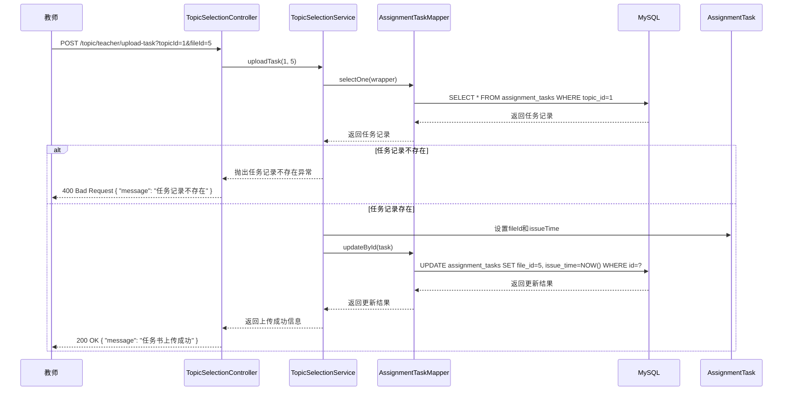
```mermaid
sequenceDiagram
    participant Teacher as 教师
    participant Controller as TopicSelectionController
    participant Service as TopicSelectionService
    participant TaskMapper as AssignmentTaskMapper
    participant MySQL as MySQL
    
    Teacher->>Controller: POST /topic/teacher/upload-task?topicId=1&fileId=5
    Controller->>Service: uploadTask(1, 5)
    
    Service->>TaskMapper: selectOne(wrapper)
    TaskMapper->>MySQL: SELECT * FROM assignment_tasks WHERE topic_id=1
    MySQL-->>TaskMapper: 返回任务记录
    TaskMapper-->>Service: 返回任务记录
    
    alt 任务记录不存在
        Service-->>Controller: 抛出任务记录不存在异常
        Controller-->>Teacher: 400 Bad Request { "message": "任务记录不存在" }
    else 任务记录存在
        
        Service->>AssignmentTask: 设置fileId和issueTime
        Service->>TaskMapper: updateById(task)
        TaskMapper->>MySQL: UPDATE assignment_tasks SET file_id=5, issue_time=NOW() WHERE id=?
        MySQL-->>TaskMapper: 返回更新结果
        TaskMapper-->>Service: 返回更新结果
        
        Service-->>Controller: 返回上传成功信息
        Controller-->>Teacher: 200 OK { "message": "任务书上传成功" }
    end
```

#### 7.3.4 技术实现

**前端实现**：
- 选题提交页面：学生填写选题名称和描述
- 选题审核页面：教师查看和审核学生选题
- 任务书上传页面：教师上传任务书
- 选题状态页面：学生查看选题状态和任务书

**后端实现**：
- TopicSelectionController：处理选题相关的请求
- TopicSelectionService：处理选题的业务逻辑
- TopicSelectionMapper：数据访问
- AssignmentTaskMapper：任务书数据访问

**学生选题提交流程**：
1. 学生登录系统
2. 进入选题提交页面
3. 填写选题名称和描述
4. 提交选题：前端调用 `/topic/student/submit` 接口
5. 系统验证：检查学生是否已绑定导师
6. 保存选题：系统保存选题信息，状态为"PENDING"
7. 提示提交成功：显示提交成功提示，等待教师审核

**教师选题审核流程**：
1. 教师登录系统
2. 进入选题审核页面
3. 查看待审核选题：前端调用 `/topic/teacher/pending` 接口
4. 审核选题：
   - 审核通过：点击通过按钮，前端调用 `/topic/teacher/approve` 接口，系统更新选题状态为"APPROVED"，创建任务记录
   - 审核拒绝：填写审核意见，点击拒绝按钮，前端调用 `/topic/teacher/reject` 接口，系统更新选题状态为"REJECTED"，保存审核意见
5. 提示审核结果：显示审核成功提示

**任务书上传流程**：
1. 教师登录系统
2. 进入任务书上传页面
3. 选择已通过审核的选题
4. 上传任务书：前端先调用文件上传接口，获取文件ID，然后调用 `/topic/teacher/upload-task` 接口
5. 系统处理：查找与选题关联的任务记录，更新任务记录，设置任务书文件ID
6. 提示上传成功：显示上传成功提示

### 7.4 论文管理功能

#### 7.4.1 功能概述

论文管理功能是系统的核心功能之一，包括开题报告、中期检查、最终论文提交与评审等。该功能允许学生提交各阶段的报告和论文，教师评审并给出意见和分数。

#### 7.4.2 类图设计

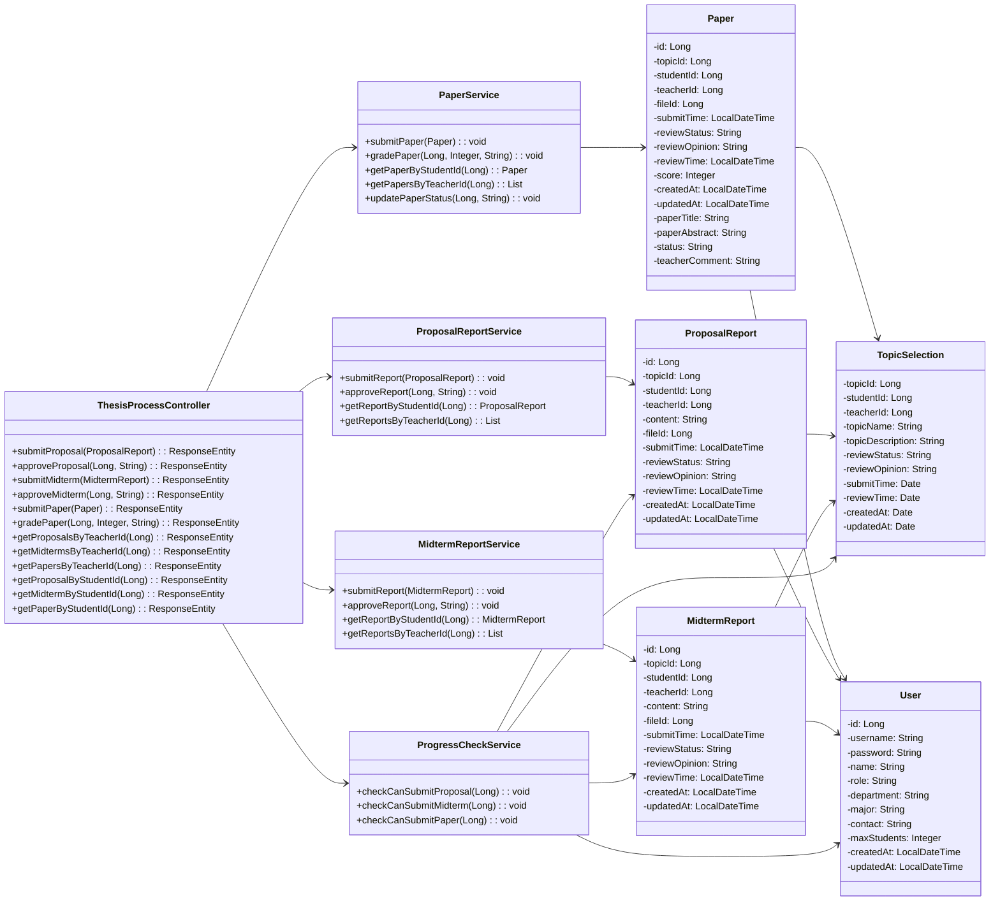
```mermaid
classDiagram
    direction LR
    
    %% 控制器类
    class ThesisProcessController {
        +submitProposal(ProposalReport): ResponseEntity
        +approveProposal(Long, String): ResponseEntity
        +submitMidterm(MidtermReport): ResponseEntity
        +approveMidterm(Long, String): ResponseEntity
        +submitPaper(Paper): ResponseEntity
        +gradePaper(Long, Integer, String): ResponseEntity
        +getProposalsByTeacherId(Long): ResponseEntity
        +getMidtermsByTeacherId(Long): ResponseEntity
        +getPapersByTeacherId(Long): ResponseEntity
        +getProposalByStudentId(Long): ResponseEntity
        +getMidtermByStudentId(Long): ResponseEntity
        +getPaperByStudentId(Long): ResponseEntity
    }
    
    %% 服务类
    class PaperService {
        +submitPaper(Paper): void
        +gradePaper(Long, Integer, String): void
        +getPaperByStudentId(Long): Paper
        +getPapersByTeacherId(Long): List<Paper>
        +updatePaperStatus(Long, String): void
    }
    
    class ProposalReportService {
        +submitReport(ProposalReport): void
        +approveReport(Long, String): void
        +getReportByStudentId(Long): ProposalReport
        +getReportsByTeacherId(Long): List<ProposalReport>
    }
    
    class MidtermReportService {
        +submitReport(MidtermReport): void
        +approveReport(Long, String): void
        +getReportByStudentId(Long): MidtermReport
        +getReportsByTeacherId(Long): List<MidtermReport>
    }
    
    class ProgressCheckService {
        +checkCanSubmitProposal(Long): void
        +checkCanSubmitMidterm(Long): void
        +checkCanSubmitPaper(Long): void
    }
    
    %% 实体类
    class Paper {
        -id: Long
        -topicId: Long
        -studentId: Long
        -teacherId: Long
        -fileId: Long
        -submitTime: LocalDateTime
        -reviewStatus: String
        -reviewOpinion: String
        -reviewTime: LocalDateTime
        -score: Integer
        -createdAt: LocalDateTime
        -updatedAt: LocalDateTime
        -paperTitle: String
        -paperAbstract: String
        -status: String
        -teacherComment: String
    }
    
    class ProposalReport {
        -id: Long
        -topicId: Long
        -studentId: Long
        -teacherId: Long
        -content: String
        -fileId: Long
        -submitTime: LocalDateTime
        -reviewStatus: String
        -reviewOpinion: String
        -reviewTime: LocalDateTime
        -createdAt: LocalDateTime
        -updatedAt: LocalDateTime
    }
    
    class MidtermReport {
        -id: Long
        -topicId: Long
        -studentId: Long
        -teacherId: Long
        -content: String
        -fileId: Long
        -submitTime: LocalDateTime
        -reviewStatus: String
        -reviewOpinion: String
        -reviewTime: LocalDateTime
        -createdAt: LocalDateTime
        -updatedAt: LocalDateTime
    }
    
    class TopicSelection {
        -topicId: Long
        -studentId: Long
        -teacherId: Long
        -topicName: String
        -topicDescription: String
        -reviewStatus: String
        -reviewOpinion: String
        -submitTime: Date
        -reviewTime: Date
        -createdAt: Date
        -updatedAt: Date
    }
    
    class User {
        -id: Long
        -username: String
        -password: String
        -name: String
        -role: String
        -department: String
        -major: String
        -contact: String
        -maxStudents: Integer
        -createdAt: LocalDateTime
        -updatedAt: LocalDateTime
    }
    
    %% 关系
    ThesisProcessController --> PaperService
    ThesisProcessController --> ProposalReportService
    ThesisProcessController --> MidtermReportService
    ThesisProcessController --> ProgressCheckService
    
    PaperService --> Paper
    ProposalReportService --> ProposalReport
    MidtermReportService --> MidtermReport
    
    Paper --> TopicSelection
    Paper --> User
    ProposalReport --> TopicSelection
    ProposalReport --> User
    MidtermReport --> TopicSelection
    MidtermReport --> User
    
    ProgressCheckService --> TopicSelection
    ProgressCheckService --> ProposalReport
    ProgressCheckService --> MidtermReport
    ProgressCheckService --> User
```

#### 7.4.3 时序图设计

##### 7.4.3.1 学生提交开题报告时序图

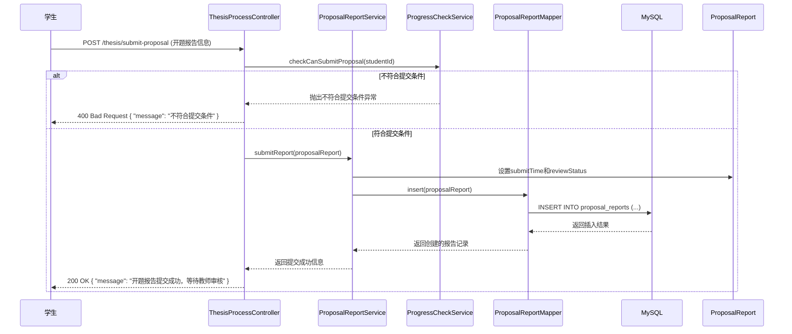
```mermaid
sequenceDiagram
    participant Student as 学生
    participant Controller as ThesisProcessController
    participant Service as ProposalReportService
    participant ProgressService as ProgressCheckService
    participant ReportMapper as ProposalReportMapper
    participant MySQL as MySQL
    
    Student->>Controller: POST /thesis/submit-proposal (开题报告信息)
    Controller->>ProgressService: checkCanSubmitProposal(studentId)
    
    alt 不符合提交条件
        ProgressService-->>Controller: 抛出不符合提交条件异常
        Controller-->>Student: 400 Bad Request { "message": "不符合提交条件" }
    else 符合提交条件
        
        Controller->>Service: submitReport(proposalReport)
        Service->>ProposalReport: 设置submitTime和reviewStatus
        Service->>ReportMapper: insert(proposalReport)
        ReportMapper->>MySQL: INSERT INTO proposal_reports (...)
        MySQL-->>ReportMapper: 返回插入结果
        ReportMapper-->>Service: 返回创建的报告记录
        
        Service-->>Controller: 返回提交成功信息
        Controller-->>Student: 200 OK { "message": "开题报告提交成功，等待教师审核" }
    end
```

##### 7.4.3.2 教师审核开题报告时序图

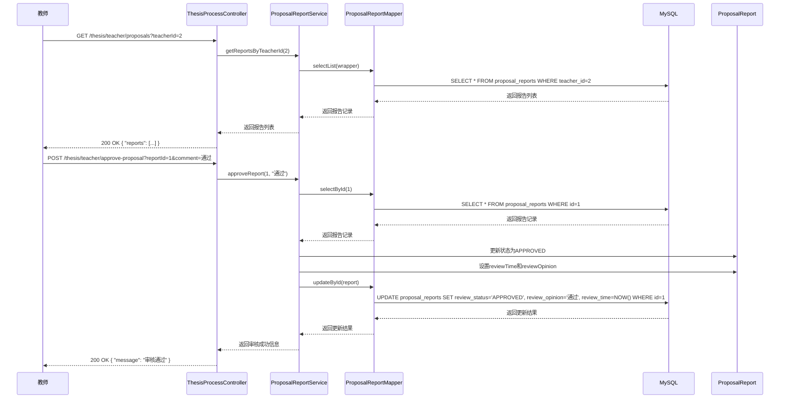
```mermaid
sequenceDiagram
    participant Teacher as 教师
    participant Controller as ThesisProcessController
    participant Service as ProposalReportService
    participant ReportMapper as ProposalReportMapper
    participant MySQL as MySQL
    
    %% 教师查看待审核的开题报告
    Teacher->>Controller: GET /thesis/teacher/proposals?teacherId=2
    Controller->>Service: getReportsByTeacherId(2)
    Service->>ReportMapper: selectList(wrapper)
    ReportMapper->>MySQL: SELECT * FROM proposal_reports WHERE teacher_id=2
    MySQL-->>ReportMapper: 返回报告列表
    ReportMapper-->>Service: 返回报告记录
    Service-->>Controller: 返回报告列表
    Controller-->>Teacher: 200 OK { "reports": [...] }
    
    %% 教师审核通过开题报告
    Teacher->>Controller: POST /thesis/teacher/approve-proposal?reportId=1&comment=通过
    Controller->>Service: approveReport(1, "通过")
    
    Service->>ReportMapper: selectById(1)
    ReportMapper->>MySQL: SELECT * FROM proposal_reports WHERE id=1
    MySQL-->>ReportMapper: 返回报告记录
    ReportMapper-->>Service: 返回报告记录
    
    Service->>ProposalReport: 更新状态为APPROVED
    Service->>ProposalReport: 设置reviewTime和reviewOpinion
    Service->>ReportMapper: updateById(report)
    ReportMapper->>MySQL: UPDATE proposal_reports SET review_status='APPROVED', review_opinion='通过', review_time=NOW() WHERE id=1
    MySQL-->>ReportMapper: 返回更新结果
    ReportMapper-->>Service: 返回更新结果
    
    Service-->>Controller: 返回审核成功信息
    Controller-->>Teacher: 200 OK { "message": "审核通过" }
```

##### 7.4.3.3 学生提交中期报告时序图

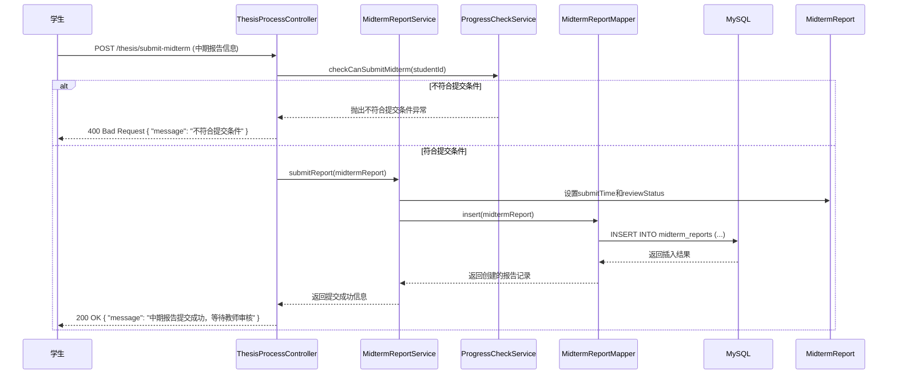
```mermaid
sequenceDiagram
    participant Student as 学生
    participant Controller as ThesisProcessController
    participant Service as MidtermReportService
    participant ProgressService as ProgressCheckService
    participant ReportMapper as MidtermReportMapper
    participant MySQL as MySQL
    
    Student->>Controller: POST /thesis/submit-midterm (中期报告信息)
    Controller->>ProgressService: checkCanSubmitMidterm(studentId)
    
    alt 不符合提交条件
        ProgressService-->>Controller: 抛出不符合提交条件异常
        Controller-->>Student: 400 Bad Request { "message": "不符合提交条件" }
    else 符合提交条件
        
        Controller->>Service: submitReport(midtermReport)
        Service->>MidtermReport: 设置submitTime和reviewStatus
        Service->>ReportMapper: insert(midtermReport)
        ReportMapper->>MySQL: INSERT INTO midterm_reports (...)
        MySQL-->>ReportMapper: 返回插入结果
        ReportMapper-->>Service: 返回创建的报告记录
        
        Service-->>Controller: 返回提交成功信息
        Controller-->>Student: 200 OK { "message": "中期报告提交成功，等待教师审核" }
    end
```

##### 7.4.3.4 学生提交最终论文时序图

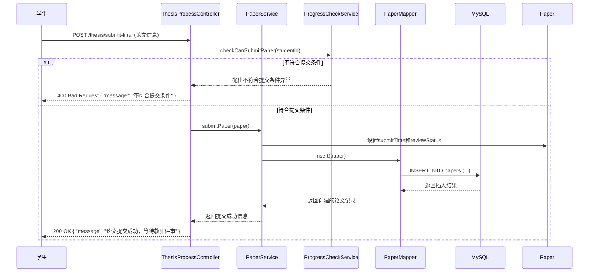
```mermaid
sequenceDiagram
    participant Student as 学生
    participant Controller as ThesisProcessController
    participant Service as PaperService
    participant ProgressService as ProgressCheckService
    participant PaperMapper as PaperMapper
    participant MySQL as MySQL
    
    Student->>Controller: POST /thesis/submit-final (论文信息)
    Controller->>ProgressService: checkCanSubmitPaper(studentId)
    
    alt 不符合提交条件
        ProgressService-->>Controller: 抛出不符合提交条件异常
        Controller-->>Student: 400 Bad Request { "message": "不符合提交条件" }
    else 符合提交条件
        
        Controller->>Service: submitPaper(paper)
        Service->>Paper: 设置submitTime和reviewStatus
        Service->>PaperMapper: insert(paper)
        PaperMapper->>MySQL: INSERT INTO papers (...)
        MySQL-->>PaperMapper: 返回插入结果
        PaperMapper-->>Service: 返回创建的论文记录
        
        Service-->>Controller: 返回提交成功信息
        Controller-->>Student: 200 OK { "message": "论文提交成功，等待教师评审" }
    end
```

##### 7.4.3.5 教师评审论文时序图

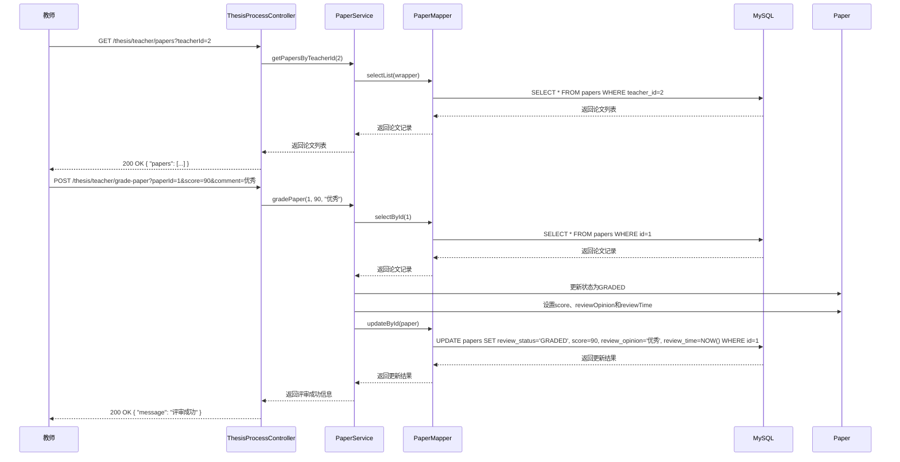
```mermaid
sequenceDiagram
    participant Teacher as 教师
    participant Controller as ThesisProcessController
    participant Service as PaperService
    participant PaperMapper as PaperMapper
    participant MySQL as MySQL
    
    %% 教师查看待评审的论文
    Teacher->>Controller: GET /thesis/teacher/papers?teacherId=2
    Controller->>Service: getPapersByTeacherId(2)
    Service->>PaperMapper: selectList(wrapper)
    PaperMapper->>MySQL: SELECT * FROM papers WHERE teacher_id=2
    MySQL-->>PaperMapper: 返回论文列表
    PaperMapper-->>Service: 返回论文记录
    Service-->>Controller: 返回论文列表
    Controller-->>Teacher: 200 OK { "papers": [...] }
    
    %% 教师评审论文
    Teacher->>Controller: POST /thesis/teacher/grade-paper?paperId=1&score=90&comment=优秀
    Controller->>Service: gradePaper(1, 90, "优秀")
    
    Service->>PaperMapper: selectById(1)
    PaperMapper->>MySQL: SELECT * FROM papers WHERE id=1
    MySQL-->>PaperMapper: 返回论文记录
    PaperMapper-->>Service: 返回论文记录
    
    Service->>Paper: 更新状态为GRADED
    Service->>Paper: 设置score、reviewOpinion和reviewTime
    Service->>PaperMapper: updateById(paper)
    PaperMapper->>MySQL: UPDATE papers SET review_status='GRADED', score=90, review_opinion='优秀', review_time=NOW() WHERE id=1
    MySQL-->>PaperMapper: 返回更新结果
    PaperMapper-->>Service: 返回更新结果
    
    Service-->>Controller: 返回评审成功信息
    Controller-->>Teacher: 200 OK { "message": "评审成功" }
```

#### 7.4.4 技术实现

**前端实现**：
- 开题报告提交页面：学生上传开题报告
- 中期报告提交页面：学生上传中期报告
- 最终论文提交页面：学生上传最终论文
- 报告评审页面：教师评审开题报告和中期报告
- 论文评审页面：教师评审最终论文

**后端实现**：
- ThesisProcessController：处理论文相关的请求
- PaperService：处理论文的业务逻辑
- ProposalReportService：处理开题报告的业务逻辑
- MidtermReportService：处理中期报告的业务逻辑

**开题报告提交流程**：
1. 学生登录系统
2. 进入开题报告提交页面
3. 上传开题报告文件
4. 提交报告：前端调用 `/thesis/submit-proposal` 接口
5. 系统处理：保存报告信息，状态为"PENDING"
6. 提示提交成功：显示提交成功提示，等待教师评审

**中期报告提交流程**：
1. 学生登录系统
2. 进入中期报告提交页面
3. 上传中期报告文件
4. 提交报告：前端调用 `/thesis/submit-midterm` 接口
5. 系统处理：保存报告信息，状态为"PENDING"
6. 提示提交成功：显示提交成功提示，等待教师评审

**最终论文提交流程**：
1. 学生登录系统
2. 进入最终论文提交页面
3. 上传最终论文文件
4. 提交论文：前端调用 `/thesis/submit-final` 接口
5. 系统处理：保存论文信息，状态为"PENDING"
6. 提示提交成功：显示提交成功提示，等待教师评审

**教师评审流程**：
1. 教师登录系统
2. 进入评审页面
3. 查看待评审的报告或论文
4. 评审：
   - 评审开题报告：前端调用 `/thesis/review-proposal` 接口
   - 评审中期报告：前端调用 `/thesis/review-midterm` 接口
   - 评审最终论文：前端调用 `/thesis/review-final` 接口
5. 系统处理：更新报告或论文的状态、评审意见和分数
6. 提示评审成功：显示评审成功提示

### 7.5 文件管理功能

#### 7.5.1 功能概述

文件管理功能是系统的基础功能之一，包括文件上传、下载、版本管理等。该功能允许用户上传和下载各种文件，如论文、报告、任务书等。

#### 7.5.2 类图设计

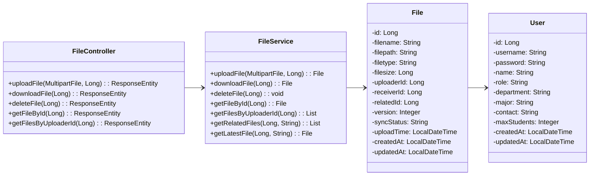
```mermaid
classDiagram
    direction LR
    
    %% 控制器类
    class FileController {
        +uploadFile(MultipartFile, Long): ResponseEntity
        +downloadFile(Long): ResponseEntity
        +deleteFile(Long): ResponseEntity
        +getFileById(Long): ResponseEntity
        +getFilesByUploaderId(Long): ResponseEntity
    }
    
    %% 服务类
    class FileService {
        +uploadFile(MultipartFile, Long): File
        +downloadFile(Long): File
        +deleteFile(Long): void
        +getFileById(Long): File
        +getFilesByUploaderId(Long): List<File>
        +getRelatedFiles(Long, String): List<File>
        +getLatestFile(Long, String): File
    }
    
    %% 实体类
    class File {
        -id: Long
        -filename: String
        -filepath: String
        -filetype: String
        -filesize: Long
        -uploaderId: Long
        -receiverId: Long
        -relatedId: Long
        -version: Integer
        -syncStatus: String
        -uploadTime: LocalDateTime
        -createdAt: LocalDateTime
        -updatedAt: LocalDateTime
    }
    
    class User {
        -id: Long
        -username: String
        -password: String
        -name: String
        -role: String
        -department: String
        -major: String
        -contact: String
        -maxStudents: Integer
        -createdAt: LocalDateTime
        -updatedAt: LocalDateTime
    }
    
    %% 关系
    FileController --> FileService
    FileService --> File
    File --> User
```

#### 7.5.3 时序图设计

##### 7.5.3.1 文件上传时序图

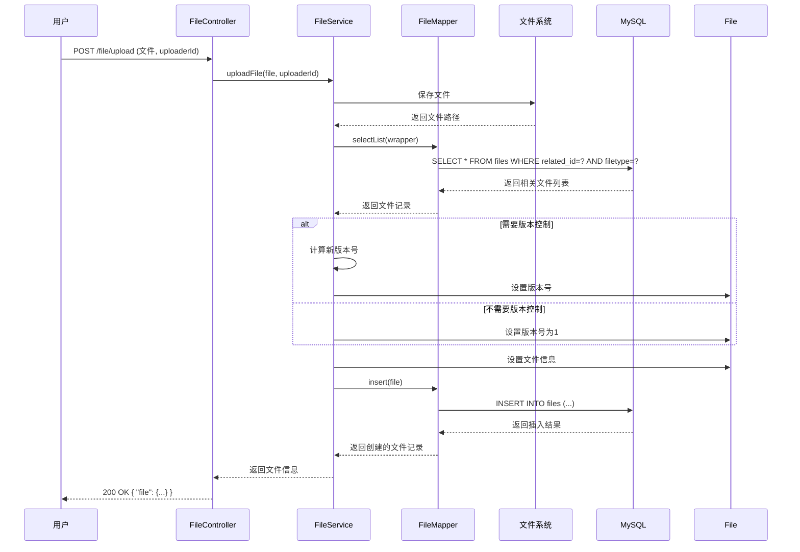
```mermaid
sequenceDiagram
    participant User as 用户
    participant Controller as FileController
    participant Service as FileService
    participant FileMapper as FileMapper
    participant FileSystem as 文件系统
    participant MySQL as MySQL
    
    User->>Controller: POST /file/upload (文件, uploaderId)
    Controller->>Service: uploadFile(file, uploaderId)
    
    %% 处理文件存储
    Service->>FileSystem: 保存文件
    FileSystem-->>Service: 返回文件路径
    
    %% 检查是否需要版本控制
    Service->>FileMapper: selectList(wrapper)
    FileMapper->>MySQL: SELECT * FROM files WHERE related_id=? AND filetype=?
    MySQL-->>FileMapper: 返回相关文件列表
    FileMapper-->>Service: 返回文件记录
    
    alt 需要版本控制
        Service->>Service: 计算新版本号
        Service->>File: 设置版本号
    else 不需要版本控制
        Service->>File: 设置版本号为1
    end
    
    %% 保存文件信息
    Service->>File: 设置文件信息
    Service->>FileMapper: insert(file)
    FileMapper->>MySQL: INSERT INTO files (...)
    MySQL-->>FileMapper: 返回插入结果
    FileMapper-->>Service: 返回创建的文件记录
    
    Service-->>Controller: 返回文件信息
    Controller-->>User: 200 OK { "file": {...} }
```

##### 7.5.3.2 文件下载时序图

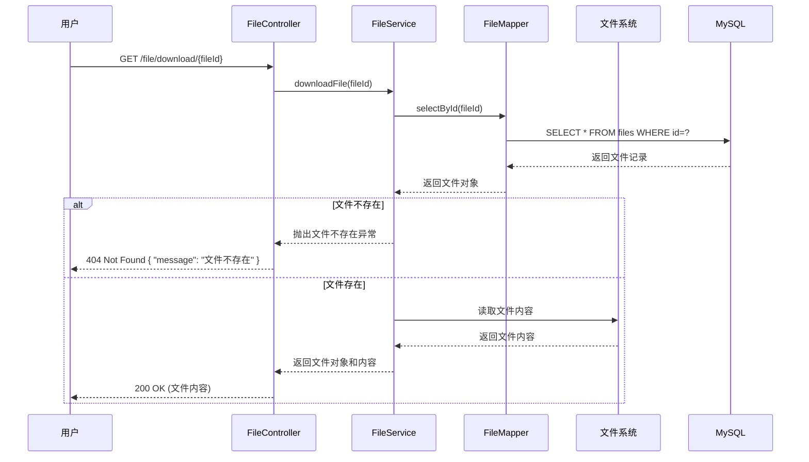
```mermaid
sequenceDiagram
    participant User as 用户
    participant Controller as FileController
    participant Service as FileService
    participant FileMapper as FileMapper
    participant FileSystem as 文件系统
    participant MySQL as MySQL
    
    User->>Controller: GET /file/download/{fileId}
    Controller->>Service: downloadFile(fileId)
    Service->>FileMapper: selectById(fileId)
    FileMapper->>MySQL: SELECT * FROM files WHERE id=?
    MySQL-->>FileMapper: 返回文件记录
    FileMapper-->>Service: 返回文件对象
    
    alt 文件不存在
        Service-->>Controller: 抛出文件不存在异常
        Controller-->>User: 404 Not Found { "message": "文件不存在" }
    else 文件存在
        Service->>FileSystem: 读取文件内容
        FileSystem-->>Service: 返回文件内容
        Service-->>Controller: 返回文件对象和内容
        Controller-->>User: 200 OK (文件内容)
    end
```

##### 7.5.3.3 文件删除时序图

```mermaid
sequenceDiagram
    participant User as 用户
    participant Controller as FileController
    participant Service as FileService
    participant FileMapper as FileMapper
    participant FileSystem as 文件系统
    participant MySQL as MySQL
    
    User->>Controller: DELETE /file/delete/{fileId}
    Controller->>Service: deleteFile(fileId)
    Service->>FileMapper: selectById(fileId)
    FileMapper->>MySQL: SELECT * FROM files WHERE id=?
    MySQL-->>FileMapper: 返回文件记录
    FileMapper-->>Service: 返回文件对象
    
    alt 文件不存在
        Service-->>Controller: 抛出文件不存在异常
        Controller-->>User: 404 Not Found { "message": "文件不存在" }
    else 文件存在
        Service->>FileSystem: 删除文件
        Service->>FileMapper: deleteById(fileId)
        FileMapper->>MySQL: DELETE FROM files WHERE id=?
        MySQL-->>FileMapper: 返回删除结果
        FileMapper-->>Service: 返回删除结果
        Service-->>Controller: 返回删除成功信息
        Controller-->>User: 200 OK { "message": "文件删除成功" }
    end
```

#### 7.5.4 技术实现

**前端实现**：
- 文件上传组件：支持文件选择和上传
- 文件列表页面：显示用户的文件列表
- 文件下载功能：支持文件下载

**后端实现**：
- FileController：处理文件相关的请求
- FileService：处理文件的业务逻辑
- FileMapper：数据访问

**文件上传流程**：
1. 用户登录系统
2. 进入文件上传页面
3. 选择文件：选择要上传的文件
4. 上传文件：前端调用 `/file/upload` 接口
5. 系统处理：保存文件到本地文件系统，记录文件信息到数据库
6. 提示上传成功：显示上传成功提示，返回文件ID

**文件下载流程**：
1. 用户登录系统
2. 进入文件列表页面
3. 选择文件：选择要下载的文件
4. 下载文件：前端调用 `/file/download/{fileId}` 接口
5. 系统处理：根据文件ID查找文件，返回文件内容
6. 浏览器下载：文件开始下载

### 7.6 系统管理功能

#### 7.6.1 功能概述

系统管理功能是系统的管理功能，包括系统设置、通知管理、用户管理等。该功能允许管理员管理系统的配置和用户。

#### 7.6.2 类图设计

```mermaid
classDiagram
    direction LR
    
    %% 控制器类
    class SystemController {
        +getSystemSettings(): ResponseEntity
        +updateSystemSettings(SystemSetting): ResponseEntity
        +sendNotification(Notification): ResponseEntity
        +getUsers(): ResponseEntity
        +addUser(User): ResponseEntity
        +updateUser(User): ResponseEntity
        +deleteUser(Long): ResponseEntity
    }
    
    %% 服务类
    class SystemSettingService {
        +getSetting(String): String
        +updateSetting(String, String): void
        +getAllSettings(): List<SystemSetting>
    }
    
    class NotificationService {
        +sendNotification(String, String, Long, Long): void
        +getNotificationsByRecipientId(Long): List<Notification>
        +markAsRead(Long): void
        +getUnreadCount(Long): Integer
    }
    
    class UserService {
        +generatePasswordHash(String): String
        +findByUsername(String): User
        +findById(Long): User
        +register(User): User
        +update(User): void
        +getAllUsers(): List<User>
        +getTeachers(): List<User>
        +getTeachersByDepartmentAndMajor(String, String): List<User>
        +deleteUser(Long): void
        +addUser(User): User
    }
    
    %% 实体类
    class SystemSetting {
        -id: Long
        -settingKey: String
        -settingValue: String
        -description: String
        -createdAt: LocalDateTime
        -updatedAt: LocalDateTime
    }
    
    class Notification {
        -id: Long
        -title: String
        -content: String
        -type: String
        -recipientId: Long
        -senderId: Long
        -sendTime: LocalDateTime
        -readStatus: String
        -createdAt: LocalDateTime
        -updatedAt: LocalDateTime
    }
    
    class User {
        -id: Long
        -username: String
        -password: String
        -name: String
        -role: String
        -department: String
        -major: String
        -contact: String
        -maxStudents: Integer
        -createdAt: LocalDateTime
        -updatedAt: LocalDateTime
    }
    
    %% 关系
    SystemController --> SystemSettingService
    SystemController --> NotificationService
    SystemController --> UserService
    
    SystemSettingService --> SystemSetting
    NotificationService --> Notification
    UserService --> User
    
    Notification --> User
```

#### 7.6.3 时序图设计

##### 7.6.3.1 系统设置更新时序图

```mermaid
sequenceDiagram
    participant Admin as 管理员
    participant Controller as SystemController
    participant Service as SystemSettingService
    participant SettingMapper as SystemSettingMapper
    participant MySQL as MySQL
    
    Admin->>Controller: PUT /system/settings (设置信息)
    Controller->>Service: updateSetting(settingKey, settingValue)
    
    Service->>SettingMapper: selectOne(wrapper)
    SettingMapper->>MySQL: SELECT * FROM system_settings WHERE setting_key=?
    MySQL-->>SettingMapper: 返回设置记录
    SettingMapper-->>Service: 返回设置对象
    
    alt 设置存在
        Service->>SystemSetting: 更新settingValue
        Service->>SettingMapper: updateById(setting)
        SettingMapper->>MySQL: UPDATE system_settings SET setting_value=?, updated_at=NOW() WHERE id=?
        MySQL-->>SettingMapper: 返回更新结果
        SettingMapper-->>Service: 返回更新结果
    else 设置不存在
        Service->>SystemSetting: 创建新设置
        Service->>SettingMapper: insert(setting)
        SettingMapper->>MySQL: INSERT INTO system_settings (...)
        MySQL-->>SettingMapper: 返回插入结果
        SettingMapper-->>Service: 返回插入结果
    end
    
    Service-->>Controller: 返回更新成功信息
    Controller-->>Admin: 200 OK { "message": "设置更新成功" }
```

##### 7.6.3.2 通知发送时序图

```mermaid
sequenceDiagram
    participant Admin as 管理员
    participant Controller as SystemController
    participant Service as NotificationService
    participant NotificationMapper as NotificationMapper
    participant MySQL as MySQL
    
    Admin->>Controller: POST /system/notification (通知信息)
    Controller->>Service: sendNotification(title, content, recipientId, senderId)
    
    Service->>Notification: 设置通知信息
    Service->>NotificationMapper: insert(notification)
    NotificationMapper->>MySQL: INSERT INTO notifications (...)
    MySQL-->>NotificationMapper: 返回插入结果
    NotificationMapper-->>Service: 返回创建的通知记录
    
    Service-->>Controller: 返回发送成功信息
    Controller-->>Admin: 200 OK { "message": "通知发送成功" }
```

##### 7.6.3.3 用户管理时序图

```mermaid
sequenceDiagram
    participant Admin as 管理员
    participant Controller as SystemController
    participant Service as UserService
    participant UserMapper as UserMapper
    participant MySQL as MySQL
    
    %% 添加用户
    Admin->>Controller: POST /system/user/add (用户信息)
    Controller->>Service: addUser(user)
    
    Service->>UserService: generatePasswordHash(user.password)
    Service->>User: 设置加密后的密码
    Service->>UserMapper: insert(user)
    UserMapper->>MySQL: INSERT INTO users (...)
    MySQL-->>UserMapper: 返回插入结果
    UserMapper-->>Service: 返回创建的用户记录
    
    Service-->>Controller: 返回添加成功信息
    Controller-->>Admin: 200 OK { "message": "用户添加成功" }
    
    %% 更新用户
    Admin->>Controller: PUT /system/user/update (用户信息)
    Controller->>Service: update(user)
    
    Service->>UserMapper: updateById(user)
    UserMapper->>MySQL: UPDATE users SET ... WHERE id=?
    MySQL-->>UserMapper: 返回更新结果
    UserMapper-->>Service: 返回更新结果
    
    Service-->>Controller: 返回更新成功信息
    Controller-->>Admin: 200 OK { "message": "用户更新成功" }
    
    %% 删除用户
    Admin->>Controller: DELETE /system/user/delete/{userId}
    Controller->>Service: deleteUser(userId)
    
    Service->>UserMapper: deleteById(userId)
    UserMapper->>MySQL: DELETE FROM users WHERE id=?
    MySQL-->>UserMapper: 返回删除结果
    UserMapper-->>Service: 返回删除结果
    
    Service-->>Controller: 返回删除成功信息
    Controller-->>Admin: 200 OK { "message": "用户删除成功" }
```

#### 7.6.4 技术实现

**前端实现**：
- 系统设置页面：管理员修改系统设置
- 通知管理页面：管理员发送系统通知
- 用户管理页面：管理员添加、修改、删除用户

**后端实现**：
- SystemController：处理系统相关的请求
- SystemSettingService：处理系统设置的业务逻辑
- NotificationService：处理通知的业务逻辑
- UserService：处理用户管理的业务逻辑

**系统设置流程**：
1. 管理员登录系统
2. 进入系统设置页面
3. 修改设置：修改系统的配置参数
4. 保存设置：前端调用 `/system/settings` 接口
5. 系统处理：更新系统设置
6. 提示保存成功：显示保存成功提示

**通知管理流程**：
1. 管理员登录系统
2. 进入通知管理页面
3. 编写通知：填写通知标题和内容
4. 发送通知：前端调用 `/system/notification` 接口
5. 系统处理：保存通知信息，发送给指定用户或角色
6. 提示发送成功：显示发送成功提示

**用户管理流程**：
1. 管理员登录系统
2. 进入用户管理页面
3. 管理用户：
   - 添加用户：填写用户信息，点击添加按钮
   - 修改用户：选择用户，修改用户信息，点击保存按钮
   - 删除用户：选择用户，点击删除按钮，确认删除
4. 系统处理：更新用户信息
5. 提示操作成功：显示操作成功提示

## 8. 业务流程

### 8.1 毕业设计整体流程

```mermaid
flowchart TD
    A[用户登录] --> B[师生互选]
    B --> C[选题提交]
    C --> D[选题审核]
    D --> E[任务书上传]
    E --> F[开题报告提交]
    F --> G[开题报告评审]
    G --> H[中期报告提交]
    H --> I[中期报告评审]
    I --> J[最终论文提交]
    J --> K[最终论文评审]
    K --> L[成绩发布]
```

### 8.2 关键业务流程

#### 8.2.1 用户登录流程

1. 用户输入用户名和密码
2. AuthController接收登录请求
3. 调用UserService验证用户信息
4. 生成JWT令牌
5. 返回用户信息和令牌

#### 8.2.2 师生互选流程

1. 学生选择教师并提交申请
2. TeacherStudentSelectionController接收请求
3. 调用TeacherStudentSelectionService处理申请逻辑
4. 教师审核申请
5. 系统更新师生关系状态

#### 8.2.3 选题管理流程

1. 学生提交选题
2. TopicSelectionController接收请求
3. 调用TopicSelectionService处理选题逻辑
4. 教师审核选题
5. 教师上传任务书
6. 系统更新选题状态和任务信息

#### 8.2.4 论文管理流程

1. 学生上传论文
2. FileController接收文件并保存
3. ThesisProcessController接收论文提交请求
4. 调用相关服务处理论文逻辑
5. 教师评审论文
6. 系统更新论文状态和分数

## 9. 技术实现细节

### 9.1 JWT认证实现

系统使用JWT（JSON Web Token）进行身份认证，具体实现如下：

1. **认证流程**：
   - 用户登录时，系统验证用户名和密码
   - 验证通过后，生成JWT令牌，包含用户ID、用户名和角色
   - 将令牌返回给前端
   - 前端存储令牌，用于后续请求
   - 后续请求时，前端在请求头中携带令牌
   - 后端验证令牌的有效性
   - 验证通过后，处理请求

2. **JWT配置**：
   - 令牌有效期：24小时
   - 签名算法：HS256
   - 密钥：系统配置的密钥

3. **安全措施**：
   - 密码加密存储：使用BCrypt加密
   - 令牌验证：验证令牌的签名和有效期
   - 权限控制：根据用户角色控制访问权限

### 9.2 文件存储实现

系统使用本地文件系统存储文件，具体实现如下：

1. **文件存储路径**：
   - 文件存储在服务器的指定目录下
   - 目录结构：`{basePath}/{year}/{month}/{day}/{fileId}`
   - basePath：系统配置的基础路径

2. **文件上传流程**：
   - 前端选择文件并上传
   - 后端接收文件，生成唯一文件ID
   - 创建存储目录
   - 保存文件到存储目录
   - 记录文件信息到数据库
   - 返回文件ID给前端

3. **文件下载流程**：
   - 前端请求下载文件，携带文件ID
   - 后端根据文件ID查找文件信息
   - 读取文件内容
   - 设置响应头，返回文件内容
   - 浏览器下载文件

### 9.3 事务管理

系统使用Spring的事务管理机制，确保业务操作的原子性，具体实现如下：

1. **事务配置**：
   - 使用`@Transactional`注解标记需要事务管理的方法
   - 事务隔离级别：默认隔离级别
   - 事务传播行为：默认传播行为

2. **事务管理场景**：
   - 选题提交和审核：确保选题状态和任务记录的一致性
   - 论文提交和评审：确保论文状态和评审信息的一致性
   - 师生互选：确保申请状态和师生关系的一致性

### 9.4 异常处理

系统实现了统一的异常处理机制，确保系统的稳定性和可靠性，具体实现如下：

1. **异常处理策略**：
   - 使用`@RestControllerAdvice`和`@ExceptionHandler`注解处理异常
   - 分类处理不同类型的异常
   - 返回统一的错误响应格式

2. **异常类型**：
   - 业务异常：如教师已满额、学生已绑定导师等
   - 系统异常：如数据库错误、文件存储错误等
   - 认证异常：如令牌无效、权限不足等

3. **错误响应格式**：
   ```json
   {
     "code": 错误码,
     "message": 错误信息
   }
   ```

## 10. 总结与优化建议

### 10.1 系统总结

本系统是一个功能完整的毕业设计管理系统，实现了用户认证、师生互选、选题管理、论文管理、文件管理和系统管理等功能。系统采用分层架构，将控制器、服务层、数据访问层和实体层分离，提高了代码的可维护性和可扩展性。

系统的主要特点包括：
- 完整的业务流程：涵盖了毕业设计的全过程，从师生互选到最终论文评审
- 安全的认证机制：使用JWT令牌认证，确保用户信息的安全性
- 便捷的文件管理：支持文件上传、下载和版本管理
- 灵活的系统配置：支持系统设置的修改和管理
- 实时的通知机制：支持系统通知的发送和接收

### 10.2 优化建议

1. **性能优化**：
   - 使用缓存：对常用数据（如教师列表、系统设置）使用缓存，减少数据库查询
   - 数据库优化：优化SQL查询，添加适当的索引
   - 文件存储优化：考虑使用云存储服务，提高文件存储的可靠性和扩展性

2. **功能优化**：
   - 添加智能推荐功能：根据学生的专业和兴趣，推荐合适的教师
   - 添加进度提醒功能：系统自动提醒学生和教师当前阶段的任务和截止时间
   - 添加数据统计功能：统计毕业设计的各项数据，如选题通过率、论文成绩分布等
   - 添加移动端支持：开发移动端应用，方便用户随时随地访问系统

3. **安全性优化**：
   - 加强密码策略：要求用户使用强密码，定期更换密码
   - 添加多因素认证：支持短信验证码、邮箱验证码等多因素认证
   - 加强文件安全：对上传的文件进行病毒扫描，防止恶意文件
   - 定期安全审计：定期检查系统的安全漏洞，及时修复

4. **用户体验优化**：
   - 改进前端界面：使用现代化的前端框架和组件，提高界面的美观性和易用性
   - 添加操作指引：为新用户提供操作指引，帮助用户快速熟悉系统
   - 优化响应速度：减少页面加载时间，提高系统的响应速度
   - 添加反馈机制：允许用户反馈系统问题和建议

### 10.3 未来展望

随着教育信息化的不断发展，毕业设计管理系统将在以下方面得到进一步的发展：

1. **智能化**：利用人工智能技术，实现智能选题推荐、智能论文评审等功能
2. **移动化**：开发移动端应用，支持学生和教师随时随地访问系统
3. **集成化**：与其他教育管理系统集成，实现数据共享和业务协同
4. **国际化**：支持多语言和国际化教育模式，适应全球化教育的需求

通过不断的优化和改进，毕业设计管理系统将成为教育信息化的重要组成部分，为高校的毕业设计管理提供更加便捷、高效、智能的解决方案。