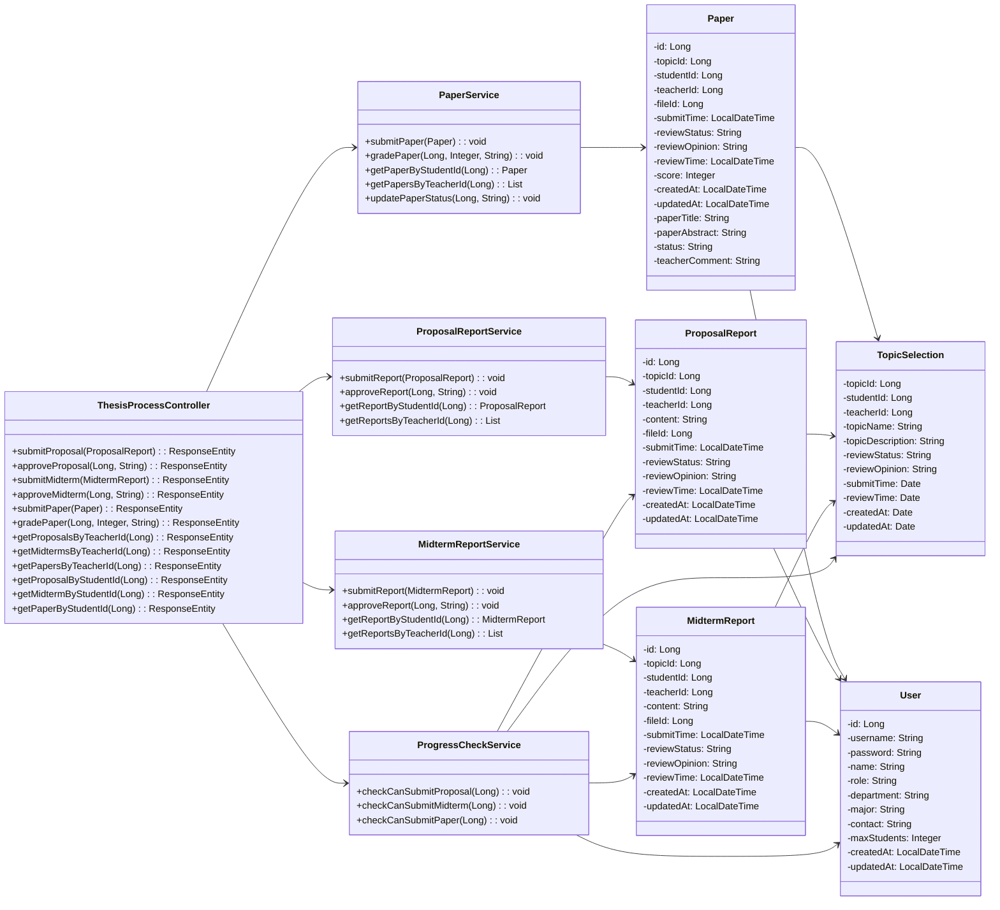
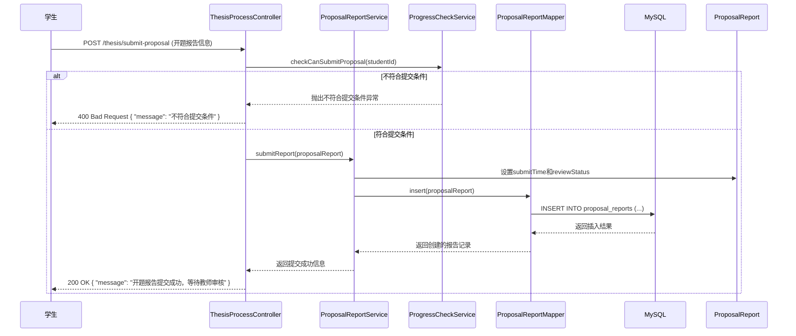
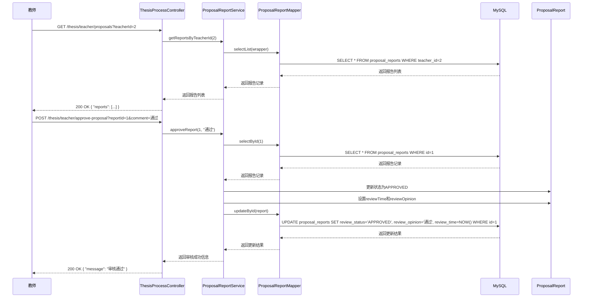
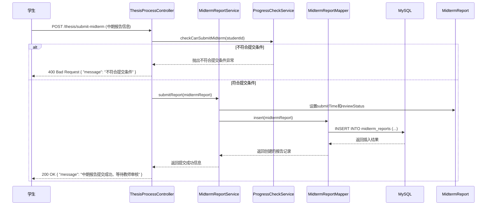
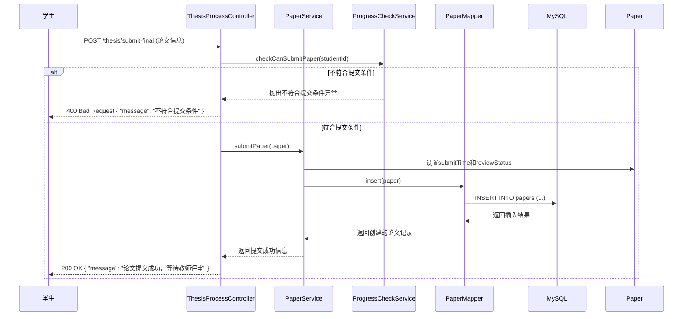
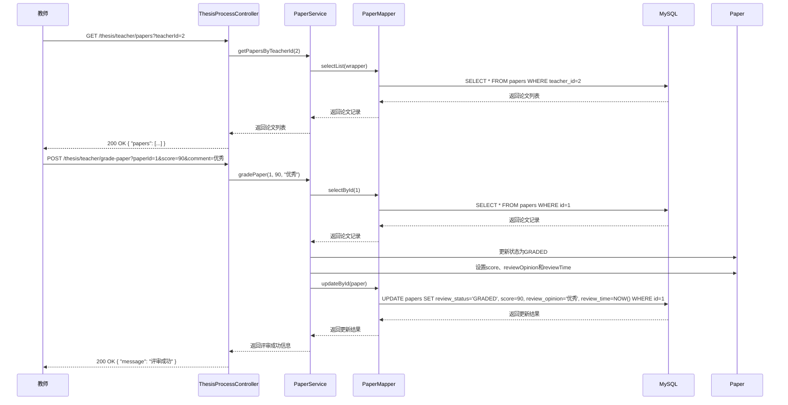

# 论文管理功能详细设计

## 1. 功能概述

论文管理功能是系统的核心功能之一，包括开题报告、中期检查、最终论文提交与评审等。该功能允许学生提交各阶段的报告和论文，教师评审并给出意见和分数。

## 2. 类图设计

### 2.1 论文管理功能类图



## 3. 时序图设计

### 3.1 学生提交开题报告时序图

学生提交开题报告模块赋予了学生提交开题报告的权力。学生在前端填写开题报告信息后，提交到系统，系统检查学生是否符合提交条件（是否绑定导师、是否已选题且选题通过、是否已有待审核的开题报告），如果条件都满足则创建开题报告记录并等待教师审核；如果任一条件不满足则返回相应的错误信息。

学生提交开题报告中的学生提交开题报告时序图如图所示，学生发起请求后，ThesisProcessController接收并调用ProgressCheckService的checkCanSubmitProposal方法检查提交条件，ProgressCheckService执行各项检查后，如果不符合提交条件则抛出异常，Controller返回400 Bad Request错误；如果符合提交条件，Controller调用ProposalReportService的submitReport方法处理业务逻辑，服务层设置ProposalReport对象的submitTime和reviewStatus，然后调用ProposalReportMapper的insert方法，由数据访问层生成并执行INSERT语句操作MySQL数据库，插入成功后，数据库返回结果，服务层逐层传递状态，最终返回提交成功的响应。



### 3.2 教师审核开题报告时序图

教师审核开题报告模块赋予了教师审核开题报告的权力。教师在前端查看待审核的开题报告列表后，可以审核通过开题报告，系统更新开题报告的状态、评审意见和评审时间。

教师审核开题报告中的教师审核开题报告时序图如图所示，首先教师查看待审核的开题报告列表，发起GET请求后，ThesisProcessController接收并调用ProposalReportService的getReportsByTeacherId方法处理业务逻辑，服务层调用ProposalReportMapper的selectList方法查询数据库，由数据访问层生成并执行SELECT语句操作MySQL数据库，数据库返回报告列表后，ProposalReportMapper返回报告记录给服务层，服务层返回报告列表给Controller，Controller最终返回包含报告列表的200 OK响应。

接着是教师审核通过开题报告的流程，教师发起POST请求后，ThesisProcessController接收并调用ProposalReportService的approveReport方法处理业务逻辑，服务层调用ProposalReportMapper的selectById方法查询数据库，数据库返回报告记录后，ProposalReportMapper返回报告记录给服务层，服务层更新ProposalReport对象的状态为APPROVED，设置reviewTime和reviewOpinion，然后调用ProposalReportMapper的updateById方法，由数据访问层生成并执行UPDATE语句操作MySQL数据库，更新成功后，数据库返回结果，服务层逐层传递状态，最终返回审核通过的响应。



### 3.3 学生提交中期报告时序图

学生提交中期报告模块赋予了学生提交中期报告的权力。学生在前端填写中期报告信息后，提交到系统，系统检查学生是否符合提交条件（是否绑定导师、开题报告是否通过、是否已有待审核的中期报告），如果条件都满足则创建中期报告记录并等待教师审核；如果任一条件不满足则返回相应的错误信息。

学生提交中期报告中的学生提交中期报告时序图如图所示，学生发起请求后，ThesisProcessController接收并调用ProgressCheckService的checkCanSubmitMidterm方法检查提交条件，ProgressCheckService执行各项检查后，如果不符合提交条件则抛出异常，Controller返回400 Bad Request错误；如果符合提交条件，Controller调用MidtermReportService的submitReport方法处理业务逻辑，服务层设置MidtermReport对象的submitTime和reviewStatus，然后调用MidtermReportMapper的insert方法，由数据访问层生成并执行INSERT语句操作MySQL数据库，插入成功后，数据库返回结果，服务层逐层传递状态，最终返回提交成功的响应。



### 3.4 学生提交最终论文时序图

学生提交最终论文模块赋予了学生提交最终论文的权力。学生在前端填写论文信息后，提交到系统，系统检查学生是否符合提交条件（是否绑定导师、中期报告是否通过），如果条件都满足则创建论文记录并等待教师评审；如果任一条件不满足则返回相应的错误信息。

学生提交最终论文中的学生提交最终论文时序图如图所示，学生发起请求后，ThesisProcessController接收并调用ProgressCheckService的checkCanSubmitPaper方法检查提交条件，ProgressCheckService执行各项检查后，如果不符合提交条件则抛出异常，Controller返回400 Bad Request错误；如果符合提交条件，Controller调用PaperService的submitPaper方法处理业务逻辑，服务层设置Paper对象的submitTime和reviewStatus，然后调用PaperMapper的insert方法，由数据访问层生成并执行INSERT语句操作MySQL数据库，插入成功后，数据库返回结果，服务层逐层传递状态，最终返回提交成功的响应。



### 3.5 教师评审论文时序图

教师评审论文模块赋予了教师评审论文的权力。教师在前端查看待评审的论文列表后，可以对论文进行评审，系统更新论文的状态、分数、评审意见和评审时间。

教师评审论文中的教师评审论文时序图如图所示，首先教师查看待评审的论文列表，发起GET请求后，ThesisProcessController接收并调用PaperService的getPapersByTeacherId方法处理业务逻辑，服务层调用PaperMapper的selectList方法查询数据库，由数据访问层生成并执行SELECT语句操作MySQL数据库，数据库返回论文列表后，PaperMapper返回论文记录给服务层，服务层返回论文列表给Controller，Controller最终返回包含论文列表的200 OK响应。

接着是教师评审论文的流程，教师发起POST请求后，ThesisProcessController接收并调用PaperService的gradePaper方法处理业务逻辑，服务层调用PaperMapper的selectById方法查询数据库，数据库返回论文记录后，PaperMapper返回论文记录给服务层，服务层更新Paper对象的状态为GRADED，设置score、reviewOpinion和reviewTime，然后调用PaperMapper的updateById方法，由数据访问层生成并执行UPDATE语句操作MySQL数据库，更新成功后，数据库返回结果，服务层逐层传递状态，最终返回评审成功的响应。



## 4. 技术实现

### 4.1 关键代码实现

#### 4.1.1 ThesisProcessController.java

```java
@RestController
@RequestMapping("/thesis")
public class ThesisProcessController {
    
    @Autowired
    private PaperService paperService;
    
    @Autowired
    private ProposalReportService proposalReportService;
    
    @Autowired
    private MidtermReportService midtermReportService;
    
    @Autowired
    private ProgressCheckService progressCheckService;
    
    @PostMapping("/submit-proposal")
    public ResponseEntity<?> submitProposal(@RequestBody ProposalReport proposalReport) {
        try {
            progressCheckService.checkCanSubmitProposal(proposalReport.getStudentId());
            proposalReportService.submitReport(proposalReport);
            return ResponseEntity.ok("开题报告提交成功，等待教师审核");
        } catch (Exception e) {
            return ResponseEntity.status(HttpStatus.BAD_REQUEST).body(e.getMessage());
        }
    }
    
    @PostMapping("/teacher/approve-proposal")
    public ResponseEntity<?> approveProposal(@RequestParam Long reportId, @RequestParam String comment) {
        try {
            proposalReportService.approveReport(reportId, comment);
            return ResponseEntity.ok("审核通过");
        } catch (Exception e) {
            return ResponseEntity.status(HttpStatus.BAD_REQUEST).body(e.getMessage());
        }
    }
    
    @PostMapping("/submit-midterm")
    public ResponseEntity<?> submitMidterm(@RequestBody MidtermReport midtermReport) {
        try {
            progressCheckService.checkCanSubmitMidterm(midtermReport.getStudentId());
            midtermReportService.submitReport(midtermReport);
            return ResponseEntity.ok("中期报告提交成功，等待教师审核");
        } catch (Exception e) {
            return ResponseEntity.status(HttpStatus.BAD_REQUEST).body(e.getMessage());
        }
    }
    
    @PostMapping("/teacher/approve-midterm")
    public ResponseEntity<?> approveMidterm(@RequestParam Long reportId, @RequestParam String comment) {
        try {
            midtermReportService.approveReport(reportId, comment);
            return ResponseEntity.ok("审核通过");
        } catch (Exception e) {
            return ResponseEntity.status(HttpStatus.BAD_REQUEST).body(e.getMessage());
        }
    }
    
    @PostMapping("/submit-final")
    public ResponseEntity<?> submitPaper(@RequestBody Paper paper) {
        try {
            progressCheckService.checkCanSubmitPaper(paper.getStudentId());
            paperService.submitPaper(paper);
            return ResponseEntity.ok("论文提交成功，等待教师评审");
        } catch (Exception e) {
            return ResponseEntity.status(HttpStatus.BAD_REQUEST).body(e.getMessage());
        }
    }
    
    @PostMapping("/teacher/grade-paper")
    public ResponseEntity<?> gradePaper(@RequestParam Long paperId, @RequestParam Integer score, @RequestParam String comment) {
        try {
            paperService.gradePaper(paperId, score, comment);
            return ResponseEntity.ok("评审成功");
        } catch (Exception e) {
            return ResponseEntity.status(HttpStatus.BAD_REQUEST).body(e.getMessage());
        }
    }
    
    @GetMapping("/teacher/proposals")
    public ResponseEntity<?> getProposalsByTeacherId(@RequestParam Long teacherId) {
        try {
            List<ProposalReport> reports = proposalReportService.getReportsByTeacherId(teacherId);
            return ResponseEntity.ok(reports);
        } catch (Exception e) {
            return ResponseEntity.status(HttpStatus.INTERNAL_SERVER_ERROR).body(e.getMessage());
        }
    }
    
    @GetMapping("/teacher/midterms")
    public ResponseEntity<?> getMidtermsByTeacherId(@RequestParam Long teacherId) {
        try {
            List<MidtermReport> reports = midtermReportService.getReportsByTeacherId(teacherId);
            return ResponseEntity.ok(reports);
        } catch (Exception e) {
            return ResponseEntity.status(HttpStatus.INTERNAL_SERVER_ERROR).body(e.getMessage());
        }
    }
    
    @GetMapping("/teacher/papers")
    public ResponseEntity<?> getPapersByTeacherId(@RequestParam Long teacherId) {
        try {
            List<Paper> papers = paperService.getPapersByTeacherId(teacherId);
            return ResponseEntity.ok(papers);
        } catch (Exception e) {
            return ResponseEntity.status(HttpStatus.INTERNAL_SERVER_ERROR).body(e.getMessage());
        }
    }
    
    @GetMapping("/student/proposal")
    public ResponseEntity<?> getProposalByStudentId(@RequestParam Long studentId) {
        try {
            ProposalReport report = proposalReportService.getReportByStudentId(studentId);
            return ResponseEntity.ok(report);
        } catch (Exception e) {
            return ResponseEntity.status(HttpStatus.INTERNAL_SERVER_ERROR).body(e.getMessage());
        }
    }
    
    @GetMapping("/student/midterm")
    public ResponseEntity<?> getMidtermByStudentId(@RequestParam Long studentId) {
        try {
            MidtermReport report = midtermReportService.getReportByStudentId(studentId);
            return ResponseEntity.ok(report);
        } catch (Exception e) {
            return ResponseEntity.status(HttpStatus.INTERNAL_SERVER_ERROR).body(e.getMessage());
        }
    }
    
    @GetMapping("/student/paper")
    public ResponseEntity<?> getPaperByStudentId(@RequestParam Long studentId) {
        try {
            Paper paper = paperService.getPaperByStudentId(studentId);
            return ResponseEntity.ok(paper);
        } catch (Exception e) {
            return ResponseEntity.status(HttpStatus.INTERNAL_SERVER_ERROR).body(e.getMessage());
        }
    }
}
```

#### 4.1.2 PaperService.java

```java
@Service
public class PaperService {
    
    @Autowired
    private PaperMapper paperMapper;
    
    public void submitPaper(Paper paper) {
        paper.setSubmitTime(LocalDateTime.now());
        paper.setReviewStatus("PENDING");
        paper.setCreatedAt(LocalDateTime.now());
        paper.setUpdatedAt(LocalDateTime.now());
        
        paperMapper.insert(paper);
    }
    
    public void gradePaper(Long paperId, Integer score, String comment) {
        Paper paper = paperMapper.selectById(paperId);
        if (paper == null) {
            throw new RuntimeException("论文不存在");
        }
        
        paper.setReviewStatus("GRADED");
        paper.setScore(score);
        paper.setReviewOpinion(comment);
        paper.setReviewTime(LocalDateTime.now());
        paper.setUpdatedAt(LocalDateTime.now());
        
        paperMapper.updateById(paper);
    }
    
    public Paper getPaperByStudentId(Long studentId) {
        LambdaQueryWrapper<Paper> wrapper = new LambdaQueryWrapper<>();
        wrapper.eq(Paper::getStudentId, studentId);
        return paperMapper.selectOne(wrapper);
    }
    
    public List<Paper> getPapersByTeacherId(Long teacherId) {
        LambdaQueryWrapper<Paper> wrapper = new LambdaQueryWrapper<>();
        wrapper.eq(Paper::getTeacherId, teacherId);
        return paperMapper.selectList(wrapper);
    }
    
    public void updatePaperStatus(Long paperId, String status) {
        Paper paper = paperMapper.selectById(paperId);
        if (paper == null) {
            throw new RuntimeException("论文不存在");
        }
        
        paper.setReviewStatus(status);
        paper.setUpdatedAt(LocalDateTime.now());
        
        paperMapper.updateById(paper);
    }
}
```

#### 4.1.3 ProgressCheckService.java

```java
@Service
public class ProgressCheckService {
    
    @Autowired
    private TopicSelectionMapper topicSelectionMapper;
    
    @Autowired
    private ProposalReportMapper proposalReportMapper;
    
    @Autowired
    private MidtermReportMapper midtermReportMapper;
    
    @Autowired
    private TeacherStudentSelectionMapper selectionMapper;
    
    public void checkCanSubmitProposal(Long studentId) {
        // 检查学生是否绑定导师
        LambdaQueryWrapper<TeacherStudentSelection> selectionWrapper = new LambdaQueryWrapper<>();
        selectionWrapper.eq(TeacherStudentSelection::getStudentId, studentId)
                      .eq(TeacherStudentSelection::getStatus, "ACCEPTED");
        List<TeacherStudentSelection> selections = selectionMapper.selectList(selectionWrapper);
        if (selections.isEmpty()) {
            throw new RuntimeException("请先绑定导师");
        }
        
        // 检查学生是否已选题且选题通过
        LambdaQueryWrapper<TopicSelection> topicWrapper = new LambdaQueryWrapper<>();
        topicWrapper.eq(TopicSelection::getStudentId, studentId)
                   .eq(TopicSelection::getReviewStatus, "APPROVED");
        List<TopicSelection> topics = topicSelectionMapper.selectList(topicWrapper);
        if (topics.isEmpty()) {
            throw new RuntimeException("请先等待选题审核通过");
        }
        
        // 检查学生是否已有待审核的开题报告
        LambdaQueryWrapper<ProposalReport> reportWrapper = new LambdaQueryWrapper<>();
        reportWrapper.eq(ProposalReport::getStudentId, studentId);
        List<ProposalReport> reports = proposalReportMapper.selectList(reportWrapper);
        if (!reports.isEmpty()) {
            throw new RuntimeException("您已提交开题报告");
        }
    }
    
    public void checkCanSubmitMidterm(Long studentId) {
        // 检查学生是否绑定导师
        LambdaQueryWrapper<TeacherStudentSelection> selectionWrapper = new LambdaQueryWrapper<>();
        selectionWrapper.eq(TeacherStudentSelection::getStudentId, studentId)
                      .eq(TeacherStudentSelection::getStatus, "ACCEPTED");
        List<TeacherStudentSelection> selections = selectionMapper.selectList(selectionWrapper);
        if (selections.isEmpty()) {
            throw new RuntimeException("请先绑定导师");
        }
        
        // 检查学生的开题报告是否通过
        LambdaQueryWrapper<ProposalReport> reportWrapper = new LambdaQueryWrapper<>();
        reportWrapper.eq(ProposalReport::getStudentId, studentId)
                   .eq(ProposalReport::getReviewStatus, "APPROVED");
        List<ProposalReport> reports = proposalReportMapper.selectList(reportWrapper);
        if (reports.isEmpty()) {
            throw new RuntimeException("请先等待开题报告审核通过");
        }
        
        // 检查学生是否已有待审核的中期报告
        LambdaQueryWrapper<MidtermReport> midtermWrapper = new LambdaQueryWrapper<>();
        midtermWrapper.eq(MidtermReport::getStudentId, studentId);
        List<MidtermReport> midterms = midtermReportMapper.selectList(midtermWrapper);
        if (!midterms.isEmpty()) {
            throw new RuntimeException("您已提交中期报告");
        }
    }
    
    public void checkCanSubmitPaper(Long studentId) {
        // 检查学生是否绑定导师
        LambdaQueryWrapper<TeacherStudentSelection> selectionWrapper = new LambdaQueryWrapper<>();
        selectionWrapper.eq(TeacherStudentSelection::getStudentId, studentId)
                      .eq(TeacherStudentSelection::getStatus, "ACCEPTED");
        List<TeacherStudentSelection> selections = selectionMapper.selectList(selectionWrapper);
        if (selections.isEmpty()) {
            throw new RuntimeException("请先绑定导师");
        }
        
        // 检查学生的中期报告是否通过
        LambdaQueryWrapper<MidtermReport> midtermWrapper = new LambdaQueryWrapper<>();
        midtermWrapper.eq(MidtermReport::getStudentId, studentId)
                     .eq(MidtermReport::getReviewStatus, "APPROVED");
        List<MidtermReport> midterms = midtermReportMapper.selectList(midtermWrapper);
        if (midterms.isEmpty()) {
            throw new RuntimeException("请先等待中期报告审核通过");
        }
    }
}
```

## 4. 流程说明

### 4.1 开题报告提交流程

1. 学生登录系统，进入开题报告提交页面
2. 填写开题报告信息，上传相关文件
3. 点击"提交开题报告"按钮
4. 前端调用 `/thesis/submit-proposal` 接口
5. ThesisProcessController接收请求，调用ProgressCheckService.checkCanSubmitProposal()方法
6. ProgressCheckService检查是否符合提交条件：
   - 学生是否绑定导师
   - 学生是否已选题且选题通过
   - 学生是否已有待审核的开题报告
7. 如果检查通过，调用ProposalReportService.submitReport()方法
8. ProposalReportService保存开题报告信息，状态为"PENDING"
9. 返回提交成功信息

### 4.2 中期报告提交流程

1. 学生登录系统，进入中期报告提交页面
2. 填写中期报告信息，上传相关文件
3. 点击"提交中期报告"按钮
4. 前端调用 `/thesis/submit-midterm` 接口
5. ThesisProcessController接收请求，调用ProgressCheckService.checkCanSubmitMidterm()方法
6. ProgressCheckService检查是否符合提交条件：
   - 学生是否绑定导师
   - 学生的开题报告是否通过
   - 学生是否已有待审核的中期报告
7. 如果检查通过，调用MidtermReportService.submitReport()方法
8. MidtermReportService保存中期报告信息，状态为"PENDING"
9. 返回提交成功信息

### 4.3 最终论文提交流程

1. 学生登录系统，进入最终论文提交页面
2. 填写论文信息，上传论文文件
3. 点击"提交论文"按钮
4. 前端调用 `/thesis/submit-final` 接口
5. ThesisProcessController接收请求，调用ProgressCheckService.checkCanSubmitPaper()方法
6. ProgressCheckService检查是否符合提交条件：
   - 学生是否绑定导师
   - 学生的中期报告是否通过
7. 如果检查通过，调用PaperService.submitPaper()方法
8. PaperService保存论文信息，状态为"PENDING"
9. 返回提交成功信息

### 4.4 教师评审流程

1. 教师登录系统，进入评审页面
2. 查看待评审的报告或论文
3. 点击"评审"按钮
4. 填写评审意见和分数
5. 前端调用相应的评审接口：
   - 评审开题报告：`/thesis/teacher/approve-proposal`
   - 评审中期报告：`/thesis/teacher/approve-midterm`
   - 评审论文：`/thesis/teacher/grade-paper`
6. ThesisProcessController接收请求，调用相应的服务方法
7. 服务方法更新报告或论文的状态、评审意见和分数
8. 返回评审成功信息

## 5. 业务规则

1. **提交顺序**：必须按照开题报告 → 中期报告 → 最终论文的顺序提交
2. **前置条件**：
   - 提交开题报告：学生必须绑定导师且选题通过
   - 提交中期报告：学生的开题报告必须通过
   - 提交最终论文：学生的中期报告必须通过
3. **状态流转**：
   - 开题报告和中期报告：PENDING → APPROVED
   - 最终论文：PENDING → GRADED
4. **评审要求**：教师必须对学生提交的报告和论文进行评审
5. **时间记录**：系统自动记录提交时间和评审时间

## 6. 总结

论文管理功能通过学生提交、教师评审等流程，实现了规范的论文管理机制。该功能不仅满足了学生提交各阶段报告和论文的需求，也保证了教师能够及时评审并给出反馈，为毕业设计的顺利完成提供了保障。

通过详细的类图和时序图设计，清晰地展示了论文管理功能的实现细节和流程，为系统的开发和维护提供了参考。