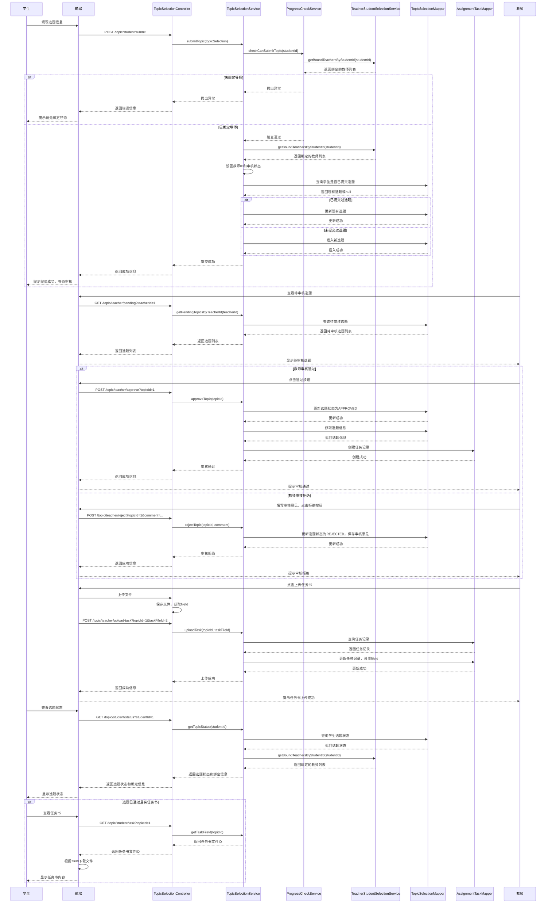

# 选题管理功能设计

## 1. 功能概述

选题管理功能是毕业论文管理系统中的重要模块，主要包括以下核心功能：

- **学生选题提交功能**：学生提交自拟论文题目及描述
- **教师选题审核功能**：教师审核学生提交的选题，可通过或拒绝
- **任务书上传功能**：教师为通过审核的选题上传任务书

## 2. 技术实现分析

### 2.1 核心类和方法

| 类/方法 | 功能描述 | 技术实现 |
|---------|---------|----------|
| `TopicSelectionController.submitTopic()` | 学生提交选题 | 接收前端请求，调用服务层方法处理提交逻辑 |
| `TopicSelectionService.submitTopic()` | 处理选题提交业务逻辑 | 检查学生是否绑定导师，设置选题状态，保存到数据库 |
| `TopicSelectionController.getPendingTopics()` | 获取待审核选题 | 接收教师ID，返回待审核的选题列表 |
| `TopicSelectionService.getPendingTopicsByTeacherId()` | 获取教师的待审核选题 | 根据教师ID查询待审核状态的选题 |
| `TopicSelectionController.approveTopic()` | 审核通过选题 | 接收选题ID，调用服务层方法处理审核通过逻辑 |
| `TopicSelectionService.approveTopic()` | 处理选题通过业务逻辑 | 更新选题状态为已通过，创建任务记录 |
| `TopicSelectionController.rejectTopic()` | 审核拒绝选题 | 接收选题ID和审核意见，调用服务层方法处理拒绝逻辑 |
| `TopicSelectionService.rejectTopic()` | 处理选题拒绝业务逻辑 | 更新选题状态为已拒绝，保存审核意见 |
| `TopicSelectionController.uploadTask()` | 上传任务书 | 接收选题ID和文件ID，调用服务层方法处理任务书上传 |
| `TopicSelectionService.uploadTask()` | 处理任务书上传业务逻辑 | 查找关联任务记录，更新文件ID |
| `TopicSelectionController.getTopicStatus()` | 获取选题状态 | 接收学生ID，返回选题状态和绑定导师信息 |
| `TopicSelectionService.getTopicStatus()` | 获取学生选题状态 | 根据学生ID查询最新的选题记录 |
| `ProgressCheckService.checkCanSubmitTopic()` | 检查是否可以提交选题 | 检查学生是否绑定导师 |

### 2.2 数据结构

#### TopicSelection 实体类

| 字段名 | 数据类型 | 描述 |
|--------|----------|------|
| `topicId` | `Long` | 选题ID |
| `studentId` | `Long` | 学生ID |
| `teacherId` | `Long` | 教师ID |
| `topicName` | `String` | 选题名称 |
| `topicDescription` | `String` | 选题描述 |
| `reviewStatus` | `String` | 审核状态（PENDING/APPROVED/REJECTED） |
| `reviewOpinion` | `String` | 审核意见 |
| `submitTime` | `Date` | 提交时间 |
| `reviewTime` | `Date` | 审核时间 |
| `createdAt` | `Date` | 创建时间 |
| `updatedAt` | `Date` | 更新时间 |

#### AssignmentTask 实体类

| 字段名 | 数据类型 | 描述 |
|--------|----------|------|
| `taskId` | `Long` | 任务ID |
| `topicId` | `Long` | 选题ID |
| `studentId` | `Long` | 学生ID |
| `teacherId` | `Long` | 教师ID |
| `fileId` | `Long` | 文件ID |
| `issueTime` | `LocalDateTime` | 发布时间 |
| `deadline` | `LocalDateTime` | 截止时间 |
| `createdAt` | `LocalDateTime` | 创建时间 |
| `updatedAt` | `LocalDateTime` | 更新时间 |

## 3. 选题管理时序图

## 4. 流程说明

### 4.1 学生选题提交流程

1. **前置条件**：学生必须已绑定导师
2. **提交过程**：
   - 学生在前端填写选题名称和描述
   - 前端调用 `POST /topic/student/submit` 接口
   - 后端检查学生是否绑定导师
   - 后端设置选题状态为 `PENDING`（待审核）
   - 后端检查学生是否已提交过选题，若已提交则更新，否则插入新记录
   - 后端返回提交成功信息
   - 前端提示学生提交成功，等待教师审核

### 4.2 教师选题审核流程

1. **查看待审核选题**：
   - 教师在前端查看待审核选题列表
   - 前端调用 `GET /topic/teacher/pending?teacherId=1` 接口
   - 后端返回该教师的待审核选题列表
   - 前端显示待审核选题

2. **审核通过**：
   - 教师点击通过按钮
   - 前端调用 `POST /topic/teacher/approve?topicId=1` 接口
   - 后端更新选题状态为 `APPROVED`（已通过）
   - 后端创建任务记录，设置截止时间为30天后
   - 后端返回审核通过信息
   - 前端提示教师审核通过

3. **审核拒绝**：
   - 教师填写审核意见，点击拒绝按钮
   - 前端调用 `POST /topic/teacher/reject?topicId=1&comment=...` 接口
   - 后端更新选题状态为 `REJECTED`（已拒绝），保存审核意见
   - 后端返回审核拒绝信息
   - 前端提示教师审核拒绝

### 4.3 任务书上传流程

1. **前置条件**：选题已通过审核
2. **上传过程**：
   - 教师在前端上传任务书文件
   - 前端先调用文件上传接口，获取文件ID
   - 前端调用 `POST /topic/teacher/upload-task?topicId=1&taskFileId=2` 接口
   - 后端查找与选题关联的任务记录
   - 后端更新任务记录，设置任务书文件ID
   - 后端返回上传成功信息
   - 前端提示教师任务书上传成功

### 4.4 学生查看选题状态和任务书

1. **查看选题状态**：
   - 学生在前端查看选题状态
   - 前端调用 `GET /topic/student/status?studentId=1` 接口
   - 后端返回选题状态和绑定导师信息
   - 前端显示选题状态

2. **查看任务书**：
   - 若选题已通过且有任务书，学生可以查看任务书
   - 前端调用 `GET /topic/student/task?topicId=1` 接口
   - 后端返回任务书文件ID
   - 前端根据文件ID下载并显示任务书内容

## 5. 代码优化建议

1. **getTaskFileId方法实现**：
   - 当前 `TopicSelectionService.getTaskFileId()` 方法返回 null，需要实现从 `AssignmentTask` 表中获取任务书文件ID的逻辑

2. **错误处理增强**：
   - 在 `TopicSelectionService.submitTopic()` 中，当 `teacherIds` 为空时直接调用 `teacherIds.get(0)` 可能会导致索引越界异常，建议增加非空检查

3. **日志记录**：
   - 在关键操作（如选题提交、审核、任务书上传）时添加日志记录，便于问题排查

4. **事务管理**：
   - 在 `approveTopic()` 方法中，更新选题状态和创建任务记录应该在同一个事务中执行，确保数据一致性

5. **参数验证**：
   - 在控制器层添加参数验证，确保传入的参数符合要求

## 6. 总结

选题管理功能是毕业论文管理系统中的重要模块，通过上述设计和实现，可以实现学生选题提交、教师选题审核和任务书上传的完整流程。系统采用了分层架构，将控制器、服务层、数据访问层分离，提高了代码的可维护性和可扩展性。

时序图清晰地展示了各个组件之间的交互流程，包括学生提交选题、教师审核选题、教师上传任务书以及学生查看选题状态和任务书的完整过程。

通过本设计，可以确保选题管理流程的顺利进行，为后续的开题报告、中期检查和论文提交等环节打下基础。