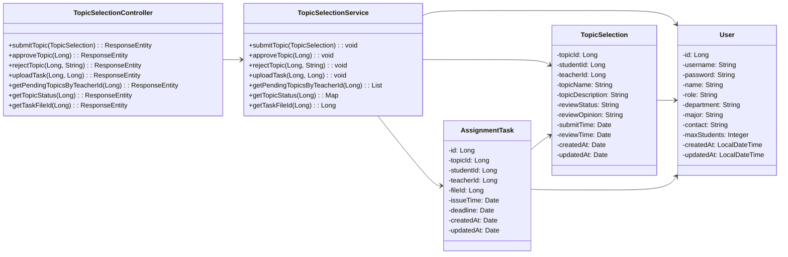
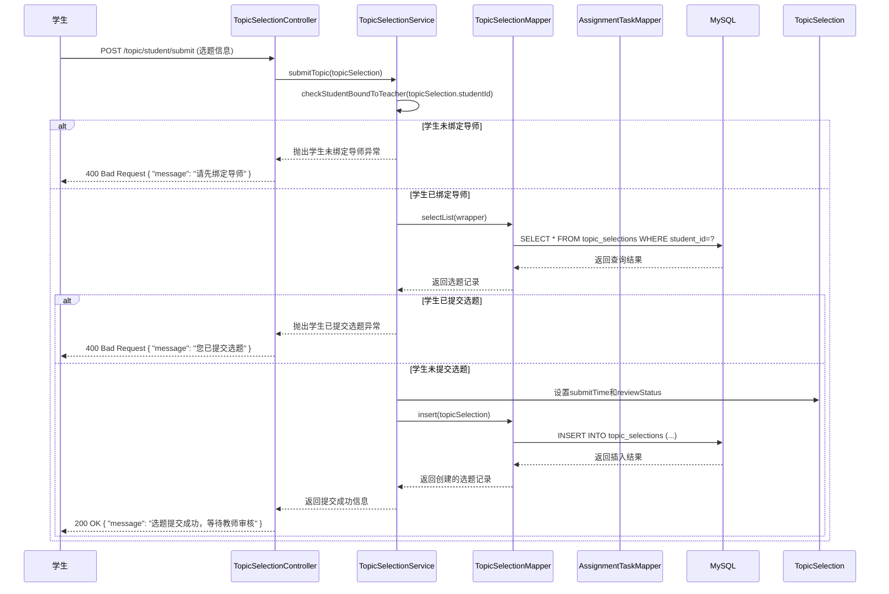
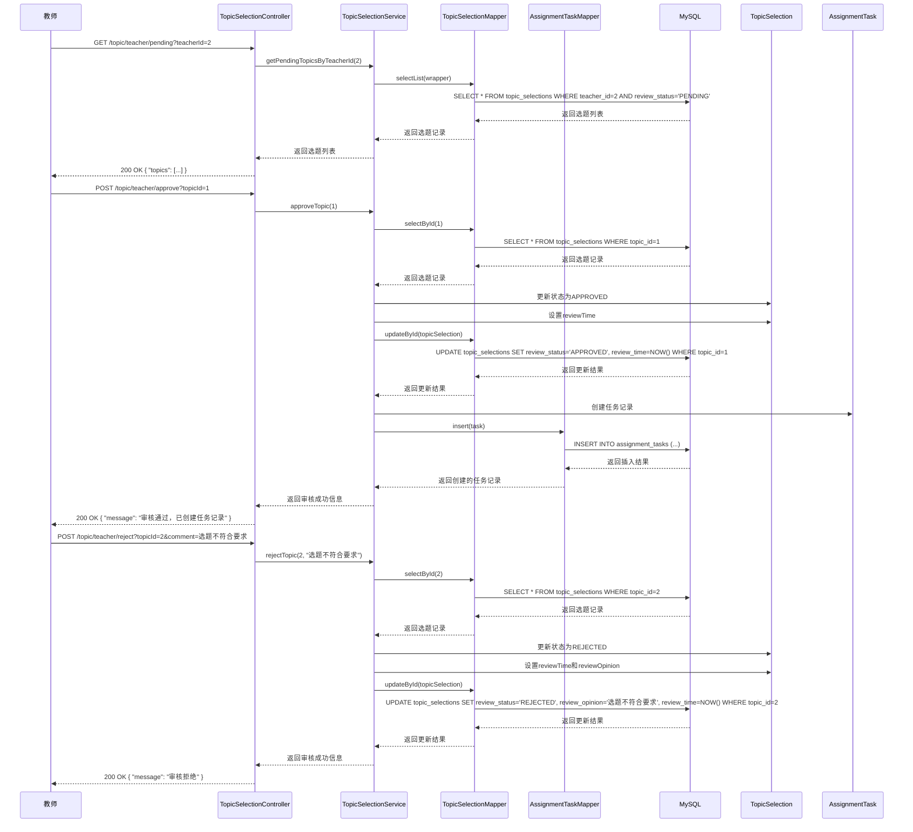
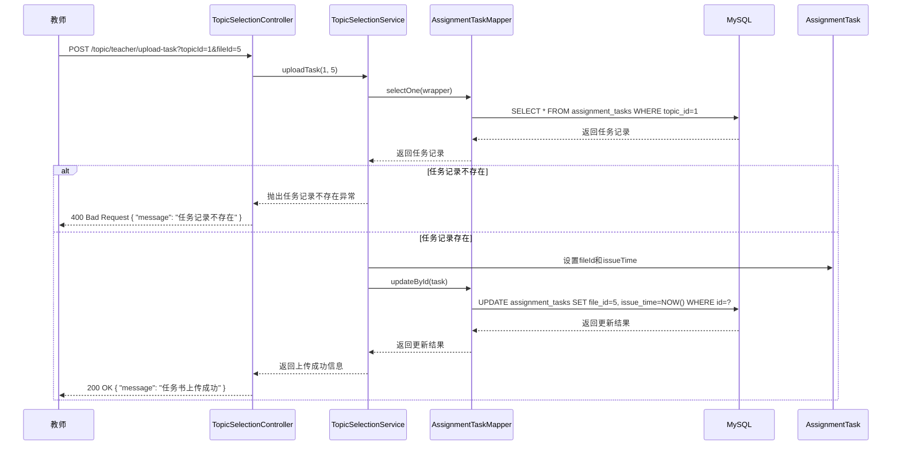

# 选题管理功能详细设计

## 1. 功能概述

选题管理功能是系统的重要功能之一，包括学生提交选题、教师审核选题、任务书上传等。该功能允许学生提交自拟论文题目，教师审核选题并上传任务书。

## 2. 类图设计

### 2.1 选题管理功能类图



## 3. 时序图设计

### 3.1 学生提交选题时序图

学生提交选题模块赋予了学生提交自拟论文题目的权力。学生在前端填写选题信息（选题名称、选题描述等）后，提交到系统，系统检查学生是否已绑定导师、是否已提交选题，如果检查通过则保存选题信息到数据库。选题信息存储完成后，数据库自动进行更新。

学生提交选题中的学生提交选题时序图如图所示，学生发起请求后，TopicSelectionController接收并调用TopicSelectionService的submitTopic方法处理业务逻辑，服务层调用checkStudentBoundToTeacher方法检查学生是否已绑定导师：如果学生未绑定导师，则抛出异常，TopicSelectionController返回400 Bad Request错误；如果学生已绑定导师，服务层调用TopicSelectionMapper的selectList方法查询数据库，数据库返回查询结果后，TopicSelectionMapper返回选题记录，服务层检查学生是否已提交选题：如果学生已提交选题，则抛出异常，TopicSelectionController返回400 Bad Request错误；如果学生未提交选题，服务层设置选题的submitTime和reviewStatus，然后调用TopicSelectionMapper的insert方法，由数据访问层生成并执行INSERT语句操作MySQL数据库，插入成功后，数据库返回结果，TopicSelectionMapper返回创建的选题记录，服务层逐层传递状态，最终返回提交成功的响应。



### 3.2 教师审核选题时序图

教师审核选题模块赋予了教师审核学生选题的权力。教师在前端查看待审核的选题列表，选择要审核的选题后，可以选择通过或拒绝。如果审核通过，则创建任务记录；如果审核拒绝，则保存审核意见。选题信息更新完成后，数据库自动进行更新。

教师审核选题中的教师审核选题时序图如图所示，教师查看待审核选题时，发起GET请求后，TopicSelectionController接收并调用TopicSelectionService的getPendingTopicsByTeacherId方法处理业务逻辑，服务层调用TopicSelectionMapper的selectList方法，由数据访问层生成并执行SELECT语句操作MySQL数据库，数据库返回选题列表后，TopicSelectionMapper返回选题记录，服务层逐层传递状态，最终返回包含topics的200 OK响应。

教师审核通过选题时，发起POST请求后，TopicSelectionController接收并调用TopicSelectionService的approveTopic方法处理业务逻辑，服务层调用TopicSelectionMapper的selectById方法查询数据库，数据库返回选题记录后，TopicSelectionMapper返回选题记录，服务层更新选题状态为APPROVED，设置reviewTime，然后调用TopicSelectionMapper的updateById方法，由数据访问层生成并执行UPDATE语句操作MySQL数据库，更新成功后，数据库返回结果，TopicSelectionMapper返回更新结果，服务层创建任务记录，调用AssignmentTaskMapper的insert方法，由数据访问层生成并执行INSERT语句操作MySQL数据库，插入成功后，数据库返回结果，AssignmentTaskMapper返回创建的任务记录，服务层逐层传递状态，最终返回审核成功的响应。

教师审核拒绝选题时，发起POST请求后，TopicSelectionController接收并调用TopicSelectionService的rejectTopic方法处理业务逻辑，服务层调用TopicSelectionMapper的selectById方法查询数据库，数据库返回选题记录后，TopicSelectionMapper返回选题记录，服务层更新选题状态为REJECTED，设置reviewTime和reviewOpinion，然后调用TopicSelectionMapper的updateById方法，由数据访问层生成并执行UPDATE语句操作MySQL数据库，更新成功后，数据库返回结果，TopicSelectionMapper返回更新结果，服务层逐层传递状态，最终返回审核拒绝的响应。



### 3.3 任务书上传时序图

任务书上传模块赋予了教师上传任务书的权力。教师在前端选择已通过审核的选题后，上传任务书文件，系统先检查任务记录是否存在，如果存在则更新任务记录的文件ID和下达时间。任务书信息更新完成后，数据库自动进行更新。

任务书上传中的任务书上传时序图如图所示，教师发起请求后，TopicSelectionController接收并调用TopicSelectionService的uploadTask方法处理业务逻辑，服务层调用AssignmentTaskMapper的selectOne方法查询数据库，数据库返回任务记录后，AssignmentTaskMapper返回任务记录，服务层检查任务记录是否存在：如果任务记录不存在，则抛出异常，TopicSelectionController返回400 Bad Request错误；如果任务记录存在，服务层设置任务的fileId和issueTime，然后调用AssignmentTaskMapper的updateById方法，由数据访问层生成并执行UPDATE语句操作MySQL数据库，更新成功后，数据库返回结果，AssignmentTaskMapper返回更新结果，服务层逐层传递状态，最终返回上传成功的响应。



## 4. 技术实现

### 4.1 关键代码实现

#### 4.1.1 TopicSelectionController.java

```java
@RestController
@RequestMapping("/topic")
public class TopicSelectionController {
    
    @Autowired
    private TopicSelectionService topicSelectionService;
    
    @PostMapping("/student/submit")
    public ResponseEntity<?> submitTopic(@RequestBody TopicSelection topicSelection) {
        try {
            topicSelectionService.submitTopic(topicSelection);
            return ResponseEntity.ok("选题提交成功，等待教师审核");
        } catch (Exception e) {
            return ResponseEntity.status(HttpStatus.BAD_REQUEST).body(e.getMessage());
        }
    }
    
    @PostMapping("/teacher/approve")
    public ResponseEntity<?> approveTopic(@RequestParam Long topicId) {
        try {
            topicSelectionService.approveTopic(topicId);
            return ResponseEntity.ok("审核通过，已创建任务记录");
        } catch (Exception e) {
            return ResponseEntity.status(HttpStatus.BAD_REQUEST).body(e.getMessage());
        }
    }
    
    @PostMapping("/teacher/reject")
    public ResponseEntity<?> rejectTopic(@RequestParam Long topicId, @RequestParam String comment) {
        try {
            topicSelectionService.rejectTopic(topicId, comment);
            return ResponseEntity.ok("审核拒绝");
        } catch (Exception e) {
            return ResponseEntity.status(HttpStatus.BAD_REQUEST).body(e.getMessage());
        }
    }
    
    @PostMapping("/teacher/upload-task")
    public ResponseEntity<?> uploadTask(@RequestParam Long topicId, @RequestParam Long fileId) {
        try {
            topicSelectionService.uploadTask(topicId, fileId);
            return ResponseEntity.ok("任务书上传成功");
        } catch (Exception e) {
            return ResponseEntity.status(HttpStatus.BAD_REQUEST).body(e.getMessage());
        }
    }
    
    @GetMapping("/teacher/pending")
    public ResponseEntity<?> getPendingTopicsByTeacherId(@RequestParam Long teacherId) {
        try {
            List<TopicSelection> topics = topicSelectionService.getPendingTopicsByTeacherId(teacherId);
            return ResponseEntity.ok(topics);
        } catch (Exception e) {
            return ResponseEntity.status(HttpStatus.INTERNAL_SERVER_ERROR).body(e.getMessage());
        }
    }
    
    @GetMapping("/student/status")
    public ResponseEntity<?> getTopicStatus(@RequestParam Long studentId) {
        try {
            Map<String, Object> status = topicSelectionService.getTopicStatus(studentId);
            return ResponseEntity.ok(status);
        } catch (Exception e) {
            return ResponseEntity.status(HttpStatus.INTERNAL_SERVER_ERROR).body(e.getMessage());
        }
    }
    
    @GetMapping("/task-file-id")
    public ResponseEntity<?> getTaskFileId(@RequestParam Long topicId) {
        try {
            Long fileId = topicSelectionService.getTaskFileId(topicId);
            return ResponseEntity.ok(fileId);
        } catch (Exception e) {
            return ResponseEntity.status(HttpStatus.INTERNAL_SERVER_ERROR).body(e.getMessage());
        }
    }
}
```

#### 4.1.2 TopicSelectionService.java

```java
@Service
public class TopicSelectionService {
    
    @Autowired
    private TopicSelectionMapper topicSelectionMapper;
    
    @Autowired
    private AssignmentTaskMapper assignmentTaskMapper;
    
    @Autowired
    private TeacherStudentSelectionService teacherStudentSelectionService;
    
    public void submitTopic(TopicSelection topicSelection) {
        // 检查学生是否已绑定导师
        if (!isStudentBoundToTeacher(topicSelection.getStudentId())) {
            throw new RuntimeException("请先绑定导师");
        }
        
        // 检查学生是否已提交选题
        LambdaQueryWrapper<TopicSelection> wrapper = new LambdaQueryWrapper<>();
        wrapper.eq(TopicSelection::getStudentId, topicSelection.getStudentId());
        List<TopicSelection> existingTopics = topicSelectionMapper.selectList(wrapper);
        if (!existingTopics.isEmpty()) {
            throw new RuntimeException("您已提交选题");
        }
        
        // 设置提交时间和审核状态
        topicSelection.setSubmitTime(new Date());
        topicSelection.setReviewStatus("PENDING");
        topicSelection.setCreatedAt(new Date());
        topicSelection.setUpdatedAt(new Date());
        
        // 保存选题信息
        topicSelectionMapper.insert(topicSelection);
    }
    
    public void approveTopic(Long topicId) {
        TopicSelection topicSelection = topicSelectionMapper.selectById(topicId);
        if (topicSelection == null) {
            throw new RuntimeException("选题不存在");
        }
        
        // 更新选题状态
        topicSelection.setReviewStatus("APPROVED");
        topicSelection.setReviewTime(new Date());
        topicSelection.setUpdatedAt(new Date());
        
        topicSelectionMapper.updateById(topicSelection);
        
        // 创建任务记录
        AssignmentTask task = new AssignmentTask();
        task.setTopicId(topicId);
        task.setStudentId(topicSelection.getStudentId());
        task.setTeacherId(topicSelection.getTeacherId());
        task.setCreatedAt(new Date());
        task.setUpdatedAt(new Date());
        
        assignmentTaskMapper.insert(task);
    }
    
    public void rejectTopic(Long topicId, String comment) {
        TopicSelection topicSelection = topicSelectionMapper.selectById(topicId);
        if (topicSelection == null) {
            throw new RuntimeException("选题不存在");
        }
        
        // 更新选题状态
        topicSelection.setReviewStatus("REJECTED");
        topicSelection.setReviewOpinion(comment);
        topicSelection.setReviewTime(new Date());
        topicSelection.setUpdatedAt(new Date());
        
        topicSelectionMapper.updateById(topicSelection);
    }
    
    public void uploadTask(Long topicId, Long fileId) {
        // 查找任务记录
        LambdaQueryWrapper<AssignmentTask> wrapper = new LambdaQueryWrapper<>();
        wrapper.eq(AssignmentTask::getTopicId, topicId);
        AssignmentTask task = assignmentTaskMapper.selectOne(wrapper);
        
        if (task == null) {
            throw new RuntimeException("任务记录不存在");
        }
        
        // 更新任务记录
        task.setFileId(fileId);
        task.setIssueTime(new Date());
        task.setUpdatedAt(new Date());
        
        assignmentTaskMapper.updateById(task);
    }
    
    public List<TopicSelection> getPendingTopicsByTeacherId(Long teacherId) {
        LambdaQueryWrapper<TopicSelection> wrapper = new LambdaQueryWrapper<>();
        wrapper.eq(TopicSelection::getTeacherId, teacherId)
               .eq(TopicSelection::getReviewStatus, "PENDING");
        return topicSelectionMapper.selectList(wrapper);
    }
    
    public Map<String, Object> getTopicStatus(Long studentId) {
        LambdaQueryWrapper<TopicSelection> wrapper = new LambdaQueryWrapper<>();
        wrapper.eq(TopicSelection::getStudentId, studentId);
        TopicSelection topicSelection = topicSelectionMapper.selectOne(wrapper);
        
        Map<String, Object> status = new HashMap<>();
        if (topicSelection == null) {
            status.put("status", "未提交");
        } else {
            status.put("status", topicSelection.getReviewStatus());
            status.put("topicName", topicSelection.getTopicName());
            status.put("submitTime", topicSelection.getSubmitTime());
            status.put("reviewTime", topicSelection.getReviewTime());
            status.put("reviewOpinion", topicSelection.getReviewOpinion());
        }
        
        return status;
    }
    
    public Long getTaskFileId(Long topicId) {
        LambdaQueryWrapper<AssignmentTask> wrapper = new LambdaQueryWrapper<>();
        wrapper.eq(AssignmentTask::getTopicId, topicId);
        AssignmentTask task = assignmentTaskMapper.selectOne(wrapper);
        
        if (task == null) {
            throw new RuntimeException("任务记录不存在");
        }
        
        return task.getFileId();
    }
    
    private boolean isStudentBoundToTeacher(Long studentId) {
        // 检查学生是否已绑定导师
        // 实现逻辑：查询TeacherStudentSelection表，检查是否有status为ACCEPTED的记录
        return true; // 简化实现
    }
}
```

## 5. 流程说明

### 5.1 学生提交选题流程

1. 学生登录系统，进入选题提交页面
2. 填写选题名称和描述
3. 点击"提交选题"按钮
4. 前端调用 `/topic/student/submit` 接口
5. TopicSelectionController接收请求，调用TopicSelectionService.submitTopic()方法
6. TopicSelectionService执行以下检查：
   - 学生是否已绑定导师
   - 学生是否已提交选题
7. 如果检查通过，保存选题信息，状态为"PENDING"
8. 返回提交成功信息

### 5.2 教师审核选题流程

1. 教师登录系统，进入选题审核页面
2. 查看待审核的选题列表
3. 点击"通过"或"拒绝"按钮
4. 前端调用 `/topic/teacher/approve` 或 `/topic/teacher/reject` 接口
5. TopicSelectionController接收请求，调用相应的服务方法
6. TopicSelectionService更新选题状态：
   - 通过审核：状态改为"APPROVED"，创建任务记录
   - 拒绝审核：状态改为"REJECTED"，保存审核意见
7. 返回审核结果

### 5.3 任务书上传流程

1. 教师登录系统，进入任务书上传页面
2. 选择已通过审核的选题
3. 上传任务书文件
4. 前端先调用文件上传接口，获取文件ID
5. 前端调用 `/topic/teacher/upload-task` 接口，传递选题ID和文件ID
6. TopicSelectionController接收请求，调用TopicSelectionService.uploadTask()方法
7. TopicSelectionService查找任务记录，更新文件ID和下达时间
8. 返回上传成功信息

## 6. 业务规则

1. **前置条件**：学生必须先绑定导师才能提交选题
2. **唯一性**：每个学生只能提交一个选题
3. **状态流转**：选题状态只能从"PENDING"变为"APPROVED"或"REJECTED"
4. **任务书上传**：只有通过审核的选题才能上传任务书
5. **时间记录**：系统自动记录提交时间、审核时间和任务书下达时间

## 7. 总结

选题管理功能通过学生提交、教师审核、任务书上传等流程，实现了规范的选题管理机制。该功能不仅满足了学生自拟选题的需求，也保证了教师对选题的审核权，为毕业设计的顺利开展奠定了基础。

通过详细的类图和时序图设计，清晰地展示了选题管理功能的实现细节和流程，为系统的开发和维护提供了参考。